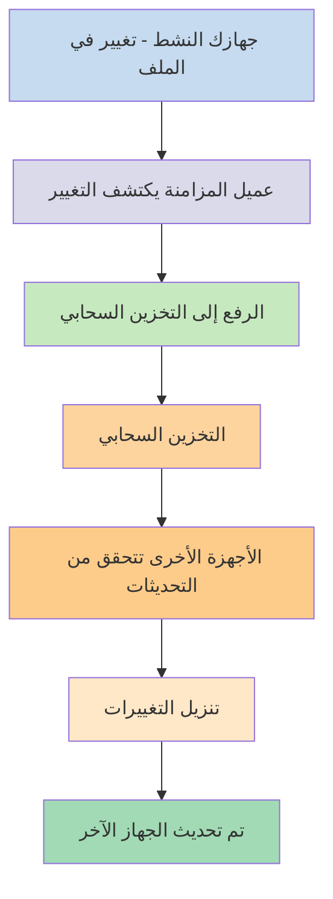
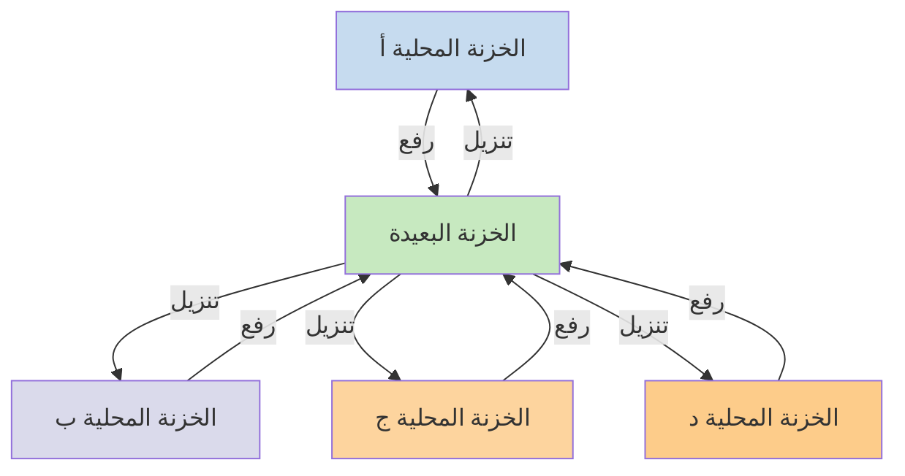

إذا كنت ترغب في استخدام ملاحظاتك على أجهزة مختلفة، فإن أحد الخيارات المتاحة لك هو [[مزامنة ملاحظاتك عبر الأجهزة|مزامنة ملاحظاتك عبر الأجهزة]]. يقدم Obsidian خدمة كهذه، وهي [[مقدمة عن Obsidian Sync|Obsidian Sync]]، التي تعمل بشكل مختلف عن خدمات المزامنة الأخرى، مثل [[مزامنة ملاحظاتك عبر الأجهزة#iCloud|iCloud]] و[[مزامنة ملاحظاتك عبر الأجهزة#OneDrive|OneDrive]].

إليك بعض المصطلحات الأساسية:

- **الخزنة** هي مجلد في نظام الملفات الخاص بك يحتوي على ملاحظات ومجلد `.obsidian` يتضمن إعدادات خاصة بـ Obsidian.
- **الخزنة المحلية** هي نسخة خزنتك الموجودة على كل جهاز من أجهزتك. عند استخدام خدمات المزامنة، تقوم بربط هذه الخزائن المحلية لتمكين المزامنة.
- **الخزنة البعيدة** هي تخزين مركزي تتصل به الخزائن المحلية مباشرة من خلال Obsidian Sync.

هناك نهجان شائعان للمزامنة:

- **[[#خدمات المزامنة القائمة على الملفات]]**: يجب أن تكون الخزائن المحلية في مجلدات مُراقبة، وتتم المزامنة من خلال نظام الملفات
- **[[#Obsidian Sync|الخزائن البعيدة]]**: تخزين مركزي تتصل به الخزائن المحلية مباشرة من خلال Obsidian

## خدمات المزامنة القائمة على الملفات

خدمات مثل Dropbox وGoogle Drive وiCloud وOneDrive هي خدمات قائمة على المجلدات. تراقب هذه الخدمات مجلدات محددة وتقوم تلقائيًا بمزامنة أي ملفات توضع فيها. يجب أن تكون الملفات في مجلدات الخدمة السحابية المخصصة حتى تتم مزامنتها. مع خدمات المزامنة القائمة على الملفات، تعمل خزنتك المحلية كمجلد آخر يتم مراقبته. لا توجد خزنة بعيدة مخصصة - بدلاً من ذلك، يعمل التخزين السحابي كوسيط، ينسخ الملفات بين الخزائن المحلية على الأجهزة المختلفة.

يوضح الرسم البياني أدناه نسخة مبسطة من كيفية عمل هذه الخدمات:

إذا كانت الخدمة السحابية تدعم المزامنة في الخلفية، فقد تحدث بعض هذه العمليات حتى عندما لا تستخدم التطبيقات بشكل نشط لعرض الملفات. تراقب هذه الخدمات مجلدات محددة وتقوم تلقائيًا بمزامنة أي ملفات توضع فيها. يجب أن تكون الملفات في مجلدات الخدمة السحابية المخصصة حتى تتم مزامنتها.

## Obsidian Sync

يتيح لك Obsidian Sync إنشاء خزنة بعيدة تعمل كتخزين مركزي من خلال خدمة [[مقدمة عن Obsidian Sync|Obsidian Sync]]. يتيح لك هذا اختيار أي مجلد تقريبًا على أي من أجهزتك لتخزين ملفاتك - سواء على قرص صلب خارجي، أو في `C:\`، أو في تخزين التطبيق على Android.

ومع ذلك، لدينا قائمة بالمواقع الموصى بها لخزنتك المحلية إذا كنت تستخدم أيضًا [[#خدمات المزامنة القائمة على الملفات]] على نفس الجهاز - بشكل أساسي، أي مكان ليس في [[التحول إلى Obsidian Sync#انقل خزنتك خارج خدمة مزامنة طرف ثالث أو التخزين السحابي|خدمة مزامنة طرف ثالث]].

يوضح الرسم البياني أدناه نسخة مبسطة من كيفية عمل Obsidian Sync:

تصبح قوة هذا النظام أكثر وضوحًا مع زيادة أنواع الأجهزة. يمكن تنفيذ [[#خدمات المزامنة القائمة على الملفات]] بشكل غير متسق عبر أنظمة التشغيل، ولأجهزة الهاتف المحمول قواعدها الخاصة فيما يتعلق بكيفية عزل التطبيقات وتقييد استهلاك الطاقة، مما يجعل من الصعب جدًا على خدمات المزامنة التقليدية القائمة على الملفات العمل بسلاسة.

مع Obsidian Sync، تتعامل الخدمة مع المزامنة مباشرة من خلال التطبيق، مما يوفر سلوكًا متسقًا بغض النظر عن نوع الجهاز أو قيود نظام التشغيل، مع إعطاء الأولوية للاحتفاظ بنسخة محلية من بياناتك كـ[[النسخ الاحتياطي لملفات Obsidian|نسخة احتياطية مرنة]].

### سلوك المزامنة

عندما تجري تغييرات على الملفات في خزنتك المحلية، يكتشف Obsidian Sync هذه التغييرات ويرفعها إلى الخزنة البعيدة. ستقوم الأجهزة الأخرى المتصلة بنفس الخزنة البعيدة بتنزيل هذه التغييرات وتطبيقها على خزائنها المحلية. يتتبع Obsidian Sync التغييرات على مستوى الملف ولا ينقل سوى الملفات التي تم تعديلها، بدلاً من مزامنة مجلدات كاملة. هذا يقلل من استخدام النطاق الترددي ووقت المزامنة.

عندما تحدث تعارضات أو عندما تحتاج إلى التحكم في الملفات التي تتم مزامنتها، يوفر Obsidian Sync آليات محددة للتعامل مع هذه المواقف:

![[استكشاف أخطاء Obsidian Sync وإصلاحها#حل التعارضات|حل التعارضات]]

![[إعدادات المزامنة والمزامنة الانتقائية#المزامنة الانتقائية#استثناء مجلد من المزامنة]]

### السلوك في وضع عدم الاتصال

يتم وضع التغييرات التي تُجرى أثناء عدم الاتصال في قائمة انتظار وتتم مزامنتها تلقائيًا عندما يعيد جهازك الاتصال بالإنترنت ويكون Obsidian مفتوحًا. تظل خزنتك المحلية تعمل بكامل وظائفها خلال فترات عدم الاتصال.

## الخطوات التالية

- [[إعداد Obsidian Sync|إعداد Obsidian Sync]] للبدء مع الخزائن البعيدة.
- [[التحول إلى Obsidian Sync|التبديل إلى Obsidian Sync]] إذا كنت تستخدم حاليًا مزامنة قائمة على الملفات وتريد استخدام Obsidian Sync.
- [[مزامنة ملاحظاتك عبر الأجهزة|استكشاف خيارات المزامنة الأخرى]] إذا كنت لا تزال تتخذ قرارك.
