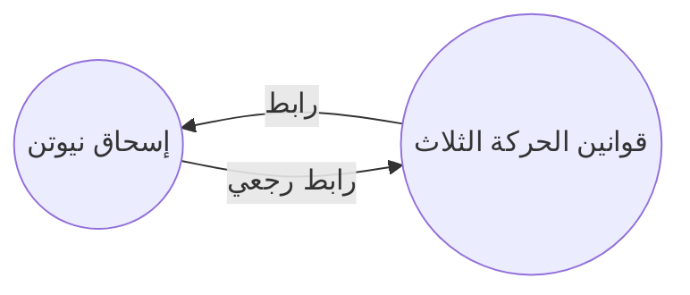

بواسطة إضافة الروابط الرجعية، يمكنك رؤية جميع الروابط الرجعية للملاحظة النشطة.

الرابط الرجعي (backlink) هو الرابط الموجود في صفحة ما يشير إلى الصفحة النشطة. في المثال التالي، تحتوي ملاحظة "قوانين الحركة الثلاث" على رابط إلى ملاحظة "إسحاق نيوتن". وسيتم إنشاء رابط عائد يشير من "إسحاق نيوتن" إلى "قوانين الحركة الثلاث".

يمكن أن تكون الروابط الرجعية مفيدة للعثور على الملاحظات التي تشير إلى الملاحظة التي تكتبها. تخيل فقط إذا كان بإمكانك سرد الروابط الرجعية لأي موقع على الإنترنت.

## لوحة الروابط الرجعية

يمكنك رؤية كل الروابط الرجعية للملاحظة النشطة من خلال "لوحة الروابط الرجعية". تتكون لوحة الروابط الرجعية من قسمين قابلين للطي: "الإشارات المرتبطة" و "الإشارات غير المرتبطة".

- "الإشارات المرتبطة" هي الروابط الرجعية إلى الملاحظات التي تحتوي على رابط داخلي إلى الملاحظة النشطة.
- "الإشارات غير المرتبطة" هي الروابط الرجعية لأي حدث غير مرتبط باسم الملاحظة النشطة.

تحتوي لوحة الروابط الرجعية على الخيارات التالية:

- **طي النتائج** يعكس ما إذا كنت تريد توسيع كل ملاحظة لعرض الإشارات الموجودة فيها.
- **عرض المزيد من السياق** يعكس ما إذا كنت تريد قص أو عرض الفقرة الكاملة التي تحتوي على الإشارة.
- **تغيير ترتيب الفرز** يحدد كيفية فرز الإشارات.
- **عرض مرشح البحث** يعكس حقل نص يتيح لك تصفية الإشارات. لمزيد من المعلومات حول كيفية إنشاء استعلام بحث، راجع [[البحث|البحث]].

## عرض الروابط الرجعية لملاحظة

لعرض الروابط الرجعية للملاحظة النشطة، انقر فوق علامة التبويب **روابط رجعية** (رمز الرابط والسهم) في الشريط الجانبي الأيمن.

> [!note] ملاحظة
> إذا لم تتمكن من رؤية علامة التبويب روابط رجعية، يمكنك جعلها ظاهرة عن طريق فتح [[قائمة الأوامر|قائمة الأوامر]] وتشغيل أمر **روابط رجعية: إظهار لوحة الروابط الرجعية**.

## فتح لوحة روابط رجعية مرتبطة

تعرض لوحة الروابط الرجعية روابط رجعية للملاحظة النشطة وتحديثاتها عند التبديل إلى ملاحظة مختلفة. إذا كنت ترغب في رؤية الروابط الرجعية لملاحظة محددة، بغض النظر عما إذا كانت نشطة أو لا، يمكنك فتح لوحة الروابط الرجعية المرتبطة.

لفتح لوحة الروابط الرجعية المرتبطة، اتبع الخطوات التالية:

1. افتح [[قائمة الأوامر|قائمة الأوامر]].
2. حدد **الروابط الرجعية: فتح الروابط الرجعية للملاحظة الحالية**.

يفتح علامة تبويب منفصلة بجوار الملاحظة النشطة. تظهر رمز الرابط لإعلامك بأنها مرتبطة بملاحظة.

## عرض الروابط الرجعية في ملاحظة

بدلاً من عرض الروابط الرجعية في علامة تبويب منفصلة، يمكنك عرضها في الأسفل من الملاحظة.

لعرض الروابط الرجعية في الملاحظة، اتبع الخطوات التالية:

1. افتح [[قائمة الأوامر|قائمة الأوامر]].
2. حدد **الروابط الرجعية: تبديل روابط الرجعية في المستند.**.

أو، يمكنك تمكين **الروابط الرجعية في مستند** تحت خيارات إضافة الروابط الرجعية لتبديل الروابط الرجعية تلقائيًا عند فتح ملاحظة جديدة.
