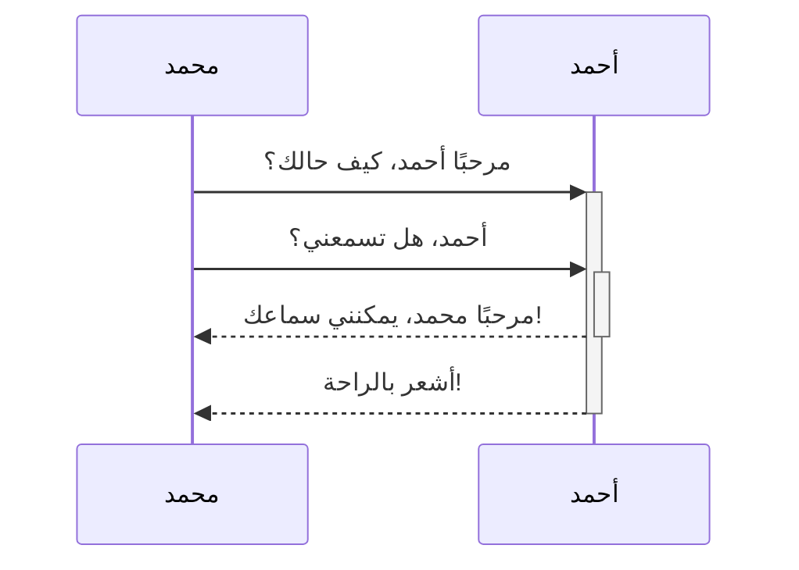
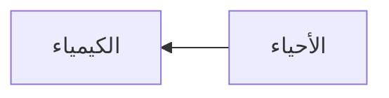

تعلّم كيفية إضافة بنية تنسيق متقدمة إلى ملاحظاتك.

## الجداول

يمكنك إنشاء جدول باستخدام الشريط الرأسي (`|`) والشرطات (`-`). تفصل الشرائط الرأسية بين الأعمدة، والشرطات تعرف رأس العمود.

```md
| الاسم الأول      | اسم العائلة       |
| ----------- | ------------ |
| أبو بكر        | الصديق         |
| فاطمة         | الزهراء         |
```

| الاسم الأول      | اسم العائلة       |
| ----------- | ------------ |
| أبو بكر        | الصديق         |
| فاطمة         | الزهراء         |

الشرائط الرأسية على جانبي الجدول اختيارية.

لا تحتاج الخلايا إلى أن تكون محاذاة بشكل مثالي مع الأعمدة. يجب أن يحتوي كل رأس صف على ما لا يقل عن شرطتين.

```md
الاسم الأول | اسم العائلة
-- | --
أبو بكر | الصديق
فاطمة | الزهراء
```

### تنسيق محتوى داخل جدول

يمكنك استخدام [[بنية التنسيق الأساسية]] لتنسيق محتوى داخل جدول.

العمود الأول |	العمود الثاني
--|--
[[الروابط الداخلية\|الروابط الداخلية]]	| رابط لملف داخل القبو الخاصة بك.
[[تضمين الملفات]]	|  ![[og-image.png\|200]]

> [!note] الشريط العمودي في الجداول
> إذا كنت تريد استخدام [[أسماء مستعارة|أسماء مستعارة]]، أو [[بنية التنسيق الأساسية#الصور الخارجية|تغيير حجم الصورة]] في الجدول، فيجب عليك إضافة `\` قبل الشريط الرأسي.
>
> ```md

> العمود الأول | العمود الثاني
> -- | --
> [[بنية التنسيق الأساسية\|بنية ماركداون]] | ![[og-image.png\|200]]

> ```
>

> العمود الأول | العمود الثاني
> -- | --
> [[بنية التنسيق الأساسية\|بنية ماركداون]] | ![[og-image.png\|200]]

يمكنك محاذاة النص إلى اليسار أو اليمين أو الوسط في العمود عن طريق إضافة نقطتان رأسيتان (`:`) إلى رأس الصف.

```md
محاذاة النص لليمين | محاذاة النص للوسط | محاذاة النص لليسار
--: | :--: | :--
المحتوى | المحتوى | المحتوى
```

محاذاة النص لليمين | محاذاة النص للوسط | محاذاة النص لليسار
--: | :--: | :--
المحتوى | المحتوى | المحتوى

## الرسم البياني

يمكنك إضافة الرسومات البيانية إلى ملاحظاتك باستخدام [Mermaid](https://mermaid.js.org/#/). يدعم Mermaid مجموعة من الرسوم البيانية مثل [الخرائط الانسيابية](https://mermaid.js.org/syntax/flowchart.html) و [رسوم التسلسل](https://mermaid.js.org/syntax/sequenceDiagram.html) و [الجداول الزمنية](https://mermaid.js.org/syntax/timeline.html).

> [!tip] تلميح
يمكنك أيضًا تجربة [محرر Mermaid المباشر](https://mermaid-js.github.io/mermaid-live-editor/) لمساعدتك على بناء الرسوم البيانية قبل تضمينها في ملاحظاتك.

لإضافة رسم بياني Mermaid، قم بإنشاء [[بنية التنسيق الأساسية#كتل الشفرة|كتلة شفرة]] `mermaid`.

````md

````


````md

````


### ربط الملفات في الرسم البياني

يمكنك إنشاء [[الروابط الداخلية|روابط داخلية]] في رسوماتك البيانية عن طريق إرفاق [فئة](https://mermaid.js.org/syntax/flowchart.html#classes) `internal-link` بالعقدة الخاصة بك.

````md

````


> [!note] ملاحظة
> الروابط الداخلية من الرسوم البيانية لا تظهر في [[العرض البياني]].

إذا كان لديك العديد من العقد في رسوماتك البيانية، فيمكنك استخدام المقتطفات التالية.

````md

````

بهذه الطريقة، يصبح كل حرف عقدة رابطًا داخليًا، مع [نص العقدة](https://mermaid.js.org/syntax/flowchart.html#a-node-with-text) كنص الرابط.

> [!note] ملاحظة
> إذا استخدمت محرف خاص في أسماء الملاحظات الخاصة بك، فيجب وضع اسم الملاحظة في علامتي اقتباس مزدوجة.
>
>```
> class "⨳ محرف خاص" internal-link
> ```
>
> أو، `A["⨳ محرف خاص"]`.

للحصول على مزيد من المعلومات حول إنشاء الرسوم البيانية، يرجى الرجوع إلى [وثائق Mermaid الرسمية](https://mermaid.js.org/intro/).

## الرياضيات

يمكنك إضافة تعابير رياضية إلى ملاحظاتك باستخدام [MathJax](http://docs.mathjax.org/en/latest/basic/mathjax.html) وتدوين LaTeX.

لإضافة تعبير MathJax إلى ملاحظتك، ضعه بين علامتي دولار (`$$`).

```md
$$
\begin{vmatrix}a & b\\
c & d
\end{vmatrix}=ad-bc
$$
```

$$
\begin{vmatrix}a & b\\
c & d
\end{vmatrix}=ad-bc
$$

يمكنك أيضًا إضافة تعابير رياضية داخل النص عن طريق وضع الرموز `$` حولها.

```md
هذا تعبير رياضي مدمج $e^{2i\pi} = 1$.
```

هذا تعبير رياضي مدمج $e^{2i\pi} = 1$.

لمزيد من المعلومات حول البنية، راجع [دليل MathJax الأساسي والمرجع السريع](https://math.meta.stackexchange.com/questions/5020/mathjax-basic-tutorial-and-quick-reference).

للحصول على قائمة بحزم MathJax المدعومة، راجع [قائمة إضافات TeX/LaTeX](http://docs.mathjax.org/en/latest/input/tex/extensions/index.html).
