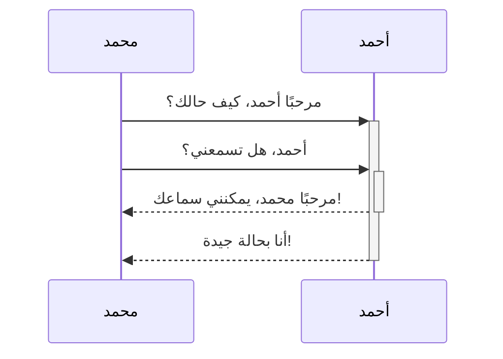
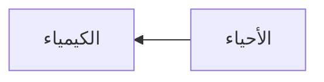

تعلّم كيفية إضافة صيغ تنسيق متقدمة إلى ملاحظاتك.

## الجداول

يمكنك إنشاء جداول باستخدام الخطوط العمودية (`|`) والشرطات (`-`). الخطوط العمودية تفصل بين الأعمدة، والشرطات تُعرف عنوان العمود.

```rtl
| الاسم الأول   | اسم العائلة |
| ----------- | ----------- |
| أبو بكر     | الصديق      |
| فاطمة       | الزهراء     |
```

| الاسم الأول | اسم العائلة |
| ----------- | ----------- |
| أبو بكر     | الصديق      |
| فاطمة       | الزهراء     |

الخطوط العمودية على جانبي الجدول اختيارية.

لا تحتاج الخلايا إلى أن تكون محاذاة بشكل مثالي مع الأعمدة. يجب أن يحتوي كل عنوان عمود على ما لا يقل عن شرطتين.

```rtl
الاسم الأول | اسم العائلة
-- | --
أبو بكر | الصديق
فاطمة | الزهراء
```

### تنسيق محتوى داخل جدول

يمكنك استخدام [[صيغ التنسيق الأساسية]] لتنسيق محتوى داخل جدول.

| العمود الأول                          | العمود الثاني                   |
| ------------------------------------- | ------------------------------- |
| [[الروابط الداخلية  \| روابط داخلية]] | رابط لملف داخل القبو الخاصة بك. |
| [[تضمين الملفات]]                     | ![[og-image.png\|200]]          |

> [!ملحوظة] الخط العمودي في الجداول
> إذا كنت تريد استخدام [[أسماء مستعارة|أسماء مستعارة]]، أو [[صيغ التنسيق الأساسية#صور خارجية|تغيير حجم الصورة]] في الجدول، فيجب عليك إضافة `\` قبل الخط الرأسي.
>
> ```rtl
> | العمود الأول                              | العمود الثاني          |
> | ---------------------------------------- | ---------------------- |
> | [[صيغ التنسيق الأساسية\|صيغ Markdown]]    | ![[og-image.png\|200]] |
> ```
>
> | العمود الأول                           | العمود الثاني          |
> | -------------------------------------- | ---------------------- |
> | [[صيغ التنسيق الأساسية\|صيغ Markdown]] | ![[og-image.png\|200]] |

يمكنك محاذاة النص إلى اليسار أو اليمين أو الوسط في العمود من خلال إضافة علامة النقطة المزدوجة `:` إلى رأس الصف.

```rtl
| محاذاة النص لليمين | محاذاة النص للوسط | محاذاة النص لليسار |
| -----------------: | :---------------: | :----------------- |
| المحتوى            |      المحتوى      |            المحتوى |
```

| محاذاة النص لليمين | محاذاة النص للوسط | محاذاة النص لليسار |
| -----------------: | :---------------: | :----------------- |
|            المحتوى |      المحتوى      | المحتوى            |

## الرسم البياني

يمكنك إضافة رسوم بيانية ومخططات إلى ملاحظاتك باستخدام [Mermaid](https://mermaid-js.github.io/). يدعم Mermaid مجموعة من الرسوم البيانية، مثل [خرائط التدفق](https://mermaid.js.org/syntax/flowchart.html)، [مخططات التسلسل](https://mermaid.js.org/syntax/sequenceDiagram.html)، و[الجداول الزمنية](https://mermaid.js.org/syntax/timeline.html).

> [!تلميح]
> يمكنك أيضًا تجربة [محرر Mermaid المباشر](https://mermaid-js.github.io/mermaid-live-editor/) لمساعدتك على بناء الرسوم البيانية قبل تضمينها في ملاحظاتك.

لإضافة رسم بياني Mermaid، قم بإنشاء [[صيغ التنسيق الأساسية#كتل نصوص برمجية|كتلة نص برمجي]] `mermaid`.

````md

````


````md

````


### ربط الملفات في الرسم البياني

يمكنك إنشاء [[الروابط الداخلية|الروابط الداخلية]] في رسوماتك البيانية عن طريق إرفاق [فئة](https://mermaid.js.org/syntax/flowchart.html#classes) `internal-link` بالعقدة الخاصة بك.

````md

````


> [!ملحوظة]
> الروابط الداخلية من الرسوم البيانية لا تظهر في [[Graph view]].

إذا كان لديك العديد من العقد في رسوماتك البيانية، فيمكنك استخدام المقتطف التالي.

````md

````

بهذه الطريقة، تصبح كل عقدة حرف رابطًا داخليًا، مع [نص العقدة](https://mermaid.js.org/syntax/flowchart.html#a-node-with-text) كنص رابط.

> [!ملحوظة]
> إذا استخدمت حرف خاص في أسماء الملاحظات الخاصة بك، فيجب وضع اسم الملاحظة بين علامتي اقتباس `" "`.
>
> ```align-right
> class "⨳ حرف خاص" internal-link
> ```
>
> أو، `A["⨳ حرف خاص"]`.

للحصول على مزيد من المعلومات حول إنشاء الرسوم البيانية، راجع [وثائق Mermaid الرسمية](https://mermaid.js.org/intro/).

## الرياضيات

يمكنك إضافة تعابير رياضية إلى ملاحظاتك باستخدام [MathJax](http://docs.mathjax.org/en/latest/basic/mathjax.html) وتعبير LaTeX.

لإضافة تعبير MathJax إلى ملاحظتك، ضعه بين علامتي دولار مزدوجتين `$$`.

```md
$$
\begin{vmatrix}a & b\\
c & d
\end{vmatrix}=ad-bc
$$
```

$$
\begin{vmatrix}a & b\\
c & d
\end{vmatrix}=ad-bc
$$

يمكنك أيضًا إدراج تعبيرات رياضية ضمن النص عن طريق وضعها بين علامتي `$`.

```align-right
هذا تعبير رياضي مضمن داخل النص $e^{2i\pi} = 1$
```

لمزيد من المعلومات حول الصيغ، راجع [دليل MathJax الأساسي والمرجع السريع](https://math.meta.stackexchange.com/questions/5020/mathjax-basic-tutorial-and-quick-reference).

للحصول على قائمة بحزم MathJax المدعومة، راجع [قائمة إضافات TeX/LaTeX](http://docs.mathjax.org/en/latest/input/tex/extensions/index.html).
