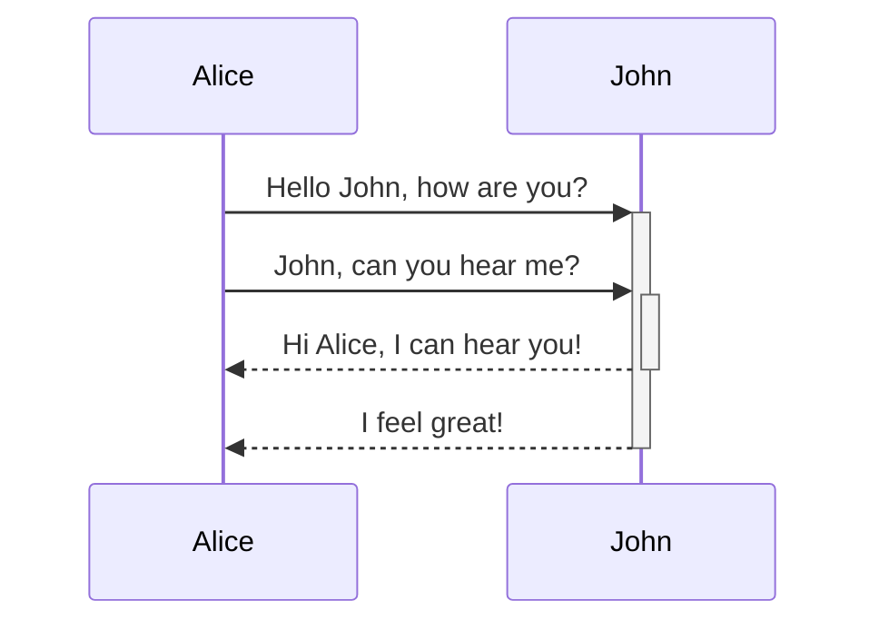
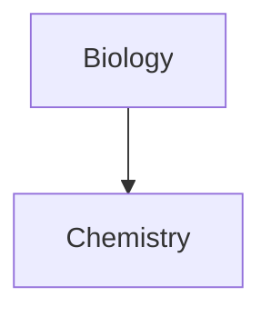

تعلم كيفية إضافة صيغ التنسيق المتقدم إلى ملاحظاتك.

## الجداول

يمكنك إنشاء جداول باستخدام الأشرطة العمودية (`|`) لفصل الأعمدة والواصلات (`-`) لتعريف العناوين. إليك مثالاً:

```md
| الاسم الأول | اسم العائلة |
| ---------- | --------- |
| Max        | Planck    |
| Marie      | Curie     |
```

| الاسم الأول | اسم العائلة |
| ---------- | --------- |
| Max        | Planck    |
| Marie      | Curie     |

على الرغم من أن الأشرطة العمودية على جانبي الجدول اختيارية، إلا أنه يُوصى بتضمينها لتحسين قابلية القراءة.

> [!tip] في _معاينة مباشرة_، يمكنك النقر بزر الماوس الأيمن على جدول لإضافة أو حذف أعمدة وصفوف. يمكنك أيضًا فرزها ونقلها باستخدام قائمة السياق.

يمكنك إدراج جدول باستخدام أمر **إدراج جدول** من [[لوحة الأوامر|لوحة الأوامر]] أو بالنقر بزر الماوس الأيمن واختيار _إدراج → جدول_. سيمنحك هذا جدولاً أساسيًا قابلاً للتحرير:

```md
|     |     |
| --- | --- |
|     |     |
```

لاحظ أن الخلايا لا تحتاج إلى محاذاة مثالية، لكن صف العنوان يجب أن يحتوي على واصلتين على الأقل:

```md
الاسم الأول | اسم العائلة
-- | --
Max | Planck
Marie | Curie
```


### تنسيق المحتوى داخل جدول

يمكنك استخدام [[صيغة التنسيق الأساسي|صيغ التنسيق الأساسي]] لتنسيق المحتوى داخل جدول.

| العمود الأول       | العمود الثاني                           |
| ------------------ | --------------------------------------- |
| [[روابط داخلية]] | رابط إلى ملف _داخل_ **خزنتك**. |
| [[تضمين الملفات]]    | ![[Engelbart.jpg\|100]]                 |

> [!note] الأشرطة العمودية في الجداول
> إذا كنت تريد استخدام [[أسماء مستعارة|أسماء مستعارة]]، أو [[صيغة التنسيق الأساسي#الصور الخارجية|تغيير حجم صورة]] في جدولك، فتحتاج إلى إضافة `\` قبل الشريط العمودي.
>
> ```md
> العمود الأول | العمود الثاني
> -- | --
> [[Basic formatting syntax\|صيغة Markdown]] | ![[Engelbart.jpg\|200]]
> ```
>
> العمود الأول | العمود الثاني
> -- | --
> [[Basic formatting syntax\|صيغة Markdown]] | ![[Engelbart.jpg\|200]]

قم بمحاذاة النص في الأعمدة بإضافة نقطتين (`:`) إلى صف العنوان. يمكنك أيضًا محاذاة المحتوى في _معاينة مباشرة_ عبر قائمة السياق.

```md
نص بمحاذاة يسارية | نص بمحاذاة وسطية | نص بمحاذاة يمينية
:-- | :--: | --:
محتوى | محتوى | محتوى
```

نص بمحاذاة يسارية | نص بمحاذاة وسطية | نص بمحاذاة يمينية
:-- | :--: | --:
محتوى | محتوى | محتوى

## المخططات البيانية

يمكنك إضافة مخططات بيانية ورسوم بيانية إلى ملاحظاتك باستخدام [Mermaid](https://mermaid-js.github.io/). يدعم Mermaid مجموعة من المخططات، مثل [مخططات التدفق](https://mermaid.js.org/syntax/flowchart.html)، و[مخططات التسلسل](https://mermaid.js.org/syntax/sequenceDiagram.html)، و[الجداول الزمنية](https://mermaid.js.org/syntax/timeline.html).

> [!tip] نصيحة
> يمكنك أيضًا تجربة [المحرر المباشر](https://mermaid-js.github.io/mermaid-live-editor) الخاص بـ Mermaid لمساعدتك في بناء المخططات قبل تضمينها في ملاحظاتك.

لإضافة مخطط Mermaid، أنشئ [[صيغة التنسيق الأساسي#كتل التعليمات البرمجية|كتلة تعليمات برمجية]] من نوع `mermaid`.

````md

````


````md

````


### ربط الملفات في مخطط

يمكنك إنشاء [[روابط داخلية|روابط داخلية]] في مخططاتك عن طريق إرفاق [فئة](https://mermaid.js.org/syntax/flowchart.html#classes) `internal-link` بعُقدك.

````md

````


> [!note] ملاحظة
> الروابط الداخلية من المخططات لا تظهر في [[العرض البياني|عرض الرسم البياني]].

إذا كان لديك العديد من العُقد في مخططاتك، يمكنك استخدام المقتطف التالي.

````md

````

بهذه الطريقة، تصبح كل عُقدة حرفية رابطًا داخليًا، مع [نص العُقدة](https://mermaid.js.org/syntax/flowchart.html#a-node-with-text) كنص للرابط.

> [!note] ملاحظة
> إذا استخدمت أحرفًا خاصة في أسماء ملاحظاتك، فتحتاج إلى وضع اسم الملاحظة بين علامتي اقتباس مزدوجتين.
>
> ```
> class "⨳ special character" internal-link
> ```
>
> أو، `A["⨳ special character"]`.

لمزيد من المعلومات حول إنشاء المخططات، راجع [وثائق Mermaid الرسمية](https://mermaid.js.org/intro/).

## الرياضيات

يمكنك إضافة تعبيرات رياضية إلى ملاحظاتك باستخدام [MathJax](http://docs.mathjax.org/en/latest/basic/mathjax.html) وترميز LaTeX.

لإضافة تعبير MathJax إلى ملاحظتك، أحطه بعلامتي دولار مزدوجتين (`$$`).

```md
$$
\begin{vmatrix}a & b\\
c & d
\end{vmatrix}=ad-bc
$$
```

$$
\begin{vmatrix}a & b\\
c & d
\end{vmatrix}=ad-bc
$$

يمكنك أيضًا تضمين التعبيرات الرياضية داخل السطر بإحاطتها برمز `$`.

```md
هذا تعبير رياضي مُضمّن في السطر $e^{2i\pi} = 1$.
```

هذا تعبير رياضي مُضمّن في السطر $e^{2i\pi} = 1$.

لمزيد من المعلومات حول الصيغة، راجع [البرنامج التعليمي الأساسي والمرجع السريع لـ MathJax](https://math.meta.stackexchange.com/questions/5020/mathjax-basic-tutorial-and-quick-reference).

للاطلاع على قائمة حزم MathJax المدعومة، راجع [قائمة إضافات TeX/LaTeX](http://docs.mathjax.org/en/latest/input/tex/extensions/index.html).
