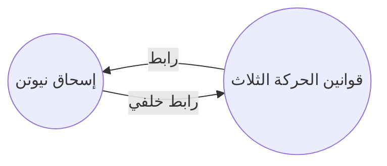

---
aliases:
  - Backlinks
permalink: plugins/backlinks
---

بواسطة مكوّن الروابط الخلفية الإضافي، يُمكنك رؤية جميع الروابط الخلفية للملاحظة النشطة.

الرابط الخلفي (backlink) هو الرابط الموجود في صفحة ما يشير إلى الصفحة النشطة. في المثال التالي، تحتوي ملاحظة "قوانين الحركة الثلاث" على رابط إلى ملاحظة "إسحاق نيوتن". وسيتم إنشاء رابط خلفي يشير من "إسحاق نيوتن" إلى "قوانين الحركة الثلاث".

قد تكون الروابط الخلفية مفيدة للعثور على الملاحظات التي تشير إلى الملاحظة التي تكتبها. فقط تخيل إمكانية عرض الروابط الخلفية لأي موقع على الإنترنت.

## عرض الروابط الخلفية

يقوم مكوّن الروابط الخلفية الإضافي بعرض الروابط الخلفية لنوافذ التبويب النشطة. هناك قسمين قابلين للطي: **Linked mentions** و **Unlinked mentions**.

- **Linked mentions** هي روابط خلفية إلى الملاحظات التي تحتوي على رابط داخلي إلى الملاحظة النشطة.
- **Unlinked mentions** هي روابط خلفية إلى أي حالة غير مرتبطة باسم الملاحظة النشطة.

يوفر الخيارات التالية:

- **Collapse results**: يفتح أو يطوي كل ملاحظة لعرض الإشارات الموجودة فيها.
- **Show more context**: يقتطع جزء من الفقرة التي تحتوي على الإشارة أو يظهرها بالكامل.
- **Change sort order**: يحدد كيفية فرز الإشارات.
- **Show search filter**: يفتح أو يطوي حقل البحث الذي يتيح لك فلترة الإشارات. لمزيد من المعلومات حول كيفية بناء استعلام بحث، راجع [[البحث]].

## عرض الروابط الخلفية لملاحظة

لعرض الروابط الخلفية للملاحظة النشطة، انقر نافذة تبويب **Backlinks** (أيقونة الرابط والسهم) في الشريط الجانبي الأيمن.

> [!ملحوظة]
> إذا لم تستطع رؤية نافذة التبويب الخاصة بالروابط الخلفية، يمكنك جعلها مرئية عن طريق فتح [[لوحة الأوامر]] وتشغيل أمر **Show backlinks**.

## رؤية الروابط الخلفية لملاحظة معينة

لوحة الروابط الخلفية تعرض روابط خلفية للملاحظة النشطة وتحديثاتها عند التبديل إلى ملاحظة مختلفة. إذا كنت ترغب في رؤية الروابط الخلفية لملاحظة محددة، بغض النظر عما إذا كانت نشطة أو لا، يمكنك فتح نافذة تبويب الروابط الخلفية المرتبطة.

لفتح نافذة تبويب الروابط الخلفية المرتبطة:

1. افتح [[لوحة الأوامر]].
2. حدد **Open backlinks for the current note**.

تفتح نافذة تبويب منفصلة بجانب ملاحظتك النشطة.

## عرض الروابط الخلفية في ملاحظة

بدلاً من عرض الروابط الخلفية في نافذة تبويب منفصلة، يمكنك عرضها في أسفل الملاحظة.

لعرض روابط خلفية في ملاحظة:

1. افتح [[لوحة الأوامر]].
2. حدد **Toggle backlinks in document**.

أو، قم بتمكين **Backlink in document** ضمن خيارات مكوّن الروابط الخلفية الإضافي لتبديل الروابط الخلفية تلقائيًا عند فتح ملاحظة جديدة.
