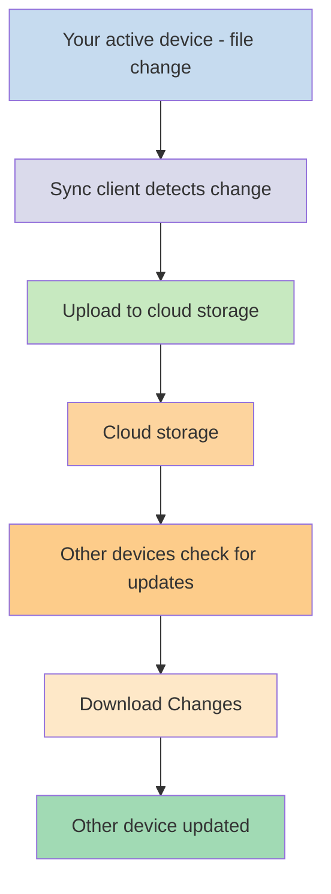
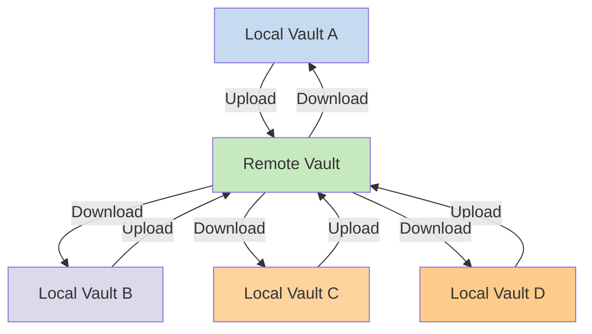

আপনি যদি বিভিন্ন ডিভাইসে আপনার নোট ব্যবহার করতে চান, তাহলে আপনার একটি অপশন হল [[Sync your notes across devices]]। Obsidian এমন একটি সার্ভিস অফার করে, [[Introduction to Obsidian Sync|Obsidian Sync]], যা [[Sync your notes across devices#iCloud|iCloud]] এবং [[Sync your notes across devices#OneDrive|OneDrive]]-এর মতো অন্যান্য সিঙ্কিং সার্ভিস থেকে ভিন্নভাবে কাজ করে।

এখানে কিছু মূল শব্দ রয়েছে:

- একটি **ভল্ট** হল আপনার ফাইল সিস্টেমের একটি ফোল্ডার যাতে নোট এবং Obsidian-নির্দিষ্ট কনফিগারেশন সহ একটি `.obsidian` ফোল্ডার থাকে।
- একটি **লোকাল ভল্ট** হল আপনার ভল্টের কপি যা আপনার প্রতিটি ডিভাইসে থাকে। সিঙ্কিং সার্ভিস ব্যবহার করার সময়, আপনি এই লোকাল ভল্টগুলো সংযুক্ত করেন সিঙ্ক্রোনাইজেশন সক্রিয় করতে।
- একটি **রিমোট ভল্ট** হল কেন্দ্রীভূত স্টোরেজ যার সাথে লোকাল ভল্টগুলো Obsidian Sync-এর মাধ্যমে সরাসরি সংযুক্ত হয়।

সিঙ্কিংয়ের দুটি সাধারণ পদ্ধতি রয়েছে:

- **[[#File-based sync services]]**: লোকাল ভল্টগুলো অবশ্যই মনিটর করা ফোল্ডারে থাকতে হবে, সিঙ্কিং ফাইল সিস্টেমের মাধ্যমে হয়
- **[[#Obsidian Sync|Remote vaults]]**: কেন্দ্রীভূত স্টোরেজ যার সাথে লোকাল ভল্টগুলো Obsidian-এর মাধ্যমে সরাসরি সংযুক্ত হয়

## ফাইল-ভিত্তিক সিঙ্ক সার্ভিস

Dropbox, Google Drive, iCloud, এবং OneDrive-এর মতো সার্ভিসগুলো ফোল্ডার-ভিত্তিক। এই সার্ভিসগুলো নির্দিষ্ট ফোল্ডার মনিটর করে এবং সেগুলোর মধ্যে রাখা যেকোনো ফাইল স্বয়ংক্রিয়ভাবে সিঙ্ক করে। সিঙ্ক করার জন্য ফাইলগুলোকে অবশ্যই নির্ধারিত ক্লাউড-সার্ভিস ফোল্ডারে থাকতে হবে। ফাইল-ভিত্তিক সিঙ্ক সার্ভিসের ক্ষেত্রে, আপনার লোকাল ভল্ট শুধুমাত্র মনিটর করা আরেকটি ফোল্ডার হিসেবে কাজ করে। এখানে কোনো ডেডিকেটেড রিমোট ভল্ট নেই - পরিবর্তে, ক্লাউড স্টোরেজ একটি পাসথ্রু হিসেবে কাজ করে, বিভিন্ন ডিভাইসের লোকাল ভল্টের মধ্যে ফাইল কপি করে।

নিচের ডায়াগ্রামে এই সার্ভিসগুলো কীভাবে কাজ করে তার একটি সরলীকৃত সংস্করণ দেখানো হয়েছে:

যদি ক্লাউড সার্ভিসে ব্যাকগ্রাউন্ড সিঙ্কিং থাকে, তাহলে আপনি যখন ফাইল দেখতে সক্রিয়ভাবে অ্যাপ্লিকেশন ব্যবহার করছেন না তখনও এই প্রক্রিয়াগুলোর কিছু ঘটতে পারে। এই সার্ভিসগুলো নির্দিষ্ট ফোল্ডার মনিটর করে এবং সেগুলোর মধ্যে রাখা যেকোনো ফাইল স্বয়ংক্রিয়ভাবে সিঙ্ক করে। সিঙ্ক করার জন্য ফাইলগুলোকে অবশ্যই নির্ধারিত ক্লাউড-সার্ভিস ফোল্ডারে থাকতে হবে।

## Obsidian Sync

Obsidian Sync আপনাকে এমন একটি রিমোট ভল্ট তৈরি করতে দেয় যা এর [[Introduction to Obsidian Sync|Obsidian Sync]] সার্ভিসের মাধ্যমে কেন্দ্রীভূত স্টোরেজ হিসেবে কাজ করে। এটি আপনাকে আপনার যেকোনো ডিভাইসের প্রায় যেকোনো ফোল্ডারে আপনার ফাইল সংরক্ষণ করতে দেয় - একটি এক্সটার্নাল হার্ড ড্রাইভে, `C:\`-তে, অথবা Android-এ অ্যাপ স্টোরেজে যাই হোক না কেন।

তবে, একই ডিভাইসে আপনি যদি [[#File-based sync services]]-ও ব্যবহার করেন, তাহলে আপনার লোকাল ভল্টের জন্য প্রস্তাবিত লোকেশনের একটি তালিকা আমাদের কাছে রয়েছে - মূলত, [[Switch to Obsidian Sync#Move your vault out of your third-party syncing service or cloud storage|থার্ড-পার্টি সিঙ্কিং সার্ভিসে]] নেই এমন যেকোনো জায়গা।

নিচের ডায়াগ্রামে Obsidian Sync কীভাবে কাজ করে তার একটি সরলীকৃত সংস্করণ দেখানো হয়েছে:

আরও বেশি ডিভাইস টাইপের সাথে এই সিস্টেমের শক্তি আরও স্পষ্ট হয়ে ওঠে। [[#File-based sync services]] বিভিন্ন অপারেটিং সিস্টেম জুড়ে অসামঞ্জস্যপূর্ণভাবে বাস্তবায়িত হতে পারে, এবং মোবাইল ডিভাইসের নিজস্ব নিয়ম রয়েছে যে কীভাবে অ্যাপ্লিকেশনগুলো স্যান্ডবক্স এবং পাওয়ার থ্রটল করা যায়, যা ঐতিহ্যবাহী ফাইল-ভিত্তিক সার্ভিসগুলোর জন্য নির্বিঘ্নে কাজ করা আরও কঠিন করে তোলে।

Obsidian Sync-এর সাথে, সার্ভিসটি সরাসরি অ্যাপ্লিকেশনের মাধ্যমে সিঙ্ক্রোনাইজেশন পরিচালনা করে, ডিভাইসের ধরন বা অপারেটিং সিস্টেমের সীমাবদ্ধতা নির্বিশেষে সামঞ্জস্যপূর্ণ আচরণ প্রদান করে, একইসাথে আপনার ডেটার একটি লোকাল কপি [[Back up your Obsidian files|সফট ব্যাকআপ]] হিসেবে রাখাকে অগ্রাধিকার দেয়।

### সিঙ্ক আচরণ

আপনি যখন আপনার লোকাল ভল্টের ফাইলে পরিবর্তন করেন, তখন Obsidian Sync এই পরিবর্তনগুলো শনাক্ত করে এবং সেগুলো রিমোট ভল্টে আপলোড করে। একই রিমোট ভল্টের সাথে সংযুক্ত অন্যান্য ডিভাইসগুলো তখন এই পরিবর্তনগুলো ডাউনলোড করবে এবং তাদের লোকাল ভল্টে প্রয়োগ করবে। Obsidian Sync ফাইল স্তরে পরিবর্তন ট্র্যাক করে এবং শুধুমাত্র পরিবর্তিত ফাইলগুলোই স্থানান্তর করে, সম্পূর্ণ ফোল্ডার সিঙ্ক করার পরিবর্তে। এটি ব্যান্ডউইথ ব্যবহার এবং সিঙ্ক সময় কমায়।

যখন কনফ্লিক্ট ঘটে বা আপনার যখন কোন ফাইল সিঙ্ক হবে তা নিয়ন্ত্রণ করার প্রয়োজন হয়, তখন Obsidian Sync এই পরিস্থিতিগুলো পরিচালনা করার জন্য নির্দিষ্ট প্রক্রিয়া প্রদান করে:

![[Troubleshoot Obsidian Sync#Conflict resolution|Conflict resolution]]

![[Sync settings and selective syncing#Selective syncing#Exclude a folder from syncing]]

### অফলাইন আচরণ

অফলাইনে থাকাকালীন করা পরিবর্তনগুলো সারিবদ্ধ থাকে এবং আপনার ডিভাইস ইন্টারনেটে পুনরায় সংযুক্ত হলে এবং Obsidian খোলা থাকলে স্বয়ংক্রিয়ভাবে সিঙ্ক হয়। অফলাইন সময়ে আপনার লোকাল ভল্ট সম্পূর্ণরূপে কার্যকর থাকে।

## পরবর্তী ধাপ

- রিমোট ভল্ট দিয়ে শুরু করতে [[Set up Obsidian Sync]]।
- আপনি যদি বর্তমানে ফাইল-ভিত্তিক সিঙ্ক ব্যবহার করেন এবং Obsidian Sync ব্যবহার করতে চান, তাহলে [[Switch to Obsidian Sync]]।
- আপনি যদি এখনও সিদ্ধান্ত নিচ্ছেন, তাহলে [[Sync your notes across devices|অন্যান্য সিঙ্ক অপশন এক্সপ্লোর করুন]]।
