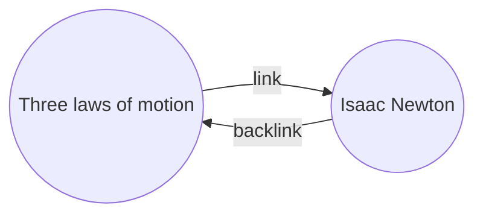

Backlinks [[Core plugins|প্লাগইন]] দিয়ে আপনি সক্রিয় নোটের জন্য সব _ব্যাকলিঙ্ক_ দেখতে পারেন।

একটি নোটের ব্যাকলিঙ্ক হলো অন্য একটি নোট থেকে সেই নোটের একটি লিঙ্ক। নিচের উদাহরণে, "Three laws of motion" নোটে "Isaac Newton" নোটের একটি লিঙ্ক রয়েছে। সংশ্লিষ্ট ব্যাকলিঙ্কটি "Isaac Newton" থেকে "Three laws of motion"-এ ফিরে লিঙ্ক করবে।

ব্যাকলিঙ্ক আপনার লেখা নোটটির উল্লেখ করা নোটগুলি খুঁজে পেতে সহায়ক হতে পারে। একবার কল্পনা করুন যে আপনি যদি ইন্টারনেটের যেকোনো ওয়েবসাইটের জন্য ব্যাকলিঙ্ক তালিকাবদ্ধ করতে পারতেন।

## ব্যাকলিঙ্ক দেখান

Backlinks প্লাগইন সক্রিয় ট্যাবগুলির জন্য ব্যাকলিঙ্ক প্রদর্শন করে। এখানে দুটি সংকোচনযোগ্য বিভাগ রয়েছে: **Linked mentions** এবং **Unlinked mentions**।

- **Linked mentions** হলো সেই নোটগুলির ব্যাকলিঙ্ক যেগুলিতে সক্রিয় নোটের একটি অভ্যন্তরীণ লিঙ্ক রয়েছে।
- **Unlinked mentions** হলো সক্রিয় নোটের নামের যেকোনো লিঙ্কবিহীন উল্লেখের ব্যাকলিঙ্ক।

এটি নিম্নলিখিত বিকল্পগুলি প্রদান করে:

- **Collapse results** টগল করে যে প্রতিটি নোটে থাকা উল্লেখগুলি প্রদর্শনের জন্য বিস্তৃত করা হবে কিনা।
- **Show more context** টগল করে যে উল্লেখ ধারণকারী পুরো অনুচ্ছেদটি সংক্ষিপ্ত করা হবে নাকি সম্পূর্ণ প্রদর্শন করা হবে।
- **Change sort order** নির্ধারণ করে যে উল্লেখগুলি কীভাবে সাজানো হবে।
- **Show search filter** একটি টেক্সট ফিল্ড টগল করে যা আপনাকে উল্লেখগুলি ফিল্টার করতে দেয়। একটি অনুসন্ধান টার্ম তৈরি করার বিষয়ে আরও তথ্যের জন্য, [[Search]] দেখুন।

## একটি নোটের ব্যাকলিঙ্ক দেখুন

সক্রিয় নোটের ব্যাকলিঙ্ক দেখতে, ডানদিকের সাইডবারে **Backlinks** ![[obsidian-icon-links-coming-in.svg#icon]] ট্যাবে ক্লিক করুন।

> [!note] নোট
> আপনি যদি Backlinks ট্যাবটি দেখতে না পান, তাহলে [[Command palette]] খুলে **Backlinks: Show backlinks** কমান্ডটি চালিয়ে এটি দৃশ্যমান করতে পারেন।

> [!info] বাদ দেয়া ফাইল
> আপনার [[Settings#Excluded files|বাদ দেয়া ফাইল]] প্যাটার্নের সাথে মিলে যাওয়া ফাইলগুলি Unlinked mentions-এ প্রদর্শিত হবে না।

## একটি নির্দিষ্ট নোটের ব্যাকলিঙ্ক দেখুন

Backlinks ট্যাবটি সক্রিয় নোটের ব্যাকলিঙ্ক তালিকাবদ্ধ করে এবং আপনি অন্য নোটে স্যুইচ করলে আপডেট হয়। আপনি যদি একটি নির্দিষ্ট নোটের ব্যাকলিঙ্ক দেখতে চান, সেটি সক্রিয় থাকুক বা না থাকুক, তাহলে আপনি একটি _লিঙ্কড_ ব্যাকলিঙ্ক ট্যাব খুলতে পারেন।

একটি লিঙ্কড ব্যাকলিঙ্ক ট্যাব খুলতে:

1. [[Command palette]] খুলুন।
2. **Backlinks: Open backlinks for the current note** নির্বাচন করুন।

আপনার সক্রিয় নোটের পাশে একটি পৃথক ট্যাব খোলে। ট্যাবটি একটি নোটের সাথে লিঙ্কড আছে তা জানাতে একটি লিঙ্ক আইকন দেখায়।

## একটি নোটে ব্যাকলিঙ্ক দেখান

একটি পৃথক ট্যাবে ব্যাকলিঙ্ক দেখানোর পরিবর্তে, আপনি আপনার নোটের নিচে ব্যাকলিঙ্ক দেখাতে পারেন।

একটি নোটে ব্যাকলিঙ্ক দেখাতে:

1. [[Command palette]] খুলুন।
2. **Backlinks: Toggle backlinks in document** নির্বাচন করুন।

অথবা, আপনি একটি নতুন নোট খুললে স্বয়ংক্রিয়ভাবে ব্যাকলিঙ্ক টগল করতে Backlinks প্লাগইন বিকল্পের অধীনে **Backlink in document** সক্রিয় করুন।
