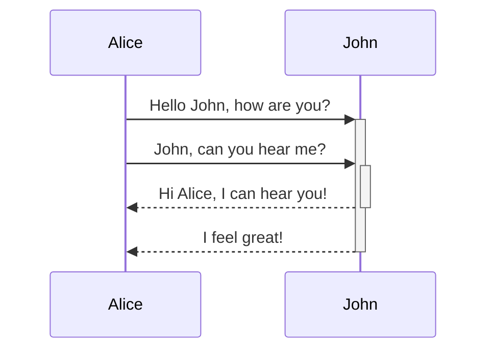
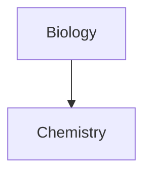

আপনার নোটে কীভাবে অ্যাডভান্সড ফরম্যাটিং সিনট্যাক্স যোগ করবেন তা জানুন।

## টেবিল

আপনি কলাম আলাদা করতে উল্লম্ব রেখা (`|`) এবং হেডার নির্ধারণ করতে হাইফেন (`-`) ব্যবহার করে টেবিল তৈরি করতে পারেন। এখানে একটি উদাহরণ দেওয়া হলো:

```md
| First name | Last name |
| ---------- | --------- |
| Max        | Planck    |
| Marie      | Curie     |
```

| First name | Last name |
| ---------- | --------- |
| Max        | Planck    |
| Marie      | Curie     |

টেবিলের দুই পাশের উল্লম্ব রেখাগুলো ঐচ্ছিক হলেও, পড়তে সুবিধার জন্য সেগুলো অন্তর্ভুক্ত করার পরামর্শ দেওয়া হয়।

> [!tip] _লাইভ প্রিভিউ_-এ, আপনি একটি টেবিলে রাইট-ক্লিক করে কলাম বা সারি যোগ বা মুছে ফেলতে পারেন। কনটেক্সট মেনু ব্যবহার করে আপনি সেগুলো সাজাতে এবং সরাতেও পারেন।

আপনি [[কমান্ড প্যালেট|কমান্ড প্যালেট]] থেকে **Insert Table** কমান্ড ব্যবহার করে, অথবা রাইট-ক্লিক করে _Insert → Table_ নির্বাচন করে একটি টেবিল যোগ করতে পারেন। এতে আপনি একটি সাধারণ, সম্পাদনাযোগ্য টেবিল পাবেন:

```md
|     |     |
| --- | --- |
|     |     |
```

লক্ষ্য করুন যে সেলগুলোতে নিখুঁত অ্যালাইনমেন্টের প্রয়োজন নেই, তবে হেডার সারিতে অন্তত দুটি হাইফেন থাকতেই হবে:

```md
First name | Last name
-- | --
Max | Planck
Marie | Curie
```


### টেবিলের মধ্যে কনটেন্ট ফরম্যাট করা

আপনি টেবিলের মধ্যে কনটেন্ট স্টাইল করতে [[মৌলিক ফরম্যাটিং সিনট্যাক্স|বেসিক ফরম্যাটিং সিনট্যাক্স]] ব্যবহার করতে পারেন।

| First column       | Second column                           |
| ------------------ | --------------------------------------- |
| [[ইন্টারনাল লিঙ্ক]] | আপনার **ভল্টের** _মধ্যে_ থাকা একটি ফাইলের লিঙ্ক। |
| [[ফাইল এম্বেড করুন]]    | ![[Engelbart.jpg\|100]]                 |

> [!note] টেবিলে উল্লম্ব রেখা
> যদি আপনি টেবিলে [[উপনাম|উপনাম]] ব্যবহার করতে চান, অথবা [[মৌলিক ফরম্যাটিং সিনট্যাক্স#External images|একটি ছবির আকার পরিবর্তন]] করতে চান, তাহলে উল্লম্ব রেখার আগে একটি `\` যোগ করতে হবে।
>
> ```md
> First column | Second column
> -- | --
> [[মৌলিক ফরম্যাটিং সিনট্যাক্স\|Markdown syntax]] | ![[Engelbart.jpg\|200]]
> ```
>
> First column | Second column
> -- | --
> [[মৌলিক ফরম্যাটিং সিনট্যাক্স\|Markdown syntax]] | ![[Engelbart.jpg\|200]]

হেডার সারিতে কোলন (`:`) যোগ করে কলামে টেক্সট অ্যালাইন করুন। আপনি _লাইভ প্রিভিউ_-এও কনটেক্সট মেনুর মাধ্যমে কনটেন্ট অ্যালাইন করতে পারেন।

```md
Left-aligned text | Center-aligned text | Right-aligned text
:-- | :--: | --:
Content | Content | Content
```

Left-aligned text | Center-aligned text | Right-aligned text
:-- | :--: | --:
Content | Content | Content

## ডায়াগ্রাম

আপনি [Mermaid](https://mermaid-js.github.io/) ব্যবহার করে আপনার নোটে ডায়াগ্রাম এবং চার্ট যোগ করতে পারেন। Mermaid বিভিন্ন ধরনের ডায়াগ্রাম সমর্থন করে, যেমন [ফ্লো চার্ট](https://mermaid.js.org/syntax/flowchart.html), [সিকোয়েন্স ডায়াগ্রাম](https://mermaid.js.org/syntax/sequenceDiagram.html), এবং [টাইমলাইন](https://mermaid.js.org/syntax/timeline.html)।

> [!tip] টিপ
> নোটে অন্তর্ভুক্ত করার আগে ডায়াগ্রাম তৈরিতে সাহায্য করতে আপনি Mermaid-এর [লাইভ এডিটর](https://mermaid-js.github.io/mermaid-live-editor)-ও ব্যবহার করে দেখতে পারেন।

একটি Mermaid ডায়াগ্রাম যোগ করতে, একটি `mermaid` [[মৌলিক ফরম্যাটিং সিনট্যাক্স#Code blocks|কোড ব্লক]] তৈরি করুন।

````md

````


````md

````


### ডায়াগ্রামে ফাইল লিঙ্ক করা

আপনার নোডগুলোতে `internal-link` [ক্লাস](https://mermaid.js.org/syntax/flowchart.html#classes) যুক্ত করে আপনি আপনার ডায়াগ্রামে [[ইন্টারনাল লিঙ্ক|ইন্টার্নাল লিঙ্ক]] তৈরি করতে পারেন।

````md

````


> [!note] নোট
> ডায়াগ্রামের ইন্টার্নাল লিঙ্কগুলো [[গ্রাফ ভিউ|গ্রাফ ভিউ]]-এ দেখা যায় না।

আপনার ডায়াগ্রামে যদি অনেক নোড থাকে, তাহলে আপনি নিচের স্নিপেটটি ব্যবহার করতে পারেন।

````md

````

এভাবে, প্রতিটি অক্ষর-নোড একটি ইন্টার্নাল লিঙ্কে পরিণত হয়, যেখানে [নোড টেক্সট](https://mermaid.js.org/syntax/flowchart.html#a-node-with-text) লিঙ্ক টেক্সট হিসেবে কাজ করে।

> [!note] নোট
> যদি আপনি আপনার নোটের নামে বিশেষ অক্ষর ব্যবহার করেন, তাহলে নোটের নামটি ডাবল কোটেশনের মধ্যে রাখতে হবে।
>
> ```
> class "⨳ special character" internal-link
> ```
>
> অথবা, `A["⨳ special character"]`।

ডায়াগ্রাম তৈরি সম্পর্কে আরও তথ্যের জন্য, [অফিসিয়াল Mermaid ডকুমেন্টেশন](https://mermaid.js.org/intro/) দেখুন।

## ম্যাথ

আপনি [MathJax](http://docs.mathjax.org/en/latest/basic/mathjax.html) এবং LaTeX নোটেশন ব্যবহার করে আপনার নোটে গাণিতিক এক্সপ্রেশন যোগ করতে পারেন।

আপনার নোটে একটি MathJax এক্সপ্রেশন যোগ করতে, এটিকে ডাবল ডলার চিহ্ন (`$$`) দিয়ে ঘিরে দিন।

```md
$$
\begin{vmatrix}a & b\\
c & d
\end{vmatrix}=ad-bc
$$
```

$$
\begin{vmatrix}a & b\\
c & d
\end{vmatrix}=ad-bc
$$

আপনি `$` চিহ্নের মধ্যে মুড়িয়ে ইনলাইন গাণিতিক এক্সপ্রেশনও তৈরি করতে পারেন।

```md
This is an inline math expression $e^{2i\pi} = 1$.
```

This is an inline math expression $e^{2i\pi} = 1$.

সিনট্যাক্স সম্পর্কে আরও তথ্যের জন্য, [MathJax basic tutorial and quick reference](https://math.meta.stackexchange.com/questions/5020/mathjax-basic-tutorial-and-quick-reference) দেখুন।

সমর্থিত MathJax প্যাকেজের একটি তালিকার জন্য, [The TeX/LaTeX Extension List](http://docs.mathjax.org/en/latest/input/tex/extensions/index.html) দেখুন।
