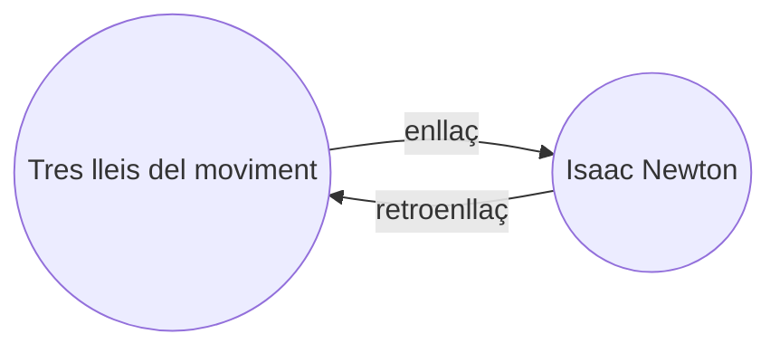

Amb el [[Connectors principals|connector]] de Retroenllaços, pots veure tots els _retroenllaços_ per a la nota activa.

Un retroenllaç per a una nota és un enllaç des d'una altra nota cap a aquella nota. En l'exemple següent, la nota "Tres lleis del moviment" conté un enllaç cap a la nota "Isaac Newton". El retroenllaç corresponent enllaçaria des d'"Isaac Newton" de tornada cap a "Tres lleis del moviment".

Els retroenllaços poden ser útils per trobar notes que fan referència a la nota que estàs escrivint. Imagina't si poguessis llistar els retroenllaços de qualsevol pàgina web a internet.

## Mostra els retroenllaços

El connector de Retroenllaços mostra els retroenllaços per a les pestanyes actives. Hi ha dues seccions plegables: **Mencions enllaçades** i **Mencions sense enllaçar**.

- Les **Mencions enllaçades** són retroenllaços cap a les notes que contenen un enllaç intern a la nota activa.
- Les **Mencions sense enllaçar** són retroenllaços cap a qualsevol ocurrència no enllaçada del nom de la nota activa.

Proporciona les opcions següents:

- **Redueix els resultats** alterna si es desplega cada nota per mostrar les mencions que conté.
- **Mostra més context** alterna si es trunca o es mostra el paràgraf complet que conté la menció.
- **Canvia l'ordre de classificació** determina com ordenar les mencions.
- **Mostra el filtre de cerca** alterna un camp de text que permet filtrar les mencions. Per a més informació sobre com construir un terme de cerca, consulta [[Cerca]].

## Visualitza els retroenllaços d'una nota

Per veure els retroenllaços de la nota activa, fes clic a la pestanya **Retroenllaços** ![[obsidian-icon-links-coming-in.svg#icon]] a la barra lateral dreta.

> [!note] Nota
> Si no pots veure la pestanya de Retroenllaços, pots fer-la visible obrint la [[Paleta d'ordres]] i executant l'ordre **Retroenllaços: Mostra els retroenllaços**.

> [!info] Fitxers exclosos
> Els fitxers que coincideixin amb els patrons de [[Configuració#Fitxers exclosos|Fitxers exclosos]] no apareixeran a les Mencions sense enllaçar.

## Veure els retroenllaços d'una nota específica

La pestanya de retroenllaços llista els retroenllaços per a la nota activa i s'actualitza quan canvies a una nota diferent. Si vols veure els retroenllaços d'una nota específica, independentment de si és activa o no, pots obrir una pestanya de retroenllaços _vinculada_.

Per obrir una pestanya de retroenllaços vinculada:

1. Obre la [[Paleta d'ordres]].
2. Selecciona **Retroenllaços: Obre els retroenllaços per al fitxer actual**.

S'obre una pestanya separada al costat de la teva nota activa. La pestanya mostra una icona d'enllaç per indicar que està vinculada a una nota.

## Mostra els retroenllaços dins una nota

En lloc de mostrar els retroenllaços en una pestanya separada, pots mostrar els retroenllaços a la part inferior de la teva nota.

Per mostrar els retroenllaços dins una nota:

1. Obre la [[Paleta d'ordres]].
2. Selecciona **Retroenllaços: Alterna els retroenllaços al document**.

O bé, activa **Retroenllaços al document** dins les opcions del connector de Retroenllaços per alternar automàticament els retroenllaços quan obris una nota nova.
