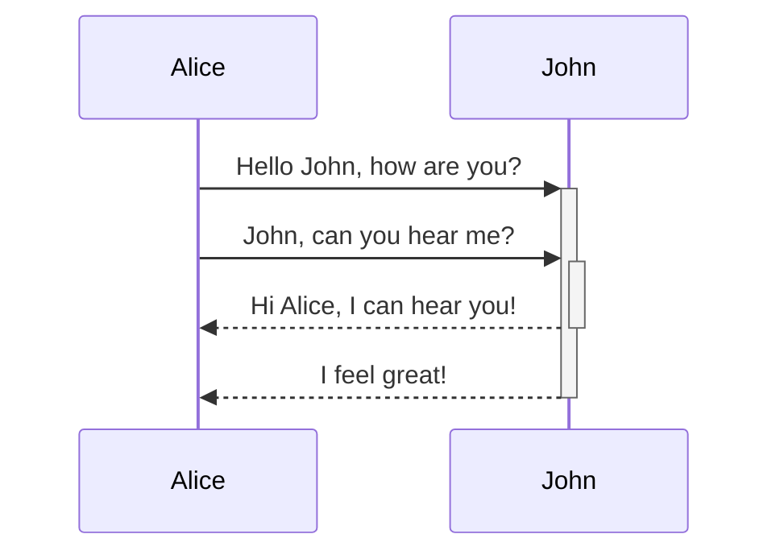
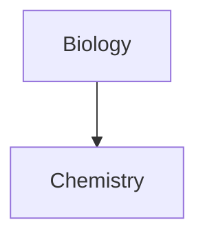

Apreneu com afegir sintaxi de format avançat a les vostres notes.

## Taules

Podeu crear taules utilitzant barres verticals (`|`) per separar columnes i guions (`-`) per definir encapçalaments. Aquí teniu un exemple:

```md
| Nom | Cognom |
| ---------- | --------- |
| Max        | Planck    |
| Marie      | Curie     |
```

| Nom | Cognom |
| ---------- | --------- |
| Max        | Planck    |
| Marie      | Curie     |

Tot i que les barres verticals als costats de la taula són opcionals, es recomana incloure-les per millorar la llegibilitat.

> [!tip] A la _previsualització en viu_, podeu fer clic dret sobre una taula per afegir o suprimir columnes i files. També podeu ordenar-les i moure-les utilitzant el menú contextual.

Podeu inserir una taula utilitzant l'ordre **Insereix taula** des de la [[Paleta d'ordres]] o fent clic dret i seleccionant _Insertar → Taula_. Això us donarà una taula bàsica i editable:

```md
|     |     |
| --- | --- |
|     |     |
```

Tingueu en compte que les cel·les no necessiten una alineació perfecta, però la fila d'encapçalament ha de contenir almenys dos guions:

```md
Nom | Cognom
-- | --
Max | Planck
Marie | Curie
```


### Formatar contingut dins d'una taula

Podeu utilitzar la [[Sintaxi de format bàsic]] per donar estil al contingut dins d'una taula.

| Primera columna       | Segona columna                           |
| ------------------ | --------------------------------------- |
| [[Enllaços interns]] | Enllaç a un fitxer _dins_ la vostra **cambra forta**. |
| [[Incrustar fitxers]]    | ![[Engelbart.jpg\|100]]                 |

> [!note] Barres verticals a les taules
> Si voleu utilitzar [[Àlies|àlies]], o [[Sintaxi de format bàsic#Imatges externes|redimensionar una imatge]] a la vostra taula, heu d'afegir una `\` abans de la barra vertical.
>
> ```md
> Primera columna | Segona columna
> -- | --
> [[Sintaxi de format bàsic\|Sintaxi Markdown]] | ![[Engelbart.jpg\|200]]
> ```
>
> Primera columna | Segona columna
> -- | --
> [[Sintaxi de format bàsic\|Sintaxi Markdown]] | ![[Engelbart.jpg\|200]]

Alineeu el text a les columnes afegint dos punts (`:`) a la fila d'encapçalament. També podeu alinear el contingut a la _previsualització en viu_ mitjançant el menú contextual.

```md
Text alineat a l'esquerra | Text alineat al centre | Text alineat a la dreta
:-- | :--: | --:
Contingut | Contingut | Contingut
```

Text alineat a l'esquerra | Text alineat al centre | Text alineat a la dreta
:-- | :--: | --:
Contingut | Contingut | Contingut

## Diagrames

Podeu afegir diagrames i gràfics a les vostres notes, utilitzant [Mermaid](https://mermaid-js.github.io/). Mermaid admet una varietat de diagrames, com ara [diagrames de flux](https://mermaid.js.org/syntax/flowchart.html), [diagrames de seqüència](https://mermaid.js.org/syntax/sequenceDiagram.html) i [línies de temps](https://mermaid.js.org/syntax/timeline.html).

> [!tip] Consell
> També podeu provar l'[editor en viu](https://mermaid-js.github.io/mermaid-live-editor) de Mermaid per ajudar-vos a crear diagrames abans d'incloure'ls a les vostres notes.

Per afegir un diagrama Mermaid, creeu un [[Sintaxi de format bàsic#Blocs de codi|bloc de codi]] `mermaid`.

````md

````


````md

````


### Enllaçar fitxers en un diagrama

Podeu crear [[Enllaços interns|enllaços interns]] als vostres diagrames adjuntant la [classe](https://mermaid.js.org/syntax/flowchart.html#classes) `internal-link` als vostres nodes.

````md

````


> [!note] Nota
> Els enllaços interns dels diagrames no es mostren a la [[Vista gràfica]].

Si teniu molts nodes als vostres diagrames, podeu utilitzar el fragment següent.

````md

````

D'aquesta manera, cada node de lletra es converteix en un enllaç intern, amb el [text del node](https://mermaid.js.org/syntax/flowchart.html#a-node-with-text) com a text de l'enllaç.

> [!note] Nota
> Si utilitzeu caràcters especials als noms de les vostres notes, heu de posar el nom de la nota entre cometes dobles.
>
> ```
> class "⨳ special character" internal-link
> ```
>
> O bé, `A["⨳ special character"]`.

Per a més informació sobre la creació de diagrames, consulteu la [documentació oficial de Mermaid](https://mermaid.js.org/intro/).

## Matemàtiques

Podeu afegir expressions matemàtiques a les vostres notes utilitzant [MathJax](http://docs.mathjax.org/en/latest/basic/mathjax.html) i la notació LaTeX.

Per afegir una expressió MathJax a la vostra nota, envolteu-la amb dos signes de dòlar (`$$`).

```md
$$
\begin{vmatrix}a & b\\
c & d
\end{vmatrix}=ad-bc
$$
```

$$
\begin{vmatrix}a & b\\
c & d
\end{vmatrix}=ad-bc
$$

També podeu posar expressions matemàtiques en línia envoltant-les amb símbols `$`.

```md
Aquesta és una expressió matemàtica en línia $e^{2i\pi} = 1$.
```

Aquesta és una expressió matemàtica en línia $e^{2i\pi} = 1$.

Per a més informació sobre la sintaxi, consulteu el [tutorial bàsic i referència ràpida de MathJax](https://math.meta.stackexchange.com/questions/5020/mathjax-basic-tutorial-and-quick-reference).

Per a una llista dels paquets MathJax compatibles, consulteu la [llista d'extensions TeX/LaTeX](http://docs.mathjax.org/en/latest/input/tex/extensions/index.html).
