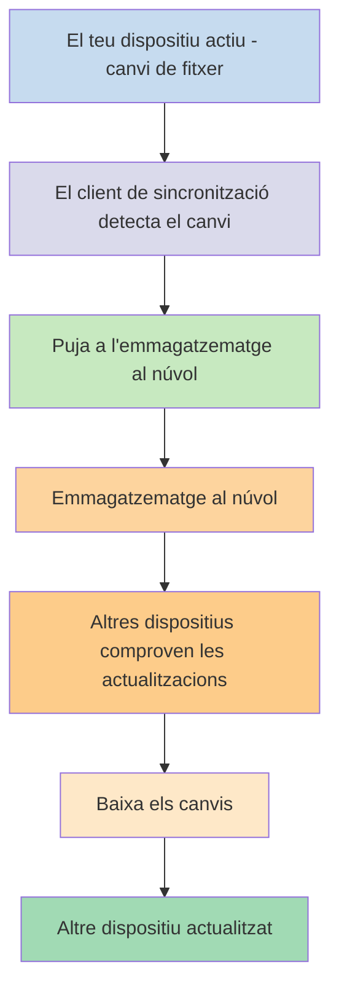
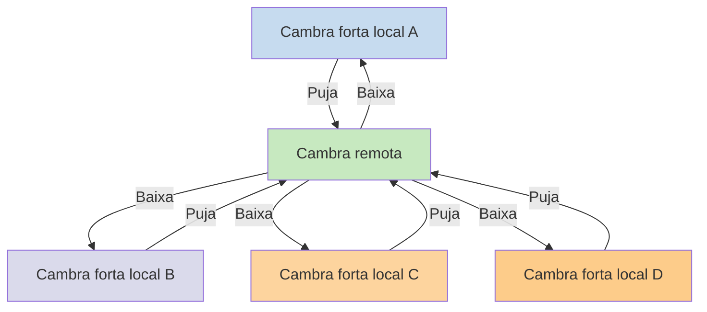

Si vols utilitzar les teves notes en dispositius diferents, una de les opcions que tens és [[Sincronitza les teves notes entre dispositius]]. Obsidian ofereix un servei d'aquest tipus, [[Introducció a Obsidian Sync|Obsidian Sync]], que funciona de manera diferent a altres serveis de sincronització, com [[Sincronitza les teves notes entre dispositius#iCloud|iCloud]] i [[Sincronitza les teves notes entre dispositius#OneDrive|OneDrive]].

Aquí tens alguns termes clau:

- Una **cambra forta** és una carpeta al teu sistema de fitxers que conté notes i una carpeta `.obsidian` amb la configuració específica d'Obsidian.
- Una **cambra forta local** és la còpia de la teva cambra forta que existeix a cadascun dels teus dispositius. Quan utilitzes serveis de sincronització, connectes aquestes cambres fortes locals per habilitar la sincronització.
- Una **cambra remota** és un emmagatzematge centralitzat al qual les cambres fortes locals es connecten directament a través d'Obsidian Sync.

Hi ha dues aproximacions comunes per a la sincronització:

- **[[#Serveis de sincronització basats en fitxers]]**: Les cambres fortes locals han d'estar en carpetes monitoritzades, la sincronització passa a través del sistema de fitxers
- **[[#Obsidian Sync|Cambres remotes]]**: Emmagatzematge centralitzat al qual les cambres fortes locals es connecten directament a través d'Obsidian

## Serveis de sincronització basats en fitxers

Serveis com Dropbox, Google Drive, iCloud i OneDrive es basen en carpetes. Aquests serveis monitoritzen carpetes específiques i sincronitzen automàticament qualsevol fitxer ubicat dins d'elles. Els fitxers han d'estar a les carpetes designades del servei al núvol per sincronitzar-se. Amb els serveis de sincronització basats en fitxers, la teva cambra forta local actua simplement com una carpeta més que està sent monitoritzada. No hi ha una cambra remota dedicada; en lloc d'això, l'emmagatzematge al núvol serveix com a passarel·la, copiant fitxers entre cambres fortes locals en dispositius diferents.

El diagrama de sota mostra una versió simplificada de com funcionen aquests serveis:

Si el servei al núvol té sincronització en segon pla, alguns d'aquests processos poden estar passant fins i tot quan no estàs utilitzant activament les aplicacions per veure els fitxers. Aquests serveis monitoritzen carpetes específiques i sincronitzen automàticament qualsevol fitxer ubicat dins d'elles. Els fitxers han d'estar a les carpetes designades del servei al núvol per sincronitzar-se.

## Obsidian Sync

Obsidian Sync et permet crear una cambra remota que serveix com a emmagatzematge centralitzat a través del seu servei [[Introducció a Obsidian Sync|Obsidian Sync]]. Això et permet escollir gairebé qualsevol carpeta en qualsevol dels teus dispositius per emmagatzemar els teus fitxers, ja sigui en un disc dur extern, a `C:\`, o a l'emmagatzematge de l'aplicació a Android.

No obstant això, tenim una llista d'ubicacions recomanades per a la teva cambra forta local si també utilitzes [[#Serveis de sincronització basats en fitxers]] al mateix dispositiu; principalment, qualsevol lloc que no estigui dins d'un [[Canviar a Obsidian Sync#Mou la teva cambra forta fora del servei de sincronització de tercers o emmagatzematge al núvol|servei de sincronització de tercers]].

El diagrama de sota mostra una versió simplificada de com funciona Obsidian Sync:

La força d'aquest sistema es fa més evident amb més tipus de dispositius. Els [[#Serveis de sincronització basats en fitxers]] poden ser implementats de manera inconsistent entre sistemes operatius, i els dispositius mòbils tenen les seves pròpies regles sobre com les aplicacions poden ser aïllades i limitades en energia, cosa que fa molt més difícil que els serveis tradicionals basats en fitxers funcionin sense problemes.

Amb Obsidian Sync, el servei gestiona la sincronització directament a través de l'aplicació, proporcionant un comportament consistent independentment del tipus de dispositiu o les limitacions del sistema operatiu, mentre prioritza mantenir una còpia local de les teves dades com una [[Fes còpia de seguretat dels fitxers d'Obsidian|còpia de seguretat lleugera]].

### Comportament de sincronització

Quan fas canvis als fitxers de la teva cambra forta local, Obsidian Sync detecta aquests canvis i els puja a la cambra remota. Altres dispositius connectats a la mateixa cambra remota baixaran llavors aquests canvis i els aplicaran a les seves cambres fortes locals. Obsidian Sync segueix els canvis a nivell de fitxer i només transfereix els fitxers que han estat modificats, en lloc de sincronitzar carpetes senceres. Això redueix l'ús d'amplada de banda i el temps de sincronització.

Quan es produeixen conflictes o quan necessites controlar quins fitxers es sincronitzen, Obsidian Sync proporciona mecanismes específics per gestionar aquestes situacions:

![[Resolució de problemes d'Obsidian Sync#Resolució de conflictes|Resolució de conflictes]]

![[Configuració de Sync i sincronització selectiva#Sincronització selectiva#Exclou una carpeta de la sincronització]]

### Comportament fora de línia

Els canvis fets mentre estàs fora de línia es posen en cua i es sincronitzen automàticament quan el teu dispositiu es reconnecta a internet i Obsidian està obert. La teva cambra forta local segueix sent completament funcional durant els períodes fora de línia.

## Passos següents

- [[Configurar Obsidian Sync]] per començar amb les cambres remotes.
- [[Canviar a Obsidian Sync]] si actualment utilitzes sincronització basada en fitxers i vols utilitzar Obsidian Sync.
- [[Sincronitza les teves notes entre dispositius|Explora altres opcions de sincronització]] si encara estàs decidint.
