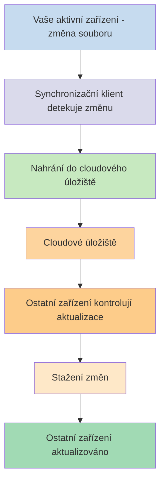
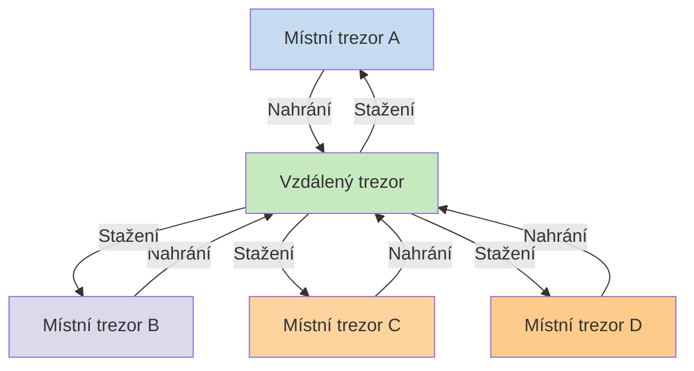

Pokud chcete používat své poznámky na různých zařízeních, jednou z možností je [[Synchronizace poznámek mezi zařízeními]]. Obsidian nabízí vlastní službu, [[Úvod do Obsidian Sync|Obsidian Sync]], která funguje odlišně od jiných synchronizačních služeb, jako jsou [[Synchronizace poznámek mezi zařízeními#iCloud|iCloud]] a [[Synchronizace poznámek mezi zařízeními#OneDrive|OneDrive]].

Zde jsou některé klíčové pojmy:

- **Trezor** je složka ve vašem souborovém systému, která obsahuje poznámky a složku `.obsidian` s konfigurací specifickou pro Obsidian.
- **Místní trezor** je kopie vašeho trezoru, která existuje na každém z vašich zařízení. Při používání synchronizačních služeb propojujete tyto místní trezory, aby byla umožněna synchronizace.
- **Vzdálený trezor** je centralizované úložiště, ke kterému se místní trezory připojují přímo prostřednictvím Obsidian Sync.

Existují dva běžné přístupy k synchronizaci:

- **[[#Souborové synchronizační služby]]**: Místní trezory musí být v monitorovaných složkách, synchronizace probíhá přes souborový systém
- **[[#Obsidian Sync|Vzdálené trezory]]**: Centralizované úložiště, ke kterému se místní trezory připojují přímo prostřednictvím Obsidian

## Souborové synchronizační služby

Služby jako Dropbox, Google Drive, iCloud a OneDrive jsou založené na složkách. Tyto služby monitorují konkrétní složky a automaticky synchronizují veškeré soubory, které do nich umístíte. Soubory musí být v určených složkách cloudové služby, aby se mohly synchronizovat. U souborových synchronizačních služeb váš místní trezor funguje jako další monitorovaná složka. Neexistuje žádný vyhrazený vzdálený trezor – místo toho cloudové úložiště slouží jako prostředník, který kopíruje soubory mezi místními trezory na různých zařízeních.

Níže uvedený diagram ukazuje zjednodušenou verzi fungování těchto služeb:

Pokud cloudová služba podporuje synchronizaci na pozadí, některé z těchto procesů mohou probíhat i tehdy, když aplikace k prohlížení souborů aktivně nepoužíváte. Tyto služby monitorují konkrétní složky a automaticky synchronizují veškeré soubory, které do nich umístíte. Soubory musí být v určených složkách cloudové služby, aby se mohly synchronizovat.

## Obsidian Sync

Obsidian Sync vám umožňuje vytvořit vzdálený trezor, který slouží jako centralizované úložiště prostřednictvím služby [[Úvod do Obsidian Sync|Obsidian Sync]]. To vám umožňuje zvolit téměř jakoukoli složku na jakémkoli z vašich zařízení pro ukládání souborů – ať už na externím pevném disku, v `C:\`, nebo v úložišti aplikace na Androidu.

Máme však seznam doporučených umístění pro váš místní trezor, pokud na stejném zařízení používáte také [[#Souborové synchronizační služby]] – především kdekoli, kde se nenachází [[Přechod na Obsidian Sync#Přesuňte svůj trezor mimo synchronizační službu třetí strany nebo cloudové úložiště|synchronizační služba třetí strany]].

Níže uvedený diagram ukazuje zjednodušenou verzi fungování Obsidian Sync:

Síla tohoto systému se stává zřejmější s větším počtem typů zařízení. [[#Souborové synchronizační služby]] mohou být na různých operačních systémech implementovány nekonzistentně a mobilní zařízení mají vlastní pravidla ohledně sandboxingu aplikací a omezení spotřeby energie, což tradičním souborovým službám značně ztěžuje bezproblémové fungování.

S Obsidian Sync služba zajišťuje synchronizaci přímo prostřednictvím aplikace, čímž poskytuje konzistentní chování bez ohledu na typ zařízení nebo omezení operačního systému, a zároveň upřednostňuje uchovávání místní kopie vašich dat jako [[Zálohování souborů Obsidian|měkké zálohy]].

### Chování synchronizace

Když provedete změny souborů ve svém místním trezoru, Obsidian Sync tyto změny detekuje a nahraje je do vzdáleného trezoru. Ostatní zařízení připojená ke stejnému vzdálenému trezoru poté tyto změny stáhnou a aplikují je na své místní trezory. Obsidian Sync sleduje změny na úrovni souborů a přenáší pouze soubory, které byly upraveny, místo synchronizace celých složek. To snižuje využití šířky pásma a dobu synchronizace.

Když dojde ke konfliktům nebo když potřebujete řídit, které soubory se synchronizují, Obsidian Sync poskytuje specifické mechanismy pro řešení těchto situací:

![[Řešení problémů s Obsidian Sync#Řešení konfliktů|Řešení konfliktů]]

![[Nastavení Sync a selektivní synchronizace#Selektivní synchronizace#Vyloučit složku ze synchronizace]]

### Chování offline

Změny provedené offline jsou zařazeny do fronty a automaticky se synchronizují, jakmile se vaše zařízení znovu připojí k internetu a Obsidian je otevřený. Váš místní trezor zůstává plně funkční během období bez připojení.

## Další kroky

- [[Nastavení Obsidian Sync]] pro začátek s vzdálenými trezory.
- [[Přechod na Obsidian Sync]], pokud aktuálně používáte souborovou synchronizaci a chcete přejít na Obsidian Sync.
- [[Synchronizace poznámek mezi zařízeními|Prozkoumejte další možnosti synchronizace]], pokud se stále rozhodujete.
