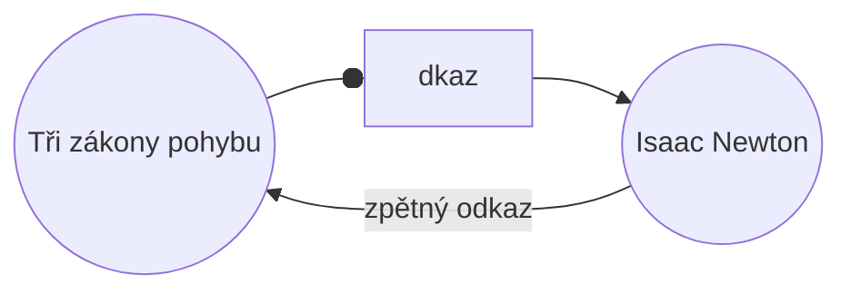

S pluginem [[Základní pluginy|Zpětné odkazy]] můžete zobrazit všechny _zpětné odkazy_ pro aktivní poznámku.

Zpětný odkaz pro poznámku je odkaz z jiné poznámky na danou poznámku. V následujícím příkladu poznámka „Tři zákony pohybu" obsahuje odkaz na poznámku „Isaac Newton". Odpovídající zpětný odkaz by vedl od „Isaac Newton" zpět na „Tři zákony pohybu".

Zpětné odkazy mohou být užitečné k nalezení poznámek, které odkazují na poznámku, kterou právě píšete. Jen si představte, že byste mohli vypsat zpětné odkazy pro jakoukoliv webovou stránku na internetu.

## Zobrazení zpětných odkazů

Plugin Zpětné odkazy zobrazuje zpětné odkazy pro aktivní karty. Existují dvě sbalitelné sekce: **Propojené zmínky** a **Neodkazované zmínky**.

- **Propojené zmínky** jsou zpětné odkazy na poznámky, které obsahují interní odkaz na aktivní poznámku.
- **Neodkazované zmínky** jsou zpětné odkazy na jakýkoliv neodkazovaný výskyt názvu aktivní poznámky.

Nabízí následující možnosti:

- **Sbalit výsledky** přepíná, zda se má každá poznámka rozbalit a zobrazit zmínky v ní.
- **Zobrazit více kontextu** přepíná, zda se má zkrátit nebo zobrazit celý odstavec obsahující zmínku.
- **Změnit pořadí řazení** určuje, jak seřadit zmínky.
- **Zobrazit filtr hledání** přepíná textové pole, které umožňuje filtrovat zmínky. Další informace o tom, jak sestavit vyhledávací výraz, naleznete v části [[Hledat]].

## Zobrazení zpětných odkazů pro poznámku

Pro zobrazení zpětných odkazů aktivní poznámky klikněte na kartu **Zpětné odkazy** ![[obsidian-icon-links-coming-in.svg#icon]] v pravém postranním panelu.

> [!note] Poznámka
> Pokud kartu Zpětné odkazy nevidíte, můžete ji zviditelnit otevřením [[Paleta příkazů|palety příkazů]] a spuštěním příkazu **Zpětné odkazy: Zobrazovat zpáteční odkazy**.

> [!info] Vyloučené soubory
> Soubory odpovídající vzorům [[Nastavení#Vyloučené soubory|Vyloučených souborů]] se nebudou zobrazovat v Neodkazovaných zmínkách.

## Zobrazení zpětných odkazů konkrétní poznámky

Karta zpětných odkazů zobrazuje zpětné odkazy pro aktivní poznámku a aktualizuje se, když přepnete na jinou poznámku. Pokud chcete zobrazit zpětné odkazy pro konkrétní poznámku bez ohledu na to, zda je aktivní nebo ne, můžete otevřít _propojenou_ kartu zpětných odkazů.

Pro otevření propojené karty zpětných odkazů:

1. Otevřete [[Paleta příkazů|paletu příkazů]].
2. Vyberte **Zpětné odkazy: Otevřít zpětné odkazy současného souboru**.

Vedle vaší aktivní poznámky se otevře samostatná karta. Karta zobrazuje ikonu odkazu, abyste věděli, že je propojena s poznámkou.

## Zobrazení zpětných odkazů v poznámce

Namísto zobrazení zpětných odkazů v samostatné kartě můžete zpětné odkazy zobrazit na konci poznámky.

Pro zobrazení zpětných odkazů v poznámce:

1. Otevřete [[Paleta příkazů|paletu příkazů]].
2. Vyberte **Zpětné odkazy: Přepnout zpětné odkazy v dokumentu**.

Nebo zapněte **Zpětné odkazy v dokumentu** v nastavení pluginu Zpětné odkazy, aby se zpětné odkazy automaticky přepínaly při otevření nové poznámky.
