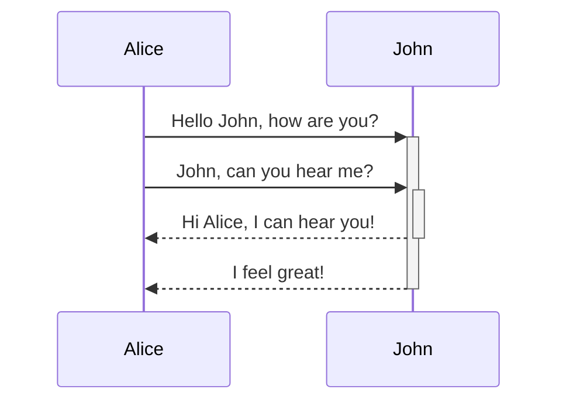
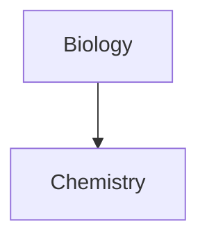

Naučte se přidávat do poznámek pokročilé formátování.

## Tabulky

Tabulky můžete vytvářet pomocí svislých čar (`|`) k oddělení sloupců a pomlček (`-`) k definování záhlaví. Zde je příklad:

```md
| Jméno | Příjmení |
| ---------- | --------- |
| Max        | Planck    |
| Marie      | Curie     |
```

| Jméno | Příjmení |
| ---------- | --------- |
| Max        | Planck    |
| Marie      | Curie     |

Ačkoli svislé čáry na obou stranách tabulky jsou volitelné, pro lepší čitelnost se doporučuje je uvádět.

> [!tip] V _živém náhledu_ můžete kliknutím pravým tlačítkem na tabulku přidávat nebo mazat sloupce a řádky. Pomocí kontextového menu je můžete také řadit a přesouvat.

Tabulku můžete vložit příkazem **Vložit tabulku** z [[Paleta příkazů|Palety příkazů]] nebo kliknutím pravým tlačítkem a výběrem _Vložit → Tabulka_. Tím získáte základní upravitelnou tabulku:

```md
|     |     |
| --- | --- |
|     |     |
```

Buňky nemusí být dokonale zarovnané, ale řádek záhlaví musí obsahovat alespoň dvě pomlčky:

```md
Jméno | Příjmení
-- | --
Max | Planck
Marie | Curie
```


### Formátování obsahu v tabulce

K úpravě stylu obsahu v tabulce můžete použít [[Základní syntaxe formátování|základní syntaxi formátování]].

| První sloupec       | Druhý sloupec                           |
| ------------------ | --------------------------------------- |
| [[Interní odkazy]] | Odkaz na soubor _uvnitř_ vašeho **trezoru**. |
| [[Vkládání souborů]]    | ![[Engelbart.jpg\|100]]                 |

> [!note] Svislé čáry v tabulkách
> Pokud chcete použít [[Aliasy|aliasy]] nebo [[Základní syntaxe formátování#Externí obrázky|změnit velikost obrázku]] v tabulce, musíte před svislou čáru přidat `\`.
>
> ```md
> První sloupec | Druhý sloupec
> -- | --
> [[Základní syntaxe formátování\|Markdown syntaxe]] | ![[Engelbart.jpg\|200]]
> ```
>
> První sloupec | Druhý sloupec
> -- | --
> [[Základní syntaxe formátování\|Markdown syntaxe]] | ![[Engelbart.jpg\|200]]

Text ve sloupcích zarovnáte přidáním dvojteček (`:`) do řádku záhlaví. Obsah můžete zarovnat také v _živém náhledu_ pomocí kontextového menu.

```md
Text zarovnaný vlevo | Text zarovnaný na střed | Text zarovnaný vpravo
:-- | :--: | --:
Obsah | Obsah | Obsah
```

Text zarovnaný vlevo | Text zarovnaný na střed | Text zarovnaný vpravo
:-- | :--: | --:
Obsah | Obsah | Obsah

## Diagramy

Do poznámek můžete přidávat diagramy a grafy pomocí [Mermaid](https://mermaid-js.github.io/). Mermaid podporuje řadu diagramů, jako jsou [vývojové diagramy](https://mermaid.js.org/syntax/flowchart.html), [sekvenční diagramy](https://mermaid.js.org/syntax/sequenceDiagram.html) a [časové osy](https://mermaid.js.org/syntax/timeline.html).

> [!tip] Tip
> Můžete také vyzkoušet [živý editor](https://mermaid-js.github.io/mermaid-live-editor) Mermaid, který vám pomůže vytvořit diagramy předtím, než je vložíte do poznámek.

Pro přidání diagramu Mermaid vytvořte [[Základní syntaxe formátování#Bloky kódu|blok kódu]] `mermaid`.

````md

````


````md

````


### Odkazování na soubory v diagramu

V diagramech můžete vytvářet [[Interní odkazy|interní odkazy]] připojením [třídy](https://mermaid.js.org/syntax/flowchart.html#classes) `internal-link` k vašim uzlům.

````md

````


> [!note] Poznámka
> Interní odkazy z diagramů se nezobrazují v [[Graf|zobrazení grafu]].

Pokud máte v diagramech mnoho uzlů, můžete použít následující úryvek.

````md

````

Tímto způsobem se každý uzel s písmenem stane interním odkazem, kde [text uzlu](https://mermaid.js.org/syntax/flowchart.html#a-node-with-text) slouží jako text odkazu.

> [!note] Poznámka
> Pokud v názvech poznámek používáte speciální znaky, musíte název poznámky uzavřít do dvojitých uvozovek.
>
> ```
> class "⨳ special character" internal-link
> ```
>
> Nebo `A["⨳ special character"]`.

Další informace o vytváření diagramů naleznete v [oficiální dokumentaci Mermaid](https://mermaid.js.org/intro/).

## Matematika

Do poznámek můžete přidávat matematické výrazy pomocí [MathJax](http://docs.mathjax.org/en/latest/basic/mathjax.html) a notace LaTeX.

Pro přidání výrazu MathJax do poznámky jej obklopte dvojitými znaky dolaru (`$$`).

```md
$$
\begin{vmatrix}a & b\\
c & d
\end{vmatrix}=ad-bc
$$
```

$$
\begin{vmatrix}a & b\\
c & d
\end{vmatrix}=ad-bc
$$

Matematické výrazy můžete také vkládat přímo do textu jejich uzavřením do znaků `$`.

```md
Toto je inline matematický výraz $e^{2i\pi} = 1$.
```

Toto je inline matematický výraz $e^{2i\pi} = 1$.

Další informace o syntaxi naleznete v [základním tutoriálu a rychlém přehledu MathJax](https://math.meta.stackexchange.com/questions/5020/mathjax-basic-tutorial-and-quick-reference).

Seznam podporovaných balíčků MathJax naleznete v [seznamu rozšíření TeX/LaTeX](http://docs.mathjax.org/en/latest/input/tex/extensions/index.html).
