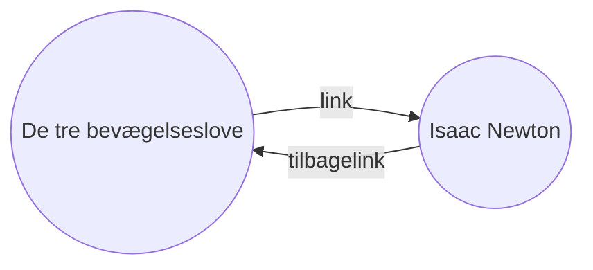

Med tilbagelinks pluginnet kan du se alle _tilbagelinks_ i det aktive dokument.

Et tilbagelink for en note er et link fra en anden note, som linker til noten. I det følgende eksempel indholder noten "De tre bevægelseslove" et link til noten "Isaac Newton". Det korresponderende tilbagelink linker fra noten "Isaac Newton" tilbage til noten "De tre bevægelseslove":

Tilbagelinks er brugbare til at finde noter, som refererer til den note du arbejder på. Forestil dig, hvis du kunne vise alle tilbagelinks for enhver webside på internettet!

## Tilbagelinks panelet

Du kan se alle tilbagelinks for den aktive note i _tilbagelinks panelet_. Tilbagelinks panelet har to sektioner, som kan sammenfoldes: **Linkede omtaler** og **Ikke-linkede omtaler**.

- **Linkede omtaler** er tilbagelinks til noter, som indeholder et link i indholdet til den aktive note
- **Ikke-linkede omtaler** er tilbagelinks til alle de steder i andre noter, hvor den aktive notes navn nævnes

Tilbagelinks panelet har følgende muligheder:

- **Sammenfold resultater** skifter mellem at vise omtalerne i hver note eller ej
- **Vis mere indhold** skifter mellem en forkortet visning af omtalen eller et helt afsnit indeholdende omtalen
- **Skift sorteringsrækkefølge** giver mulighed for at sortere omtalerne på forskellige måder
- **Vis søgefilter** åbner en tekstfelt, hvor du har mulighed for at filtrere omtaler. Få mere information som at skrive [[Søg|søgninger her]].

> [!tip]
> Hvis du ønsker at se tilbagelinks for flere noter på samme tid, kan du aktivere **Tilbagelinks i dokumenter** i indstillingerne for tilabgelinks pluginnet, så du kan se tilbagelinks i samme panel som din note.

## Vis tilbagelinks for en note

Du kan vise en aktiv notes tilbagelinks  med at klikke på **Tilbagelinks** (link med venstre pil ikonet) i det højre sidepanel.

> [!note]
> Hvis du ikke kan se tilbagelinks fanen, kan du gøre den synlig ved at åbne [[Kommandopalette|kommandopaletten]] og køre kommandoen: **Tilbagelinks: Vis tilbagelinks panel**
