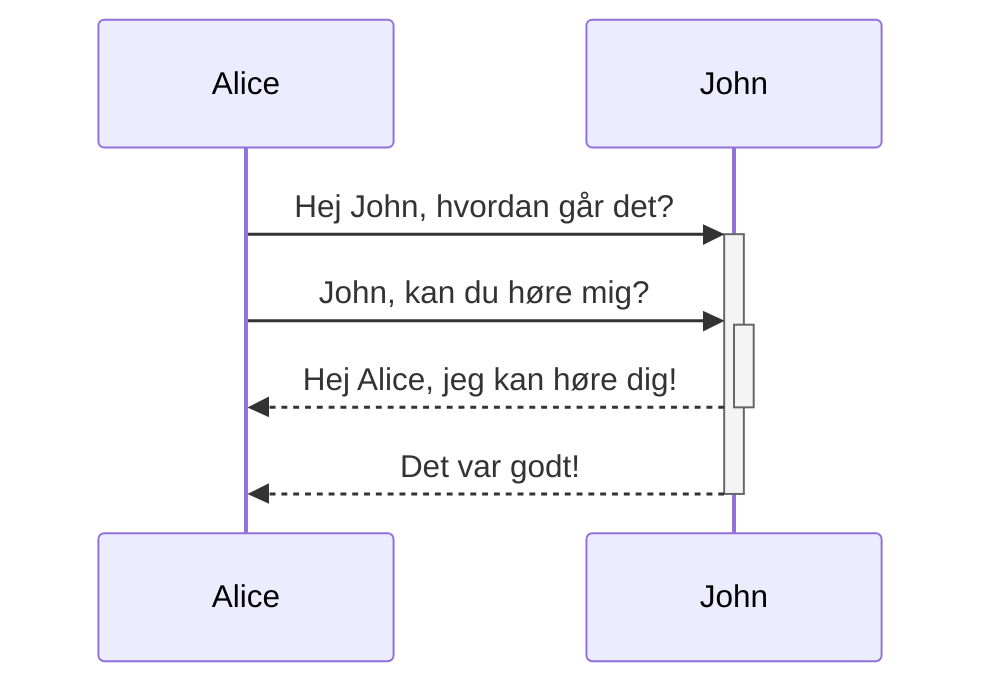
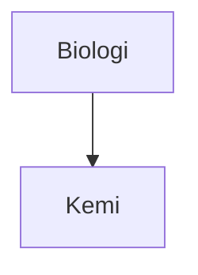

I denne guide kan du lære avanceret syntaks, som du kan anvende i dine noter.

## Tabeller

Du kan oprette tabeller ved at anvende lodrette streger (`|`) til at adskille kolonner og bindestreger (`-`) til at definere overskrifter. Her er et eksempel:

```md
| Fornavn    | Efternavn |
| ---------- | --------- |
| Max        | Planck    |
| Marie      | Curie     |
```

| Fornavn    | Efternavn |
| ---------- | --------- |
| Max        | Planck    |
| Marie      | Curie     |

De lodrette streger på begge sider af tabellen er valgfrie, men det er anbefales at anvende dem, så det er lettere at læse tabellen.

> [!tip] I _Forhåndvisningstilstand_, kan du højreklikke på en tabel for at tilføje eller slette kolonner og rækker. Dy kan også sortere- og flytte dem ved hjælp af kontekstmenuen.

Du kan indsætte en tabel ved at anvende **Indsæt tabel** kommandoen fra [[Kommandopaletten|kommandopaletten]] eller ved at højreklikke og vælge _Indsæt → Tabel_. Dette giver dig en basal redigerbar tabel:

```md
|     |     |
| --- | --- |
|     |     |
```

Bemærk at tabellerns celler ikke har brug for perfekt justering af lodrette streger eller bindestreger, men overskriftsrækken **skal** indeholde mindst to bindestreger:

```md
Fornavn | Efternavn
-- | --
Max | Planck
Marie | Curie
```

### Sådan formaterer du indhold i en tabel

Du kan anvende [[Grundlæggende formaterings syntaks|grundlæggende formaterings syntaks]] til ændre indholdets stil i en tabel.

| Første kolonne       | Anden kolonne                         |
| ------------------ | --------------------------------------- |
| [[Interne links]] | Link til en fil _i_ din **boks**. |
| [[Indlejr filer]]    | ![[Engelbart.jpg\|100]]                 |

> [!note] Lodrette streger i tabeller
> Hvis du vil anvende [[Aliaser|aliaser]] eller [[Grundlæggende formaterings syntaks#Eksterne billeder|justere størrelsen på et billede]], så skal du tilføje et `\` før den lodrette streg.
>
> ```md
> Første kolonne | Anden kolonne
> -- | --
> [[Grundlæggende formaterings syntaks\|Markdown syntaks]] | ![[Engelbart.jpg\|200]]
> ```
>
> Første kolonne | Anden kolonne
> -- | --
> [[Grundlæggende formaterings syntaks\|Markdown syntaks]] | ![[Engelbart.jpg\|200]]

Du kan justere teksten i kolonner ved at tilføje kolonner (`:`) til overskriftsrækken. Du kan også justere indholdet i _Forhåndsvisningstilstand_ via kontekstmenuen.

```md
Venstre justeret tekst | Center justeret tekst | Højre justeret tekst
:-- | :--: | --:
Indhold | Indhold | Indhold
```

Venstre justeret tekst | Center justeret tekst | Højre justeret tekst
:-- | :--: | --:
Indhold | Indhold | Indhold

## Diagrammer

Du kan tilføje diagrammer til dine noter ved at anvende [Mermaid](https://mermaid-js.github.io/). Mermaid supporterer en række diagrammer, såsom [flowdiagrammer](https://mermaid.js.org/syntax/flowchart.html), [sekvensdiagrammer](https://mermaid.js.org/syntax/sequenceDiagram.html), og [tidslinjer](https://mermaid.js.org/syntax/timeline.html).

> [!tip]
> Du kan også anvende Mermaids [Live Editor](https://mermaid-js.github.io/mermaid-live-editor) som hjælp til at lave diagrammer for du inkluderer dem i dine noter.

For at oprette et Mermaid diagram skal du tilføje en `mermaid` [[Grundlæggende formaterings syntaks#Kodeblokke|kodeblok]].

````md

````


````md

````


### Sådan anvender du links i diagrammer

Du kan anvende [[Interne links|interne links]] i dine diagrammer ved at tilføje [klassen](https://mermaid.js.org/syntax/flowchart.html#classes) `internal-link` til dine noter.

````md

````


> [!note]
> Interne links i diagrammer bliver ikke vist i [[Grafvisning|grafvisning]].

Du kan anvende følgende kodestykke, hvis du har mange noder i dit diagram:

````md

````

På den måde bliver hver bogstav et internt link med [node teksten](https://mermaid.js.org/syntax/flowchart.html#a-node-with-text) som linktekst.

> [!note]
> Du skal skrive navnet med anførselstegn (`":"`), hvis du anvender specialkarakterer i dine notenavne.
>
> ```
> class "⨳ specialkarakter" internal-link
> ```
>
> Eller, `A["⨳ specialkarakter"]`.

Du kan læse mere om diagrammer i den [officielle Mermaid dokumentation](https://mermaid.js.org/intro/).

## Matematik

Du kan tilføje matematiske udtryk i dine noter ved at anvende [MathJax](http://docs.mathjax.org/en/latest/basic/mathjax.html) og LaTeX notation.

For at tilføje matematisk udtryk til en note, skal du starte og slutte med dobbeltdollar tegn (`$$`).

```md
$$
\begin{vmatrix}a & b\\
c & d
\end{vmatrix}=ad-bc
$$
```

$$
\begin{vmatrix}a & b\\
c & d
\end{vmatrix}=ad-bc
$$

Du kan også indlejre matematiske udtryk ved at skrive det mellem to `$` symboler.

```md
Dette er et indlejret matematisk udtryk $e^{2i\pi} = 1$.
```

Dette er et indlejret matematisk udtryk $e^{2i\pi} = 1$.

Du kan læse mere om MathJax i guiden: [MathJax basic tutorial and quick reference](https://math.meta.stackexchange.com/questions/5020/mathjax-basic-tutorial-and-quick-reference).

Læs guiden: [The TeX/LaTeX Extension List](http://docs.mathjax.org/en/latest/input/tex/extensions/index.html) for at få information om understøttede MathJax pakker.
