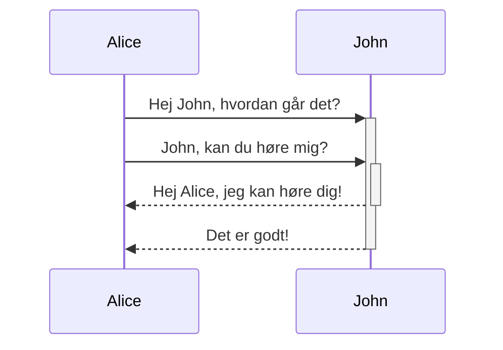

Obsidian er en Markdown baseret notetagnings- og videnbaseapplikation.

Vi supporterer for nuværende følgende formatering:

---

### Intern linking

```md
Link til side: [[Internt link]].
```

Link til side: [[Interne links]].

---

### Indlejringer

Indlejr en anden fil (Læs mere om at [[Indlejre filer]]). Her er en indlejret sektion:


```md
![[Obsidian#Hvad er Obsidian]]
```

![[Obsidian#Hvad er Obsidian]]

---

### Overskrifter

```md
# Dette er overskrift niveau 1
## Dette er overskrift niveau 2
### Dette er overskrift niveau 3 
#### Dette er overskrift niveau 4
##### Dette er overskrift niveau 5
###### Dette er overskrift niveau 6
```

# Dette er overskrift niveau  1
## Dette er overskrift niveau  2
### Dette er overskrift niveau  3 
#### Dette er overskrift niveau  4
##### Dette er overskrift niveau  5
###### Dette er overskrift niveau  6

---

### Fremhævning

```md
*Denne tekst vil stå med kursiv skrift*
_Denne tekst vil også stå med kursiv skrift_
```

*Denne tekst vil stå med kursiv skrift*
_Denne tekst vil også stå med kursiv skrift_

```md
**Denne tekst vil stå med fed skrift**
__Denne tekst vil også stå med fed skrift__
```

**Denne tekst vil stå med fed skrift**
__Denne tekst vil også stå med fed skrift__

```md
_Du **kan** kombinere dem_
```

_Du **kan** kombinere dem_

---

### Lister

```md
- Element 1
- Element 2
  - Element 2a
  - Element 2b

1. Element 1
1. Element 2
1. Element 3
   1. Element 3a
   1. Element 3b
```

- Element 1
- Element 2
  - Element 2a
  - Element 2b

1. Element 1
1. Element 2
1. Element 3
   1. Element 3a
   1. Element 3b

--- 

### billeder

```md

```


#### Tilpas billedstørrelsen

Her er et eksempel p ovenstående billede ændret til 100 pixel bred.

```md

```


---

### Links

#### Eksterne links

Du kan anvende Markdown links til at referere alle slags eksterne objekter, så som websider, eller en intern side eller et billede.

```md
https://obsidian.md - automatisk!
[Obsidian](https://obsidian.md)
```

https://obsidian.md - automatic!
[Obsidian](https://obsidian.md)

#### Obsidian URI links

[[Brug af obsidian URI|Obsidian URI]] links kan benyttes til at åbne noter i Obsidian fra en anden obsidian boks eller et andet program.

Du kan f.eks. lave et link til en fil i en boks sådan (Bemærk at [[Brug af obsidian URI#Encoding|en speciel kodning ]] er påkrævet):

```md
[Link til note](obsidian://open?path=D:%2Fsti%2Ftil%2Ffil.md)
```

[Link til note](obsidian://open?path=D:%2Fsti%2Ftil%2Ffil.md)

Du kan også linke til en note ved at benytte boksnavnet og filnavnet i stedet for stien:

```md
[Link til note](obsidian://open?vault=MinBoks&file=MinNote.md)
```

[Link til note](obsidian://open?vault=MinBoks&file=MinNote.md)

#### Mellemrums erstatning

Hvis der er mellemrum i en url, kan de erstattes ved enten at benytte `%20` som et mellemrum, som f.eks.:

```md
[Eksport indstillinger](Indsat%20billede)
```

[Eksport indstillinger](Indsat%20billede)

Eller du kan omslutte url'en med `<>`, som f.eks.:

```md
[Slide Demo](<Slide Demo>)
```

[Slide demo](Slide%20demo.md Demo>)

---

### Blokcitater

```md
> Human beings face ever more complex and urgent problems, and their effectiveness in dealing with these problems is a matter that is critical to the stability and continued progress of society.

\- Doug Engelbart, 1961
```

> Human beings face ever more complex and urgent problems, and their effectiveness in dealing with these problems is a matter that is critical to the stability and continued progress of society.

\- Doug Engelbart, 1961

---

### Inline-kode

```md
Tekst omsluttet af `accent grave` på en linje vil blive formatteret som kode.
```

Tekst omsluttet af `accent grave` på en linje vil blive formatteret som kode.

---

### Kodeblokke
Syntaks fremhævning for programmeringskode i et bestemt sprog er understøttet ved at angive det efter første sæt af accent graves. Vi benytter __prismjs__ til syntaktsfremhævning og en liste af understøttede programmeringssprog kan findes [på deres webside](https://prismjs.com/#supported-languages)

<pre><code>```js
function fancyAlert(arg) {
  if(arg) {
    $.facebox({div:'#foo'})
  }
}
```</code></pre>

```js
function fancyAlert(arg) {
  if(arg) {
    $.facebox({div:'#foo'})
  }
}
```
    
	
```md
	Tekst, der er indrykket med tabulator lige som her, vil også blive vist som en kodeblok i forhåndsvisning.
```

	Tekst, der er indrykket med tabulator lige som her, vil også blive vist som en kodeblok i forhåndsvisning.
    
---


### Opgaveliste

```md
- [x] #tags, [links](), og **formatering** er understøttet
- [x] der kræves listesyntaks (enhver uordnet eller ordnet liste er understøttet)
- [x] dette er et færdig opgavepunkt
- [ ] dette er et ufærdig opgavepunkt
- [ ] man kan skifte status på opgavepunkter i forhåndsvisning
```

- [x] #tags, [links](), og **formatering** er understøttet
- [x] der kræves listesyntaks (enhver uordnet eller ordnet liste er understøttet)
- [x] dette er et færdig opgavepunkt
- [ ] dette er et ufærdig opgavepunkt
- [ ] man kan skifte status på opgavepunkter i forhåndsvisning

---

### Tabeller

Du kan oprette tabeller ved at samle en liste af ord og opdele dem med bindestreger `-` (for den første række), og så separere hver kolonne med en lodret streg `|`:


```md
Første Overskrift | Anden Overskrift
------------ | ------------
Indhold i celle 1 | Indhold i celle 2
Indhold i den første kolonne | Indhold i den anden kolonne
```

Første Overskrift | Anden Overskrift
------------ | ------------
Indhold i celle 1 | Indhold i celle 2
Indhold i den første kolonne | Indhold i den anden kolonne

---

```md
Tabeller kan justeres med et kolon | Et andet eksempel med en lang titel
:----------------|-------------:
På grund af `:` | vil rækken blive justeret

```

Tabeller kan justeres med et kolon | Et andet eksempel med en lang titel
:----------------|-------------:
På grund af `:` | vil rækken blive justeret

Du kan anvende links i tabeller, men hvis du benytter lodret streg `|` i links skal den foranstilles med `\` for at forhindre, at den bliver læst som et tabelelement.

```md
Første overskrift | Anden overskrift
------------ | ------------
[[Arbejde med tags\|Tilladte tegn]]	|  [[Arbejde med flere bokse\|Flytning af indstillinger mellem bokse]]
```

Første overskrift | Anden overskrift
------------ | ------------
[[Arbejde med tags\|Tilladte tegn]]	|  [[Arbejde med flere bokse\|Flytning af indstillinger mellem bokse]]

---

### Gennemstreget

```md
Alle ord som er omsluttet af to tilder (som ~~dette~~) vil blive vist gennemstreget.
```

Alle ord som er omsluttet af to tilder (som ~~dette~~) vil blive vist gennemstreget.

---

### Fremhævning

```md
Benyt to lighedstegn for at ==fremhæve tekst==.
```

Benyt to lighedstegn for at ==fremhæve tekst==.

---

### Fodnoter

```md
Her er en simpel fodnote,[^1] og her er en længere en.[^langnote] 

[^1]: meningsfuld!

[^langnote]: Her er en fodnote med flere afsnit og kode.

    Indryk afsnit for at inkludere dem i fodnoten.

    `{ min kode }`

    Tilføj så mange afsnit, som du har lyst til.
```

Her er en simpel fodnote,[^1] og her er en længere en.[^langnote] 

[^1]: meningsfuld!

[^langnote]: Her er en fodnote med flere afsnit og kode.

    Indryk afsnit for at inkludere dem i fodnoten.

    `{ min kode }`

    Tilføj så mange afsnit, som du har lyst til.
	
	
```md
Du kan også benytte inline fodnoter. ^[bemærk at cirkumfleks tegnet står udenfor de firkantede paranteser.]
```

Du kan også benytte inline fodnoter. ^[bemærk at cirkumfleks tegnet står udenfor de firkantede paranteser.]

### Matematik

```md
$$\begin{vmatrix}a & b\\
c & d
\end{vmatrix}=ad-bc$$
```

$$\begin{vmatrix}a & b\\
c & d
\end{vmatrix}=ad-bc$$

Du kan også lave inline matematik som: $e^{2i\pi} = 1$ .

### Kommentarer

Benyt `%%` for at omslutte kommentarer, som vil blive læst som Markdown, men vil ikke blive vist i forhåndsvisning.up in the preview.

```md
Her er nogle indlejrede kommentarer: %%Du kan ikke se denne tekst%% (Kan ikke ses i forhåndsvisning)

Her er en blok kommentar:
%%
Den kan spænde over
flere linjer
%%
```

Her er nogle indlejrede kommentarer: %%Du kan ikke se denne tekst%% (Kan ikke ses i forhåndsvisning)

Her er en blok kommentar: (Kan heller ikke ses i forhåndsvisning)
%%
Den kan spænde over
flere linjer
%%

### Diagrammer
Obsidian benytter [Mermaid](https://mermaid-js.github.io/) til at gengive diagrammer og grafer. Mermaid har udbyder også [en hjælpsom live editor](https://mermaid-js.github.io/mermaid-live-editor).

<pre><code>```mermaid
sequenceDiagram
    Alice->>+John: Hej John, hvordan går det?
    Alice->>+John: John, kan du høre  mig?
    John-->>-Alice: Hej Alice, jeg kan høre dig!
    John-->>-Alice: Det er godt!
```</code></pre>



## Udvikler noter
Vi stræber efter den bedste kompabilitet uden at bryde eksisterende formater, derfor benytter vi en lidt uortodoks kombination af forskellige markdown formater. Det er stort set "CommonMark" med nogle funktionalitetstilføjelser fra "GitHub Flavored Markdown" (GFM), noget latex support, og vores egen indlejringssyntax, som du kan læse mere om under [[Accepterede filformater]].
