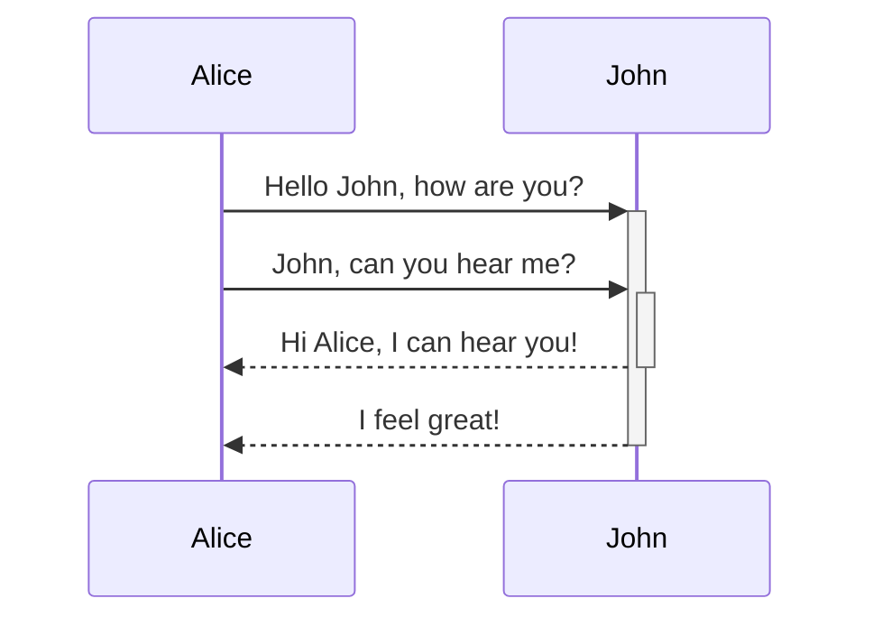
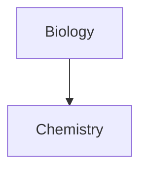

Erfahre, wie du erweiterte Formatierungssyntax zu deinen Notizen hinzufügen kannst.

## Tabellen

Du kannst Tabellen mithilfe von senkrechten Strichen (`|`) zur Spaltentrennung und Bindestrichen (`-`) zur Definition von Überschriften erstellen. Hier ein Beispiel:

```md
| Vorname | Nachname |
| ------- | -------- |
| Max     | Planck   |
| Marie   | Curie    |
```

| Vorname | Nachname |
| ------- | -------- |
| Max     | Planck   |
| Marie   | Curie    |

Die senkrechten Striche an beiden Seiten der Tabelle sind zwar optional, ihre Verwendung wird jedoch für die Lesbarkeit empfohlen.

> [!tip] In der _Live-Vorschau_ kannst du mit der rechten Maustaste auf eine Tabelle klicken, um Spalten und Zeilen hinzuzufügen oder zu löschen. Über das Kontextmenü kannst du diese auch sortieren und verschieben.

Du kannst eine Tabelle über den Befehl **Tabelle einfügen** aus der [[Befehlspalette]] oder per Rechtsklick und Auswahl von _Einfügen → Tabelle_ einfügen. Dadurch erhältst du eine einfache, bearbeitbare Tabelle:

```md
|     |     |
| --- | --- |
|     |     |
```

Beachte, dass die Zellen nicht perfekt ausgerichtet sein müssen, aber die Überschriftenzeile mindestens zwei Bindestriche enthalten muss:

```md
Vorname | Nachname
-- | --
Max | Planck
Marie | Curie
```


### Inhalte innerhalb einer Tabelle formatieren

Du kannst [[Grundlegende Formatierungssyntax|grundlegende Formatierungssyntax]] verwenden, um Inhalte innerhalb einer Tabelle zu gestalten.

| Erste Spalte                | Zweite Spalte                                       |
| --------------------------- | --------------------------------------------------- |
| [[Interne Links]]          | Link zu einer Datei _innerhalb_ deines **Vaults**. |
| [[Dateien einbetten]]       | ![[Engelbart.jpg\|100]]                             |

> [!note] Senkrechte Striche in Tabellen
> Wenn du [[Aliasse]] verwendest oder ein [[Grundlegende Formatierungssyntax#Externe Bilder|Bild vergrößern/verkleinern]] möchtest, musst du vor dem senkrechten Strich ein `\` einfügen.
>
> ```md
> Erste Spalte | Zweite Spalte
> -- | --
> [[Grundlegende Formatierungssyntax\|Markdown-Syntax]] | ![[Engelbart.jpg\|200]]
> ```
>
> Erste Spalte | Zweite Spalte
> -- | --
> [[Grundlegende Formatierungssyntax\|Markdown-Syntax]] | ![[Engelbart.jpg\|200]]

Richte Text in Spalten aus, indem du Doppelpunkte (`:`) zur Überschriftenzeile hinzufügst. Du kannst Inhalte auch in der _Live-Vorschau_ über das Kontextmenü ausrichten.

```md
Linksbündiger Text | Zentrierter Text | Rechtsbündiger Text
:-- | :--: | --:
Inhalt | Inhalt | Inhalt
```

Linksbündiger Text | Zentrierter Text | Rechtsbündiger Text
:-- | :--: | --:
Inhalt | Inhalt | Inhalt

## Diagramme

Du kannst deinen Notizen Diagramme und Grafiken hinzufügen, indem du [Mermaid](https://mermaid-js.github.io/) verwendest. Mermaid unterstützt verschiedene Diagrammtypen, wie [Flussdiagramme](https://mermaid.js.org/syntax/flowchart.html), [Sequenzdiagramme](https://mermaid.js.org/syntax/sequenceDiagram.html) und [Zeitleisten](https://mermaid.js.org/syntax/timeline.html).

> [!tip] Tipp
> Du kannst auch Mermaids [Live Editor](https://mermaid-js.github.io/mermaid-live-editor) ausprobieren, um Diagramme zu erstellen, bevor du sie in deine Notizen einfügst.

Um ein Mermaid-Diagramm hinzuzufügen, erstelle einen `mermaid`-[[Grundlegende Formatierungssyntax#Quelltext-Blöcke|Quelltext-Block]].

````md

````


````md

````


### Dateien in einem Diagramm verknüpfen

Du kannst [[Interne Links|interne Links]] in deinen Diagrammen erstellen, indem du deinen Knoten die `internal-link`-[Klasse](https://mermaid.js.org/syntax/flowchart.html#classes) zuweist.

````md

````


> [!note] Hinweis
> Interne Links aus Diagrammen werden nicht in der [[Graph-Ansicht]] angezeigt.

Wenn deine Diagramme viele Knoten enthalten, kannst du das folgende Snippet verwenden.

````md

````

Auf diese Weise wird jeder Buchstabenknoten zu einem internen Link, wobei der [Knotentext](https://mermaid.js.org/syntax/flowchart.html#a-node-with-text) als Linktext dient.

> [!note] Hinweis
> Wenn du Sonderzeichen in deinen Notiznamen verwendest, musst du den Notiznamen in doppelte Anführungszeichen setzen.
>
> ```
> class "⨳ special character" internal-link
> ```
>
> Oder: `A["⨳ special character"]`.

Weitere Informationen zum Erstellen von Diagrammen findest du in der [offiziellen Mermaid-Dokumentation](https://mermaid.js.org/intro/).

## Mathe

Du kannst deinen Notizen mathematische Ausdrücke hinzufügen, indem du [MathJax](http://docs.mathjax.org/en/latest/basic/mathjax.html) und die LaTeX-Notation verwendest.

Um einen MathJax-Ausdruck zu deiner Notiz hinzuzufügen, umschließe ihn mit doppelten Dollarzeichen (`$$`).

```md
$$
\begin{vmatrix}a & b\\
c & d
\end{vmatrix}=ad-bc
$$
```

$$
\begin{vmatrix}a & b\\
c & d
\end{vmatrix}=ad-bc
$$

Du kannst mathematische Ausdrücke auch inline einfügen, indem du sie mit `$`-Zeichen umschließt.

```md
Dies ist ein Inline-Matheausdruck $e^{2i\pi} = 1$.
```

Dies ist ein Inline-Matheausdruck $e^{2i\pi} = 1$.

Weitere Informationen zur Syntax findest du unter [MathJax basic tutorial and quick reference](https://math.meta.stackexchange.com/questions/5020/mathjax-basic-tutorial-and-quick-reference).

Eine Liste der unterstützten MathJax-Pakete findest du unter [The TeX/LaTeX Extension List](http://docs.mathjax.org/en/latest/input/tex/extensions/index.html).
