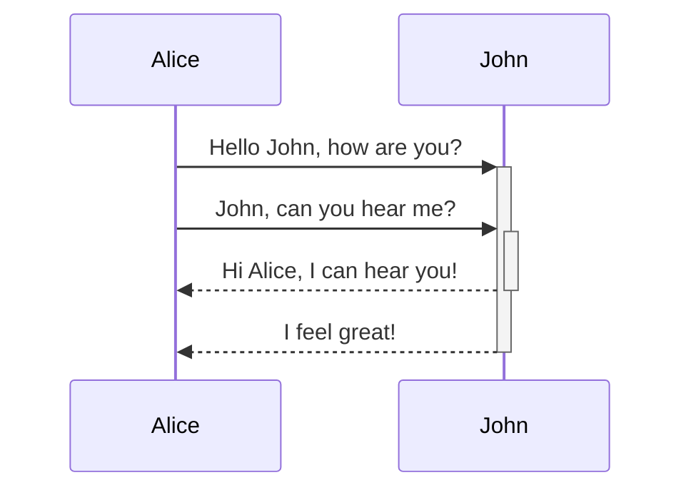
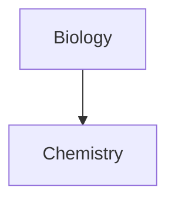

Erfahren Sie, wie Sie erweiterte Formatierungssyntax zu Ihren Notizen hinzufügen können.

## Tabellen

Sie können Tabellen mithilfe von senkrechten Strichen (`|`) zur Spaltentrennung und Bindestrichen (`-`) zur Definition von Überschriften erstellen. Hier ein Beispiel:

```md
| Vorname | Nachname |
| ------- | -------- |
| Max     | Planck   |
| Marie   | Curie    |
```

| Vorname | Nachname |
| ------- | -------- |
| Max     | Planck   |
| Marie   | Curie    |

Die senkrechten Striche an beiden Seiten der Tabelle sind zwar optional, ihre Verwendung wird jedoch für die Lesbarkeit empfohlen.

> [!tip] In der _Live-Vorschau_ können Sie mit der rechten Maustaste auf eine Tabelle klicken, um Spalten und Zeilen hinzuzufügen oder zu löschen. Über das Kontextmenü können Sie diese auch sortieren und verschieben.

Sie können eine Tabelle über den Befehl **Tabelle einfügen** aus der [[Befehlspalette]] oder per Rechtsklick und Auswahl von _Einfügen → Tabelle_ einfügen. Dadurch erhalten Sie eine einfache, bearbeitbare Tabelle:

```md
|     |     |
| --- | --- |
|     |     |
```

Beachten Sie, dass die Zellen nicht perfekt ausgerichtet sein müssen, aber die Überschriftenzeile mindestens zwei Bindestriche enthalten muss:

```md
Vorname | Nachname
-- | --
Max | Planck
Marie | Curie
```


### Inhalte innerhalb einer Tabelle formatieren

Sie können [[Grundlegende Formatierungssyntax|grundlegende Formatierungssyntax]] verwenden, um Inhalte innerhalb einer Tabelle zu gestalten.

| Erste Spalte                | Zweite Spalte                                       |
| --------------------------- | --------------------------------------------------- |
| [[Interne Links]]          | Link zu einer Datei _innerhalb_ Ihres **Vaults**. |
| [[Dateien einbetten]]       | ![[Engelbart.jpg\|100]]                             |

> [!note] Senkrechte Striche in Tabellen
> Wenn Sie [[Aliasse]] verwenden oder ein [[Grundlegende Formatierungssyntax#Externe Bilder|Bild vergrößern/verkleinern]] möchten, müssen Sie vor dem senkrechten Strich ein `\` einfügen.
>
> ```md
> Erste Spalte | Zweite Spalte
> -- | --
> [[Grundlegende Formatierungssyntax\|Markdown-Syntax]] | ![[Engelbart.jpg\|200]]
> ```
>
> Erste Spalte | Zweite Spalte
> -- | --
> [[Grundlegende Formatierungssyntax\|Markdown-Syntax]] | ![[Engelbart.jpg\|200]]

Richten Sie Text in Spalten aus, indem Sie Doppelpunkte (`:`) zur Überschriftenzeile hinzufügen. Sie können Inhalte auch in der _Live-Vorschau_ über das Kontextmenü ausrichten.

```md
Linksbündiger Text | Zentrierter Text | Rechtsbündiger Text
:-- | :--: | --:
Inhalt | Inhalt | Inhalt
```

Linksbündiger Text | Zentrierter Text | Rechtsbündiger Text
:-- | :--: | --:
Inhalt | Inhalt | Inhalt

## Diagramme

Sie können Ihren Notizen Diagramme und Grafiken hinzufügen, indem Sie [Mermaid](https://mermaid-js.github.io/) verwenden. Mermaid unterstützt verschiedene Diagrammtypen, wie [Flussdiagramme](https://mermaid.js.org/syntax/flowchart.html), [Sequenzdiagramme](https://mermaid.js.org/syntax/sequenceDiagram.html) und [Zeitleisten](https://mermaid.js.org/syntax/timeline.html).

> [!tip] Tipp
> Sie können auch Mermaids [Live Editor](https://mermaid-js.github.io/mermaid-live-editor) ausprobieren, um Diagramme zu erstellen, bevor Sie sie in Ihre Notizen einfügen.

Um ein Mermaid-Diagramm hinzuzufügen, erstellen Sie einen `mermaid`-[[Grundlegende Formatierungssyntax#Quelltext-Blöcke|Quelltext-Block]].

````md

````


````md

````


### Dateien in einem Diagramm verknüpfen

Sie können [[Interne Links|interne Links]] in Ihren Diagrammen erstellen, indem Sie Ihren Knoten die `internal-link`-[Klasse](https://mermaid.js.org/syntax/flowchart.html#classes) zuweisen.

````md

````


> [!note] Hinweis
> Interne Links aus Diagrammen werden nicht in der [[Graph-Ansicht]] angezeigt.

Wenn Ihre Diagramme viele Knoten enthalten, können Sie das folgende Snippet verwenden.

````md

````

Auf diese Weise wird jeder Buchstabenknoten zu einem internen Link, wobei der [Knotentext](https://mermaid.js.org/syntax/flowchart.html#a-node-with-text) als Linktext dient.

> [!note] Hinweis
> Wenn Sie Sonderzeichen in Ihren Notiznamen verwenden, müssen Sie den Notiznamen in doppelte Anführungszeichen setzen.
>
> ```
> class "⨳ special character" internal-link
> ```
>
> Oder: `A["⨳ special character"]`.

Weitere Informationen zum Erstellen von Diagrammen finden Sie in der [offiziellen Mermaid-Dokumentation](https://mermaid.js.org/intro/).

## Mathe

Sie können Ihren Notizen mathematische Ausdrücke hinzufügen, indem Sie [MathJax](http://docs.mathjax.org/en/latest/basic/mathjax.html) und die LaTeX-Notation verwenden.

Um einen MathJax-Ausdruck zu Ihrer Notiz hinzuzufügen, umschließen Sie ihn mit doppelten Dollarzeichen (`$$`).

```md
$$
\begin{vmatrix}a & b\\
c & d
\end{vmatrix}=ad-bc
$$
```

$$
\begin{vmatrix}a & b\\
c & d
\end{vmatrix}=ad-bc
$$

Sie können mathematische Ausdrücke auch inline einfügen, indem Sie sie mit `$`-Zeichen umschließen.

```md
Dies ist ein Inline-Matheausdruck $e^{2i\pi} = 1$.
```

Dies ist ein Inline-Matheausdruck $e^{2i\pi} = 1$.

Weitere Informationen zur Syntax finden Sie unter [MathJax basic tutorial and quick reference](https://math.meta.stackexchange.com/questions/5020/mathjax-basic-tutorial-and-quick-reference).

Eine Liste der unterstützten MathJax-Pakete finden Sie unter [The TeX/LaTeX Extension List](http://docs.mathjax.org/en/latest/input/tex/extensions/index.html).
