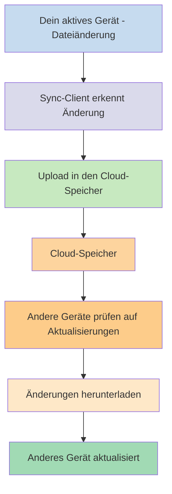
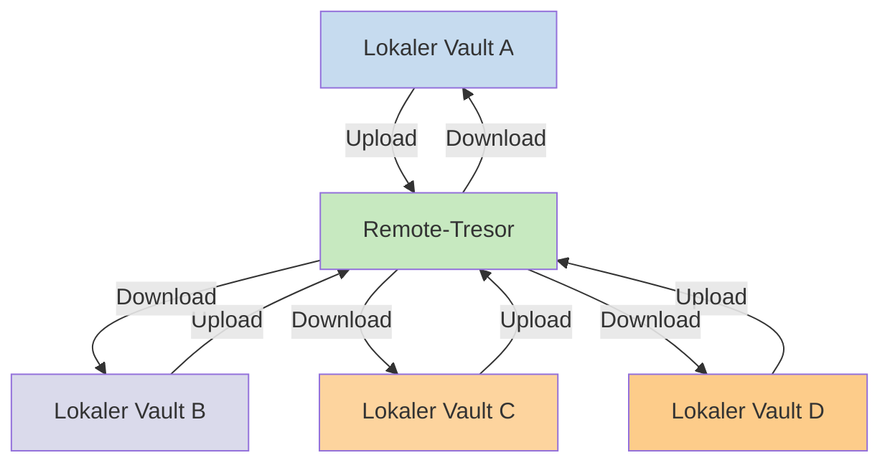

Wenn du deine Notizen auf verschiedenen Geräten nutzen möchtest, ist eine der Möglichkeiten, die du hast, [[Notizen geräteübergreifend synchronisieren|deine Notizen geräteübergreifend zu synchronisieren]]. Obsidian bietet einen solchen Dienst an, [[Einführung in Obsidian Sync|Obsidian Sync]], der anders funktioniert als andere Synchronisierungsdienste wie [[Notizen geräteübergreifend synchronisieren#iCloud|iCloud]] und [[Notizen geräteübergreifend synchronisieren#OneDrive|OneDrive]].

Hier sind einige wichtige Begriffe:

- Ein **Vault** ist ein Ordner in deinem Dateisystem, der Notizen und einen `.obsidian`-Ordner mit Obsidian-spezifischer Konfiguration enthält.
- Ein **lokaler Vault** ist die Kopie deines Vaults, die auf jedem deiner Geräte existiert. Bei der Nutzung von Synchronisierungsdiensten verbindest du diese lokalen Vaults, um die Synchronisierung zu ermöglichen.
- Ein **Remote-Tresor** ist ein zentraler Speicher, mit dem sich lokale Vaults direkt über Obsidian Sync verbinden.

Es gibt zwei gängige Ansätze zur Synchronisierung:

- **[[#Dateibasierte Synchronisierungsdienste]]**: Lokale Vaults müssen sich in überwachten Ordnern befinden, die Synchronisierung erfolgt über das Dateisystem
- **[[#Obsidian Sync|Remote-Tresore]]**: Zentraler Speicher, mit dem sich lokale Vaults direkt über Obsidian verbinden

## Dateibasierte Synchronisierungsdienste

Dienste wie Dropbox, Google Drive, iCloud und OneDrive sind ordnerbasiert. Diese Dienste überwachen bestimmte Ordner und synchronisieren automatisch alle darin abgelegten Dateien. Dateien müssen sich in den vorgesehenen Cloud-Dienst-Ordnern befinden, um synchronisiert zu werden. Bei dateibasierten Synchronisierungsdiensten fungiert dein lokaler Vault einfach als ein weiterer überwachter Ordner. Es gibt keinen dedizierten Remote-Tresor – stattdessen dient der Cloud-Speicher als Durchgangsstation, die Dateien zwischen lokalen Vaults auf verschiedenen Geräten kopiert.

Das folgende Diagramm zeigt eine vereinfachte Version der Funktionsweise dieser Dienste:

Wenn der Cloud-Dienst Hintergrundsynchronisierung unterstützt, können einige dieser Prozesse auch ablaufen, wenn du die Anwendungen nicht aktiv zum Betrachten der Dateien verwendest. Diese Dienste überwachen bestimmte Ordner und synchronisieren automatisch alle darin abgelegten Dateien. Dateien müssen sich in den vorgesehenen Cloud-Dienst-Ordnern befinden, um synchronisiert zu werden.

## Obsidian Sync

Obsidian Sync ermöglicht es dir, über den [[Einführung in Obsidian Sync|Obsidian Sync]]-Dienst einen Remote-Tresor als zentralen Speicher zu erstellen. So kannst du fast jeden beliebigen Ordner auf jedem deiner Geräte zum Speichern deiner Dateien wählen – ob auf einer externen Festplatte, in `C:\` oder im App-Speicher auf Android.

Allerdings haben wir eine Liste empfohlener Speicherorte für deinen lokalen Vault, wenn du auch [[#Dateibasierte Synchronisierungsdienste]] auf demselben Gerät verwendest – hauptsächlich überall dort, wo sich kein [[Zu Obsidian Sync wechseln#Verschiebe deinen Vault aus deinem Drittanbieter-Synchronisierungsdienst oder Cloud-Speicher|Drittanbieter-Synchronisierungsdienst]] befindet.

Das folgende Diagramm zeigt eine vereinfachte Version der Funktionsweise von Obsidian Sync:

Die Stärke dieses Systems wird mit mehr Gerätetypen deutlicher. [[#Dateibasierte Synchronisierungsdienste]] können betriebssystemübergreifend unterschiedlich implementiert sein, und mobile Geräte haben eigene Regeln für das Sandboxing und die Energiedrosselung von Anwendungen, was es für herkömmliche dateibasierte Dienste wesentlich schwieriger macht, nahtlos zu funktionieren.

Mit Obsidian Sync übernimmt der Dienst die Synchronisierung direkt über die App und bietet konsistentes Verhalten unabhängig von Gerätetyp oder Betriebssystem-Einschränkungen, während der Fokus darauf liegt, eine lokale Kopie deiner Daten als [[Obsidian-Dateien sichern|Soft-Backup]] zu bewahren.

### Sync-Verhalten

Wenn du Änderungen an Dateien in deinem lokalen Vault vornimmst, erkennt Obsidian Sync diese Änderungen und lädt sie in den Remote-Tresor hoch. Andere Geräte, die mit demselben Remote-Tresor verbunden sind, laden diese Änderungen dann herunter und wenden sie auf ihre lokalen Vaults an. Obsidian Sync verfolgt Änderungen auf Dateiebene und überträgt nur die Dateien, die geändert wurden, anstatt ganze Ordner zu synchronisieren. Dies reduziert den Bandbreitenverbrauch und die Synchronisierungszeit.

Wenn Konflikte auftreten oder wenn du kontrollieren musst, welche Dateien synchronisiert werden, bietet Obsidian Sync spezifische Mechanismen zur Handhabung dieser Situationen:

![[Obsidian Sync Fehlerbehebung#Konfliktlösung|Konfliktlösung]]

![[Sync-Einstellungen und selektive Synchronisierung#Selektive Synchronisierung#Einen Ordner von der Synchronisierung ausschließen]]

### Offline-Verhalten

Änderungen, die offline vorgenommen werden, werden in eine Warteschlange eingereiht und automatisch synchronisiert, wenn dein Gerät wieder mit dem Internet verbunden ist und Obsidian geöffnet ist. Dein lokaler Vault bleibt während Offline-Zeiten voll funktionsfähig.

## Nächste Schritte

- [[Obsidian Sync einrichten]], um mit Remote-Tresoren zu beginnen.
- [[Zu Obsidian Sync wechseln]], wenn du derzeit dateibasierte Synchronisierung verwendest und Obsidian Sync nutzen möchtest.
- [[Notizen geräteübergreifend synchronisieren|Weitere Synchronisierungsoptionen erkunden]], wenn du dich noch entscheidest.
