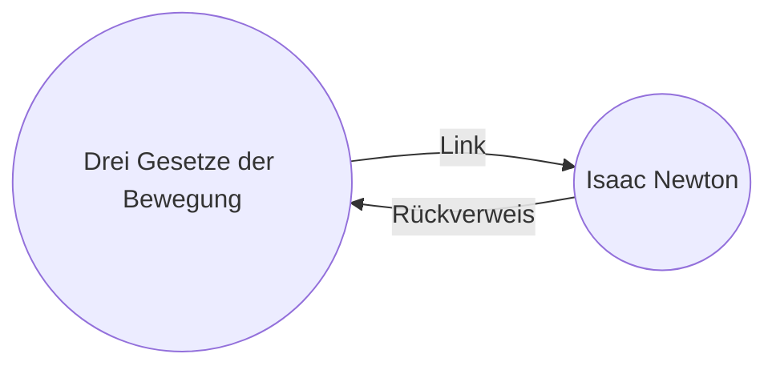

Mit der Rückverweise-[[Obsidian-Erweiterungen|Erweiterung]] kannst du alle _Rückverweise_ für die aktive Notiz anzeigen.

Ein Rückverweis für eine Notiz ist ein Link von einer anderen Notiz zu dieser Notiz. Im folgenden Beispiel enthält die Notiz „Drei Gesetze der Bewegung" einen Link zur Notiz „Isaac Newton". Der entsprechende Rückverweis würde von „Isaac Newton" zurück zu „Drei Gesetze der Bewegung" verweisen.

Rückverweise können nützlich sein, um Notizen zu finden, die auf die Notiz verweisen, an der du gerade schreibst. Stell dir vor, du könntest die Rückverweise für jede beliebige Website im Internet auflisten.

## Rückverweise anzeigen

Die Rückverweise-Erweiterung zeigt die Rückverweise für die aktiven Tabs an. Es gibt zwei einklappbare Bereiche: **Verlinkte Erwähnungen** und **Nicht verlinkte Erwähnungen**.

- **Verlinkte Erwähnungen** sind Rückverweise auf Notizen, die einen internen Link zur aktiven Notiz enthalten.
- **Nicht verlinkte Erwähnungen** sind Rückverweise auf jedes nicht verlinkte Vorkommen des Namens der aktiven Notiz.

Folgende Optionen stehen zur Verfügung:

- **Ergebnisse einklappen** schaltet um, ob jede Notiz ausgeklappt wird, um die darin enthaltenen Erwähnungen anzuzeigen.
- **Mehr Kontext anzeigen** schaltet um, ob der vollständige Absatz mit der Erwähnung angezeigt oder gekürzt wird.
- **Sortierreihenfolge ändern** bestimmt, wie die Erwähnungen sortiert werden.
- **Suchfilter anzeigen** schaltet ein Textfeld um, mit dem du die Erwähnungen filtern kannst. Weitere Informationen zum Erstellen eines Suchbegriffs findest du unter [[Suchen]].

## Rückverweise für eine Notiz anzeigen

Um die Rückverweise für die aktive Notiz anzuzeigen, klicke auf den **Rückverweise**-Tab ( ![[obsidian-icon-links-coming-in.svg#icon]] ) in der rechten Seitenleiste.

> [!note] Hinweis
> Wenn du den Rückverweise-Tab nicht sehen kannst, kannst du ihn sichtbar machen, indem du die [[Befehlspalette]] öffnest und den Befehl **Rückverweise: Rückverweise anzeigen** ausführst.

> [!info] Ignorierte Dateien
> Dateien, die deinen [[Einstellungen#Ignorierte Dateien|Ignorierte Dateien]]-Mustern entsprechen, werden nicht in den nicht verlinkten Erwähnungen angezeigt.

## Rückverweise einer bestimmten Notiz anzeigen

Der Rückverweise-Tab listet die Rückverweise für die aktive Notiz auf und aktualisiert sich, wenn du zu einer anderen Notiz wechselst. Wenn du die Rückverweise für eine bestimmte Notiz sehen möchtest, unabhängig davon, ob sie aktiv ist oder nicht, kannst du einen _verknüpften_ Rückverweise-Tab öffnen.

So öffnest du einen verknüpften Rückverweise-Tab:

1. Öffne die [[Befehlspalette]].
2. Wähle **Rückverweise: Rückverweise für die aktive Datei öffnen**.

Ein separater Tab öffnet sich neben deiner aktiven Notiz. Der Tab zeigt ein Link-Symbol, um anzuzeigen, dass er mit einer Notiz verknüpft ist.

## Rückverweise in einer Notiz anzeigen

Anstatt die Rückverweise in einem separaten Tab anzuzeigen, kannst du die Rückverweise am Ende deiner Notiz anzeigen.

So zeigst du Rückverweise in einer Notiz an:

1. Öffne die [[Befehlspalette]].
2. Wähle **Rückverweise: Rückverweise im Dokument ein-/ausblenden**.

Alternativ kannst du **Rückverweise im Dokument** in den Erweiterungs-Einstellungen der Rückverweise-Erweiterung aktivieren, um Rückverweise automatisch umzuschalten, wenn du eine neue Notiz öffnest.
