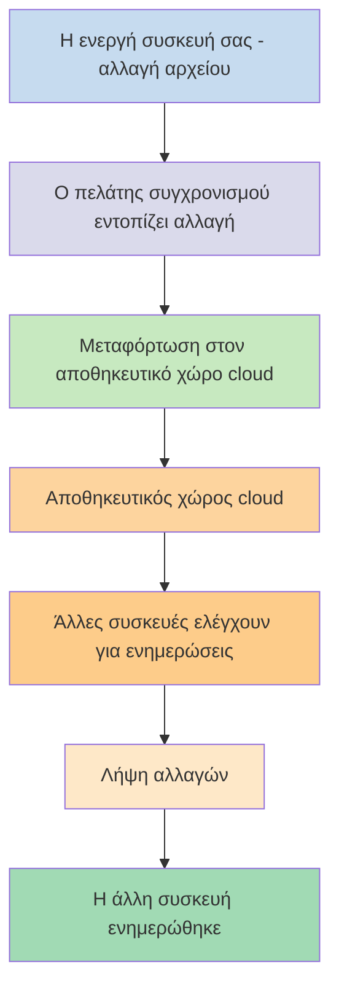
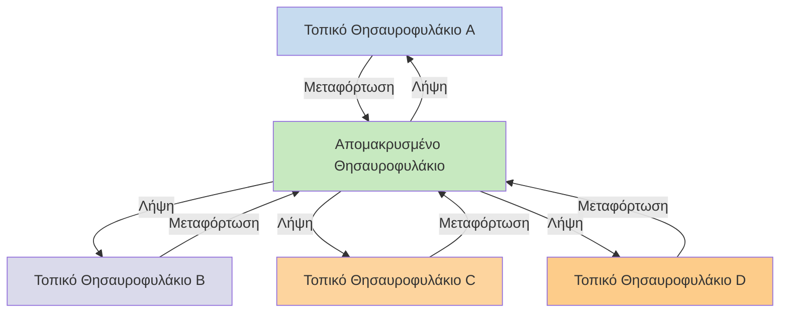

Εάν θέλετε να χρησιμοποιήσετε τις σημειώσεις σας σε διαφορετικές συσκευές, μία από τις επιλογές που έχετε είναι να [[Συγχρονισμός σημειώσεων μεταξύ συσκευών|συγχρονίσετε τις σημειώσεις σας μεταξύ συσκευών]]. Το Obsidian προσφέρει μια τέτοια υπηρεσία, το [[Εισαγωγή στο Obsidian Sync|Obsidian Sync]], που λειτουργεί διαφορετικά από άλλες υπηρεσίες συγχρονισμού, όπως το [[Συγχρονισμός σημειώσεων μεταξύ συσκευών#iCloud|iCloud]] και το [[Συγχρονισμός σημειώσεων μεταξύ συσκευών#OneDrive|OneDrive]].

Ακολουθούν ορισμένοι βασικοί όροι:

- Ένα **θησαυροφυλάκιο** είναι ένας φάκελος στο σύστημα αρχείων σας που περιέχει σημειώσεις και έναν φάκελο `.obsidian` με ρυθμίσεις ειδικές για το Obsidian.
- Ένα **τοπικό θησαυροφυλάκιο** είναι το αντίγραφο του θησαυροφυλακίου σας που υπάρχει σε κάθε μία από τις συσκευές σας. Όταν χρησιμοποιείτε υπηρεσίες συγχρονισμού, συνδέετε αυτά τα τοπικά θησαυροφυλάκια για να ενεργοποιήσετε τον συγχρονισμό.
- Ένα **απομακρυσμένο θησαυροφυλάκιο** είναι κεντρικοποιημένος αποθηκευτικός χώρος στον οποίο τα τοπικά θησαυροφυλάκια συνδέονται απευθείας μέσω του Obsidian Sync.

Υπάρχουν δύο κοινές προσεγγίσεις για τον συγχρονισμό:

- **[[#Υπηρεσίες συγχρονισμού βασισμένες σε αρχεία]]**: Τα τοπικά θησαυροφυλάκια πρέπει να βρίσκονται σε παρακολουθούμενους φακέλους, ο συγχρονισμός γίνεται μέσω του συστήματος αρχείων
- **[[#Obsidian Sync|Απομακρυσμένα θησαυροφυλάκια]]**: Κεντρικοποιημένος αποθηκευτικός χώρος στον οποίο τα τοπικά θησαυροφυλάκια συνδέονται απευθείας μέσω του Obsidian

## Υπηρεσίες συγχρονισμού βασισμένες σε αρχεία

Υπηρεσίες όπως το Dropbox, το Google Drive, το iCloud και το OneDrive βασίζονται σε φακέλους. Αυτές οι υπηρεσίες παρακολουθούν συγκεκριμένους φακέλους και συγχρονίζουν αυτόματα όσα αρχεία τοποθετούνται μέσα σε αυτούς. Τα αρχεία πρέπει να βρίσκονται στους καθορισμένους φακέλους της υπηρεσίας cloud για να συγχρονιστούν. Με τις υπηρεσίες συγχρονισμού βασισμένες σε αρχεία, το τοπικό θησαυροφυλάκιό σας λειτουργεί απλώς ως ένας ακόμη φάκελος υπό παρακολούθηση. Δεν υπάρχει αποκλειστικό απομακρυσμένο θησαυροφυλάκιο — αντ' αυτού, ο αποθηκευτικός χώρος cloud λειτουργεί ως ενδιάμεσος, αντιγράφοντας αρχεία μεταξύ τοπικών θησαυροφυλακίων σε διαφορετικές συσκευές.

Το παρακάτω διάγραμμα δείχνει μια απλοποιημένη εκδοχή του τρόπου λειτουργίας αυτών των υπηρεσιών:

Εάν η υπηρεσία cloud διαθέτει συγχρονισμό στο παρασκήνιο, τότε ορισμένες από αυτές τις διαδικασίες μπορεί να πραγματοποιούνται ακόμη και όταν δεν χρησιμοποιείτε ενεργά τις εφαρμογές για να προβάλετε τα αρχεία. Αυτές οι υπηρεσίες παρακολουθούν συγκεκριμένους φακέλους και συγχρονίζουν αυτόματα όσα αρχεία τοποθετούνται μέσα σε αυτούς. Τα αρχεία πρέπει να βρίσκονται στους καθορισμένους φακέλους της υπηρεσίας cloud για να συγχρονιστούν.

## Obsidian Sync

Το Obsidian Sync σας επιτρέπει να δημιουργήσετε ένα απομακρυσμένο θησαυροφυλάκιο που χρησιμεύει ως κεντρικοποιημένος αποθηκευτικός χώρος μέσω της υπηρεσίας [[Εισαγωγή στο Obsidian Sync|Obsidian Sync]]. Αυτό σας επιτρέπει να επιλέξετε σχεδόν οποιονδήποτε φάκελο σε οποιαδήποτε από τις συσκευές σας για να αποθηκεύσετε τα αρχεία σας — είτε σε εξωτερικό σκληρό δίσκο, στο `C:\`, είτε στον αποθηκευτικό χώρο εφαρμογής στο Android.

Ωστόσο, έχουμε μια λίστα προτεινόμενων τοποθεσιών για το τοπικό θησαυροφυλάκιό σας εάν χρησιμοποιείτε επίσης [[#Υπηρεσίες συγχρονισμού βασισμένες σε αρχεία]] στην ίδια συσκευή — κυρίως, οπουδήποτε που δεν βρίσκεται σε [[Μετάβαση στο Obsidian Sync#Μετακινήστε το θησαυροφυλάκιό σας εκτός της υπηρεσίας συγχρονισμού τρίτων ή του αποθηκευτικού χώρου cloud|υπηρεσία συγχρονισμού τρίτων]].

Το παρακάτω διάγραμμα δείχνει μια απλοποιημένη εκδοχή του τρόπου λειτουργίας του Obsidian Sync:

Η δύναμη αυτού του συστήματος γίνεται πιο εμφανής με περισσότερους τύπους συσκευών. Οι [[#Υπηρεσίες συγχρονισμού βασισμένες σε αρχεία]] μπορούν να υλοποιούνται ασυνεπώς μεταξύ λειτουργικών συστημάτων, και οι κινητές συσκευές έχουν τους δικούς τους κανόνες σχετικά με το πώς οι εφαρμογές μπορούν να απομονώνονται και να περιορίζονται ενεργειακά, κάτι που καθιστά πολύ πιο δύσκολη την απρόσκοπτη λειτουργία των παραδοσιακών υπηρεσιών βασισμένων σε αρχεία.

Με το Obsidian Sync, η υπηρεσία χειρίζεται τον συγχρονισμό απευθείας μέσω της εφαρμογής, παρέχοντας συνεπή συμπεριφορά ανεξαρτήτως τύπου συσκευής ή περιορισμών λειτουργικού συστήματος, ενώ δίνει προτεραιότητα στη διατήρηση ενός τοπικού αντιγράφου των δεδομένων σας ως [[Δημιουργία αντιγράφων ασφαλείας των αρχείων Obsidian|ήπιο αντίγραφο ασφαλείας]].

### Συμπεριφορά συγχρονισμού

Όταν κάνετε αλλαγές σε αρχεία στο τοπικό θησαυροφυλάκιό σας, το Obsidian Sync εντοπίζει αυτές τις αλλαγές και τις μεταφορτώνει στο απομακρυσμένο θησαυροφυλάκιο. Άλλες συσκευές συνδεδεμένες στο ίδιο απομακρυσμένο θησαυροφυλάκιο θα κατεβάσουν στη συνέχεια αυτές τις αλλαγές και θα τις εφαρμόσουν στα τοπικά τους θησαυροφυλάκια. Το Obsidian Sync παρακολουθεί τις αλλαγές σε επίπεδο αρχείου και μεταφέρει μόνο τα αρχεία που έχουν τροποποιηθεί, αντί να συγχρονίζει ολόκληρους φακέλους. Αυτό μειώνει τη χρήση εύρους ζώνης και τον χρόνο συγχρονισμού.

Όταν προκύπτουν διενέξεις ή όταν χρειάζεται να ελέγξετε ποια αρχεία συγχρονίζονται, το Obsidian Sync παρέχει συγκεκριμένους μηχανισμούς για τη διαχείριση αυτών των καταστάσεων:

![[Αντιμετώπιση προβλημάτων Obsidian Sync#Επίλυση διενέξεων|Επίλυση διενέξεων]]

![[Ρυθμίσεις Sync και επιλεκτικός συγχρονισμός#Επιλεκτικός συγχρονισμός#Εξαίρεση φακέλου από τον συγχρονισμό]]

### Συμπεριφορά εκτός σύνδεσης

Οι αλλαγές που γίνονται ενώ είστε εκτός σύνδεσης τοποθετούνται σε ουρά αναμονής και συγχρονίζονται αυτόματα όταν η συσκευή σας επανασυνδεθεί στο διαδίκτυο και το Obsidian είναι ανοιχτό. Το τοπικό θησαυροφυλάκιό σας παραμένει πλήρως λειτουργικό κατά τις περιόδους εκτός σύνδεσης.

## Επόμενα βήματα

- [[Ρύθμιση Obsidian Sync]] για να ξεκινήσετε με τα απομακρυσμένα θησαυροφυλάκια.
- [[Μετάβαση στο Obsidian Sync]] εάν χρησιμοποιείτε αυτή τη στιγμή συγχρονισμό βασισμένο σε αρχεία και θέλετε να χρησιμοποιήσετε το Obsidian Sync.
- [[Συγχρονισμός σημειώσεων μεταξύ συσκευών|Εξερευνήστε άλλες επιλογές συγχρονισμού]] εάν ακόμη αποφασίζετε.
