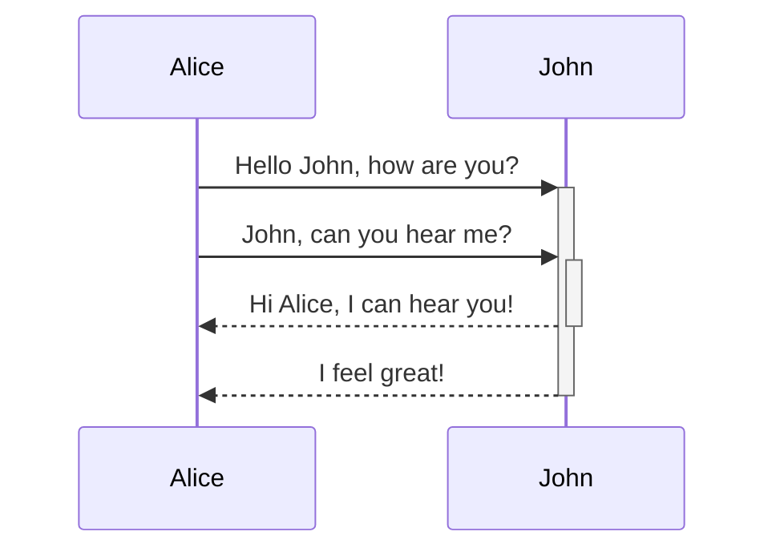
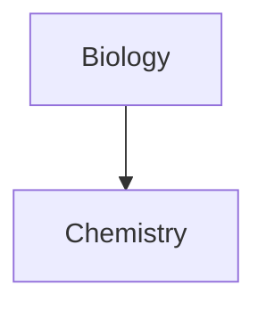

Μάθετε πώς να προσθέτετε σύνθετη σύνταξη μορφοποίησης στις σημειώσεις σας.

## Πίνακες

Μπορείτε να δημιουργήσετε πίνακες χρησιμοποιώντας κάθετες γραμμές (`|`) για να διαχωρίσετε στήλες και ενωτικά (`-`) για να ορίσετε επικεφαλίδες. Ακολουθεί ένα παράδειγμα:

```md
| First name | Last name |
| ---------- | --------- |
| Max        | Planck    |
| Marie      | Curie     |
```

| First name | Last name |
| ---------- | --------- |
| Max        | Planck    |
| Marie      | Curie     |

Αν και οι κάθετες γραμμές στις δύο πλευρές του πίνακα είναι προαιρετικές, η χρήση τους συνιστάται για καλύτερη αναγνωσιμότητα.

> [!tip] Στη *Ζωντανή προεπισκόπηση*, μπορείτε να κάνετε δεξί κλικ σε έναν πίνακα για να προσθέσετε ή να διαγράψετε στήλες και γραμμές. Μπορείτε επίσης να τις ταξινομήσετε και να τις μετακινήσετε χρησιμοποιώντας το μενού περιβάλλοντος.

Μπορείτε να εισαγάγετε έναν πίνακα χρησιμοποιώντας την εντολή **Εισαγωγή πίνακα** από την [[Παλέτα εντολών|Παλέτα Εντολών]] ή κάνοντας δεξί κλικ και επιλέγοντας _Εισαγωγή → Πίνακας_. Αυτό θα σας δώσει έναν βασικό, επεξεργάσιμο πίνακα:

```md
|     |     |
| --- | --- |
|     |     |
```

Σημειώστε ότι τα κελιά δεν χρειάζεται να είναι τέλεια στοιχισμένα, αλλά η γραμμή επικεφαλίδας πρέπει να περιέχει τουλάχιστον δύο ενωτικά:

```md
First name | Last name
-- | --
Max | Planck
Marie | Curie
```


### Μορφοποίηση περιεχομένου εντός πίνακα

Μπορείτε να χρησιμοποιήσετε [[Βασική σύνταξη μορφοποίησης|βασική σύνταξη μορφοποίησης]] για να μορφοποιήσετε το περιεχόμενο εντός ενός πίνακα.

| Πρώτη στήλη                | Δεύτερη στήλη                                        |
| ------------------ | --------------------------------------- |
| [[Εσωτερικοί σύνδεσμοι]] | Σύνδεσμος σε ένα αρχείο _εντός_ του **θησαυροφυλακίου** σας. |
| [[Ενσωμάτωση αρχείων]]    | ![[Engelbart.jpg\|100]]                 |

> [!note] Κάθετες γραμμές σε πίνακες
> Αν θέλετε να χρησιμοποιήσετε [[Ψευδώνυμα|ψευδώνυμα]], ή να [[Βασική σύνταξη μορφοποίησης#Εξωτερικές εικόνες|αλλάξετε μέγεθος μιας εικόνας]] στον πίνακά σας, πρέπει να προσθέσετε ένα `\` πριν από την κάθετη γραμμή.
>
> ```md
> First column | Second column
> -- | --
> [[Βασική σύνταξη μορφοποίησης\|Σύνταξη Markdown]] | ![[Engelbart.jpg\|200]]
> ```
>
> First column | Second column
> -- | --
> [[Βασική σύνταξη μορφοποίησης\|Σύνταξη Markdown]] | ![[Engelbart.jpg\|200]]

Στοιχίστε κείμενο σε στήλες προσθέτοντας άνω και κάτω τελείες (`:`) στη γραμμή επικεφαλίδας. Μπορείτε επίσης να στοιχίσετε περιεχόμενο στη *Ζωντανή προεπισκόπηση* μέσω του μενού περιβάλλοντος.

```md
Left-aligned text | Center-aligned text | Right-aligned text
:-- | :--: | --:
Content | Content | Content
```

Left-aligned text | Center-aligned text | Right-aligned text
:-- | :--: | --:
Content | Content | Content

## Διάγραμμα

Μπορείτε να προσθέσετε διαγράμματα και γραφήματα στις σημειώσεις σας, χρησιμοποιώντας το [Mermaid](https://mermaid-js.github.io/). Το Mermaid υποστηρίζει μια σειρά διαγραμμάτων, όπως [διαγράμματα ροής](https://mermaid.js.org/syntax/flowchart.html), [διαγράμματα ακολουθίας](https://mermaid.js.org/syntax/sequenceDiagram.html) και [χρονοδιαγράμματα](https://mermaid.js.org/syntax/timeline.html).

> [!tip] Συμβουλή
> Μπορείτε επίσης να δοκιμάσετε τον [Ζωντανό Επεξεργαστή](https://mermaid-js.github.io/mermaid-live-editor) του Mermaid για να σας βοηθήσει να δημιουργήσετε διαγράμματα πριν τα συμπεριλάβετε στις σημειώσεις σας.

Για να προσθέσετε ένα διάγραμμα Mermaid, δημιουργήστε ένα [[Βασική σύνταξη μορφοποίησης#Μπλοκ κώδικα|μπλοκ κώδικα]] `mermaid`.

````md

````


````md

````


### Σύνδεση αρχείων σε διάγραμμα

Μπορείτε να δημιουργήσετε [[Εσωτερικοί σύνδεσμοι|εσωτερικούς συνδέσμους]] στα διαγράμματά σας επισυνάπτοντας την [κλάση](https://mermaid.js.org/syntax/flowchart.html#classes) `internal-link` στους κόμβους σας.

````md

````


> [!note] Σημείωση
> Οι εσωτερικοί σύνδεσμοι από διαγράμματα δεν εμφανίζονται στην [[Προβολή Γράφου]].

Αν έχετε πολλούς κόμβους στα διαγράμματά σας, μπορείτε να χρησιμοποιήσετε το παρακάτω απόσπασμα.

````md

````

Με αυτόν τον τρόπο, κάθε κόμβος γράμματος γίνεται εσωτερικός σύνδεσμος, με το [κείμενο κόμβου](https://mermaid.js.org/syntax/flowchart.html#a-node-with-text) ως κείμενο συνδέσμου.

> [!note] Σημείωση
> Αν χρησιμοποιείτε ειδικούς χαρακτήρες στα ονόματα των σημειώσεών σας, πρέπει να βάλετε το όνομα σημείωσης σε διπλά εισαγωγικά.
>
> ```
> class "⨳ special character" internal-link
> ```
>
> Ή, `A["⨳ special character"]`.

Για περισσότερες πληροφορίες σχετικά με τη δημιουργία διαγραμμάτων, ανατρέξτε στην [επίσημη τεκμηρίωση του Mermaid](https://mermaid.js.org/intro/).

## Μαθηματικά

Μπορείτε να προσθέσετε μαθηματικές εκφράσεις στις σημειώσεις σας χρησιμοποιώντας το [MathJax](http://docs.mathjax.org/en/latest/basic/mathjax.html) και τη σημειογραφία LaTeX.

Για να προσθέσετε μια έκφραση MathJax στη σημείωσή σας, περικλείστε τη με διπλά σύμβολα δολαρίου (`$$`).

```md
$$
\begin{vmatrix}a & b\\
c & d
\end{vmatrix}=ad-bc
$$
```

$$
\begin{vmatrix}a & b\\
c & d
\end{vmatrix}=ad-bc
$$

Μπορείτε επίσης να χρησιμοποιήσετε ενσωματωμένες μαθηματικές εκφράσεις περικλείοντάς τες σε σύμβολα `$`.

```md
This is an inline math expression $e^{2i\pi} = 1$.
```

This is an inline math expression $e^{2i\pi} = 1$.

Για περισσότερες πληροφορίες σχετικά με τη σύνταξη, ανατρέξτε στο [Βασικό σεμινάριο και γρήγορη αναφορά MathJax](https://math.meta.stackexchange.com/questions/5020/mathjax-basic-tutorial-and-quick-reference).

Για μια λίστα υποστηριζόμενων πακέτων MathJax, ανατρέξτε στη [Λίστα Επεκτάσεων TeX/LaTeX](http://docs.mathjax.org/en/latest/input/tex/extensions/index.html).
