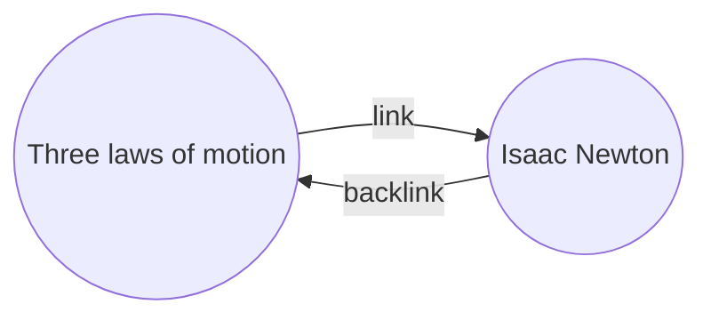

Με το [[Κύρια πρόσθετα|πρόσθετο]] Οπισθοσύνδεσμοι, μπορείτε να δείτε όλους τους _οπισθοσυνδέσμους_ για την ενεργή σημείωση.

Ένας οπισθοσύνδεσμος για μια σημείωση είναι ένας σύνδεσμος από μια άλλη σημείωση προς αυτήν τη σημείωση. Στο παρακάτω παράδειγμα, η σημείωση "Τρεις νόμοι της κίνησης" περιέχει έναν σύνδεσμο προς τη σημείωση "Ισαάκ Νεύτων". Ο αντίστοιχος οπισθοσύνδεσμος θα συνδέει από τον "Ισαάκ Νεύτων" πίσω στους "Τρεις νόμους της κίνησης".

Οι οπισθοσύνδεσμοι μπορεί να είναι χρήσιμοι για να βρείτε σημειώσεις που αναφέρονται στη σημείωση που γράφετε. Φανταστείτε αν μπορούσατε να εμφανίσετε τους οπισθοσυνδέσμους για οποιαδήποτε ιστοσελίδα στο διαδίκτυο.

## Προβολή backlinks

Το πρόσθετο Οπισθοσύνδεσμοι εμφανίζει τους οπισθοσυνδέσμους για τις ενεργές καρτέλες. Υπάρχουν δύο πτυσσόμενες ενότητες: **Συνδεδεμένες αναφορές** και **Μη συνδεδεμένες αναφορές**.

- Οι **Συνδεδεμένες αναφορές** είναι οπισθοσύνδεσμοι προς τις σημειώσεις που περιέχουν έναν εσωτερικό σύνδεσμο προς την ενεργή σημείωση.
- Οι **Μη συνδεδεμένες αναφορές** είναι οπισθοσύνδεσμοι προς οποιαδήποτε μη συνδεδεμένη εμφάνιση του ονόματος της ενεργής σημείωσης.

Παρέχει τις ακόλουθες επιλογές:

- **Κλείσιμο αποτελεσμάτων** εναλλάσσει αν θα αναπτύσσεται κάθε σημείωση για να εμφανίζονται οι αναφορές σε αυτήν.
- **Προβολή παραπάνω πλαισίου** εναλλάσσει αν θα περικόπτεται ή θα εμφανίζεται ολόκληρη η παράγραφος που περιέχει την αναφορά.
- **Αλλαγή σειράς ταξινόμησης** καθορίζει πώς θα ταξινομούνται οι αναφορές.
- **Προβολή φίλτρου αναζήτησης** εναλλάσσει ένα πεδίο κειμένου που σας επιτρέπει να φιλτράρετε τις αναφορές. Για περισσότερες πληροφορίες σχετικά με τον τρόπο δημιουργίας ενός όρου αναζήτησης, ανατρέξτε στην [[Αναζήτηση]].

## Προβολή οπισθοσυνδέσμων για μια σημείωση

Για να δείτε τους οπισθοσυνδέσμους για την ενεργή σημείωση, κάντε κλικ στην καρτέλα **Οπισθοσύνδεσμοι** ![[obsidian-icon-links-coming-in.svg#icon]] στη δεξιά πλαϊνή μπάρα.

> [!note] Σημείωση
> Αν δεν μπορείτε να δείτε την καρτέλα Οπισθοσύνδεσμοι, μπορείτε να την κάνετε ορατή ανοίγοντας την [[Παλέτα εντολών]] και εκτελώντας την εντολή **Οπισθοσύνδεσμοι: Προβολή backlinks**.

> [!info] Φάκελοι που εξαιρούνται
> Τα αρχεία που ταιριάζουν με τα μοτίβα [[Ρυθμίσεις#Φάκελοι που εξαιρούνται|Φάκελοι που εξαιρούνται]] δεν θα εμφανίζονται στις Μη συνδεδεμένες αναφορές.

## Προβολή οπισθοσυνδέσμων συγκεκριμένης σημείωσης

Η καρτέλα οπισθοσυνδέσμων εμφανίζει τους οπισθοσυνδέσμους για την ενεργή σημείωση και ενημερώνεται όταν μεταβαίνετε σε διαφορετική σημείωση. Αν θέλετε να δείτε τους οπισθοσυνδέσμους για μια συγκεκριμένη σημείωση, ανεξάρτητα από το αν είναι ενεργή ή όχι, μπορείτε να ανοίξετε μια _συνδεδεμένη_ καρτέλα οπισθοσυνδέσμων.

Για να ανοίξετε μια συνδεδεμένη καρτέλα οπισθοσυνδέσμων:

1. Ανοίξτε την [[Παλέτα εντολών]].
2. Επιλέξτε **Οπισθοσύνδεσμοι: Άνοιγμα backlinks για το τρέχον αρχείο**.

Μια ξεχωριστή καρτέλα ανοίγει δίπλα στην ενεργή σημείωσή σας. Η καρτέλα εμφανίζει ένα εικονίδιο συνδέσμου για να σας ενημερώσει ότι είναι συνδεδεμένη με μια σημείωση.

## Εμφάνιση οπισθοσυνδέσμων σε μια σημείωση

Αντί να εμφανίζετε τους οπισθοσυνδέσμους σε ξεχωριστή καρτέλα, μπορείτε να τους εμφανίσετε στο κάτω μέρος της σημείωσής σας.

Για να εμφανίσετε οπισθοσυνδέσμους σε μια σημείωση:

1. Ανοίξτε την [[Παλέτα εντολών]].
2. Επιλέξτε **Οπισθοσύνδεσμοι: Ενεργοποίηση/Απενεργοποίηση backlinks σε έγγραφο**.

Εναλλακτικά, ενεργοποιήστε την επιλογή **Backlinks σε έγγραφο** στις ρυθμίσεις του προσθέτου Οπισθοσύνδεσμοι για αυτόματη εναλλαγή οπισθοσυνδέσμων όταν ανοίγετε μια νέα σημείωση.
