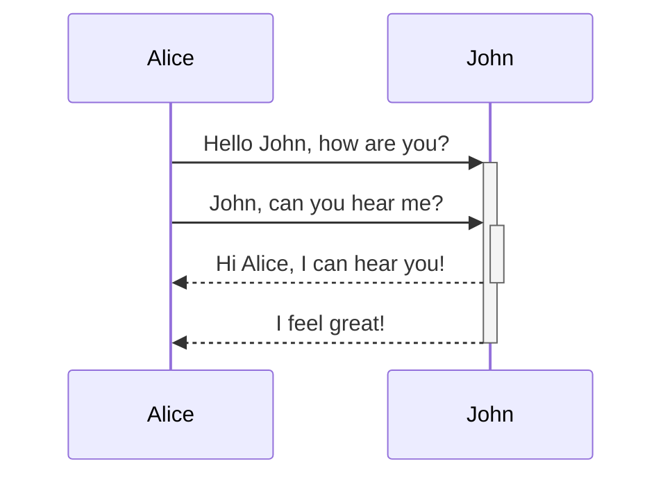
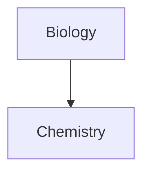

---
aliases:
  - Advanced Markdown
---
Learn how to add advanced formatting syntax to your notes.

## Tables

You can create table using vertical bars (`|`) and hyphens (`-`). Vertical bars separate columns, and hyphens define the column header.

```md
| First name | Last name |
| ---------- | --------- |
| Max        | Planck    |
| Marie      | Curie     |
```

| First name | Last name |
| ---------- | --------- |
| Max        | Planck    |
| Marie      | Curie     |

The vertical bars on either side of the table are optional.

Cells don't need to be perfectly aligned with the columns. Each header row must have at least two hyphens.

```md
First name | Last name
-- | --
Max | Planck
Marie | Curie
```

### Format content within a table

You can use [[basic formatting syntax]] to style content within a table.

First column | Second column
-- | --
[[Internal links]] | Link to a file _within_ your **vault**.
[[Embed files]] | ![[og-image.png\|200]]

> [!note] Vertical bars in tables
> If you want to use [[aliases]], or to [[Basic formatting syntax#External images|resize an image]] in your table, you need to add a `\` before the vertical bar.
>
> ```md
> First column | Second column
> -- | --
> [[Basic formatting syntax\|Markdown syntax]] | ![[og-image.png\|200]]
> ```
>
> First column | Second column
> -- | --
> [[Basic formatting syntax\|Markdown syntax]] | ![[og-image.png\|200]]

You can align text to the left, right, or center of a column by adding colons (`:`) to the header row.

```md
Left-aligned text | Center-aligned text | Right-aligned text
:-- | :--: | --:
Content | Content | Content
```

Left-aligned text | Center-aligned text | Right-aligned text
:-- | :--: | --:
Content | Content | Content

## Diagram

You can add diagrams and charts to your notes, using [Mermaid](https://mermaid-js.github.io/). Mermaid supports a range of diagrams, such as [flow charts](https://mermaid.js.org/syntax/flowchart.html), [sequence diagrams](https://mermaid.js.org/syntax/sequenceDiagram.html), and [timelines](https://mermaid.js.org/syntax/timeline.html).

> [!tip]
> You can also try Mermaid's [Live Editor](https://mermaid-js.github.io/mermaid-live-editor) to help you build diagrams before you include them in your notes.

To add a Mermaid diagram, create a `mermaid` [[Basic formatting syntax#Code blocks|code block]].

````md

````


````md

````


### Linking files in a diagram

You can create [[internal links]] in your diagrams by attaching the `internal-link` [class](https://mermaid.js.org/syntax/flowchart.html#classes) to your nodes.

````md

````


> [!note]
> Internal links from diagrams don't show up in the [[Graph view]].

If you have many nodes in your diagrams, you can use the following snippet.

````md

````

This way, each letter node becomes an internal link, with the [node text](https://mermaid.js.org/syntax/flowchart.html#a-node-with-text) as the link text.

> [!note]
> If you use special characters in your note names, you need to put the note name in double quotes.
>
> ```
> class "⨳ special character" internal-link
> ```
>
> Or, `A["⨳ special character"]`.

For more information about creating diagrams, refer to the [official Mermaid docs](https://mermaid.js.org/intro/).

## Math

You can add math expressions to your notes using [MathJax](http://docs.mathjax.org/en/latest/basic/mathjax.html) and the LaTeX notation.

To add a MathJax expression to your note, surround it with double dollar signs (`$$`).

```md
$$
\begin{vmatrix}a & b\\
c & d
\end{vmatrix}=ad-bc
$$
```

$$
\begin{vmatrix}a & b\\
c & d
\end{vmatrix}=ad-bc
$$

You can also inline math expressions by wrapping it in `$` symbols.

```md
This is an inline math expression $e^{2i\pi} = 1$.
```

This is an inline math expression $e^{2i\pi} = 1$.

For more information about the syntax, refer to [MathJax basic tutorial and quick reference](https://math.meta.stackexchange.com/questions/5020/mathjax-basic-tutorial-and-quick-reference).

For a list of supported MathJax packages, refer to [The TeX/LaTeX Extension List](http://docs.mathjax.org/en/latest/input/tex/extensions/index.html).
