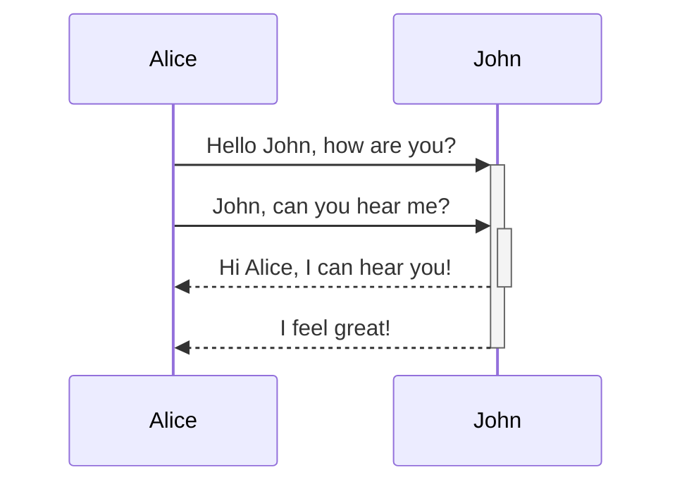
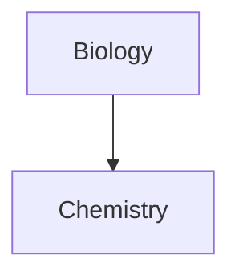

## Tables

You can create tables by assembling a list of words and dividing the header from the content with hyphens, `-`, and then separating each column with a pipe `|`:

```md
|First Header | Second Header|
|------------ | ------------|
|Content from cell 1 | Content from cell 2|
|Content in the first column | Content in the second column|
```

|First Header | Second Header|
|------------ | ------------|
|Content from cell 1 | Content from cell 2|
|Content in the first column | Content in the second column|

The vertical bars at the start and end of a line are optional.

```md
First Header | Second Header
------------ | ------------
Content from cell 1 | Content from cell 2
Content in the first column | Content in the second column
```

This results in the same table as the one above.

---

```md
Tables can be justified with a colon | Another example with a long title | And another long title as a example
:----------------|-------------:|:-------------:
because of the `:` | these will be justified |this is centered
```

Tables can be justified with a colon | Another example with a long title | And another long title as a example
:----------------|-------------:|:-------------:
because of the `:` | these will be justified |this is centered

If you put links in tables, they will work, but if you use [[Aliases|aliases]], the pipe must be escaped with a `\` to prevent it being read as a table element.

```md
First Header | Second Header
------------ | ------------
[[Format your notes\|Formatting]]	|  [[Keyboard shortcuts\|hotkeys]]
```

First Header | Second Header
------------ | ------------
[[Format your notes\|Formatting]]	|  [[Use hotkeys\|hotkeys]]

If you want to resize images in tables, you need to escape the pipe with a `\`:

```md
Image | Description
----- | -----------
![[og-image.png\|200]] | Obsidian
```

Image | Description
----- | -----------
![[og-image.png\|200]] | Obsidian


## Diagram

Obsidian uses [Mermaid](https://mermaid-js.github.io/) to render diagrams and charts. Mermaid also provides [a helpful live editor](https://mermaid-js.github.io/mermaid-live-editor).
Mermaid provides the following diagram types:

- Flowchart
- Sequence diagram
- Class Diagram
- State Diagram
- Entity Relationship Diagram
- User Journey
- Gantt
- Pie Chart
- Requirement Diagram

````md

````


````md

````


Obsidian supports linking to notes in Mermaid, these links won't show up on [[Graph view]].

````md

````


An easier way to do it is the following: ^376b9d

````md

````

This way, all the note names (at least until `Z[note name]`) are all automatically assigned the class `internal-link` when you use this snippet.

If you use special characters in your note names, you need to put the note name in double quotes.
`"⨳ special character"`
It looks like this if you follow the [[Format your notes#^376b9d|second option]]:
`A["⨳ special character"]`


## Math

```md
$$\begin{vmatrix}a & b\\
c & d
\end{vmatrix}=ad-bc$$
```

$$\begin{vmatrix}a & b\\
c & d
\end{vmatrix}=ad-bc$$

---

```md
You can also do inline math like $e^{2i\pi} = 1$ .
```

You can also do inline math like $e^{2i\pi} = 1$ .

To render math from LaTeX notation Obsidian uses [MathJax](http://docs.mathjax.org/en/latest/basic/mathjax.html).
For more information about the syntax, refer to [MathJax basic tutorial and quick reference](https://math.meta.stackexchange.com/questions/5020/mathjax-basic-tutorial-and-quick-reference).

For a list of supported MathJax packages, refer to [The TeX/LaTeX Extension List](http://docs.mathjax.org/en/latest/input/tex/extensions/index.html).
