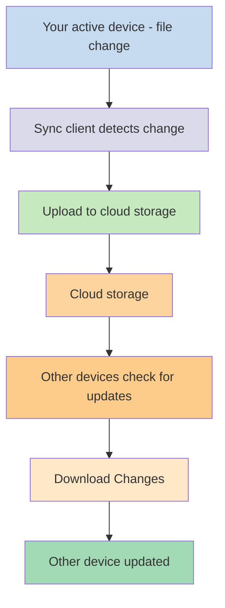
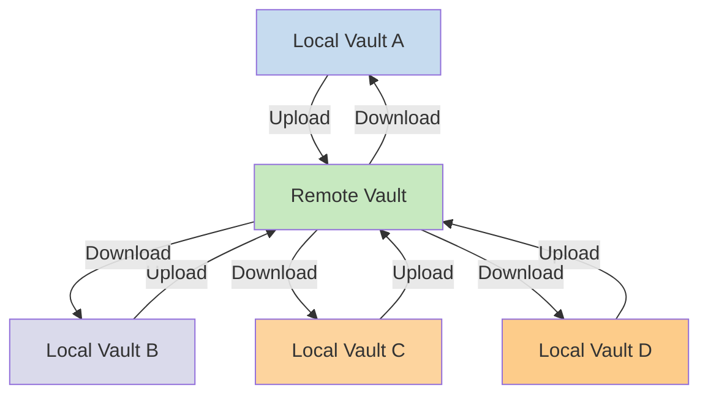

---
aliases:
  - Local vaults
  - remote vaults
  - remote vault
  - local vault
cssclasses:
  - soft-embed
description: This page describes the differences between local and remote vaults in practice. 
mobile: true
permalink: sync/vault-types
publish: true
---

If you want to use your notes on different devices, one of the options you have is to [[Sync your notes across devices]]. Obsidian offers one such service, [[Introduction to Obsidian Sync|Obsidian Sync]], that works differently than other syncing services, like [[Sync your notes across devices#iCloud|iCloud]] and [[Sync your notes across devices#OneDrive|OneDrive]].

Here are some key terms:

- A **vault** is a folder on your file system which contains notes and an `.obsidian` folder with Obsidian-specific configuration.
- A **local vault** is the copy of your vault that exists on each of your devices. When using sync services, you connect these local vaults to enable synchronization.
- A **remote vault** is centralized storage that local vaults connect to directly through Obsidian Sync.

There are two common approaches to syncing:

- **[[#File-based sync services]]**: Local vaults must be in monitored folders, sync happens through the file system
- **[[#Obsidian Sync|Remote vaults]]**: Centralized storage that local vaults connect to directly through Obsidian

## File-based sync services

Services like Dropbox, Google Drive, iCloud, and OneDrive are folder-based. These services monitor specific folders and automatically sync any files placed within them. Files must be in the designated cloud-service folders to sync. With file-based sync services, your local vault acts as just another folder being monitored. There is no dedicated remote vault - instead, the cloud storage serves as a passthrough, copying files between local vaults on different devices.

The diagram below shows a simplified version of how these services work:

If the cloud service has background syncing, then some of these processes may be happening even when you are not actively using the applications to view the files. These services monitor specific folders and automatically sync any files placed within them. Files must be in the designated cloud-service folders to sync.

## Obsidian Sync

Obsidian Sync allows you to create a remote vault that serves as centralized storage through its [[Introduction to Obsidian Sync|Obsidian Sync]] service. This allows you to choose almost any folder on any of your devices to store your files - whether on an external hard drive, in `C:\`, or in App storage on Android.

However, we do have a list of recommended locations for your local vault if you also use [[#File-based sync services]] on the same device - mainly, anywhere that is not in a [[Switch to Obsidian Sync#Move your vault out of your third-party syncing service or cloud storage|third-party syncing service]].

The diagram below shows a simplified version of how Obsidian Sync works:

The strength of this system becomes more apparent with more device types. [[#File-based sync services]] can be implemented inconsistently across operating systems, and mobile devices have their own rules with how applications can be sandboxed and power throttled, which makes it much harder for traditional file-based services to work seamlessly.

With Obsidian Sync, the service handles synchronization directly through the application, providing consistent behavior regardless of device type or operating system limitations, while prioritizing keeping a local copy of your data as a [[Back up your Obsidian files|soft backup]].

### Sync behavior

When you make changes to files in your local vault, Obsidian Sync detects these changes and uploads them to the remote vault. Other devices connected to the same remote vault will then download these changes and apply them to their local vaults. Obsidian Sync tracks changes at the file level and only transfers the files that have been modified, rather than syncing entire folders. This reduces bandwidth usage and sync time.

When conflicts occur or when you need to control which files sync, Obsidian Sync provides specific mechanisms to handle these situations:

![[Troubleshoot Obsidian Sync#Conflict resolution|Conflict resolution]]

![[Sync settings and selective syncing#Selective syncing#Exclude a folder from syncing]]

### Offline behavior

Changes made while offline are queued and sync automatically when your device reconnects to the internet and Obsidian is open. Your local vault remains fully functional during offline periods.

## Next steps

- [[Set up Obsidian Sync]] to get started with remote vaults.
- [[Switch to Obsidian Sync]] if you're currently using file-based sync and want to use Obsidian Sync.
- [[Sync your notes across devices|Explore other sync options]] if you're still deciding.
