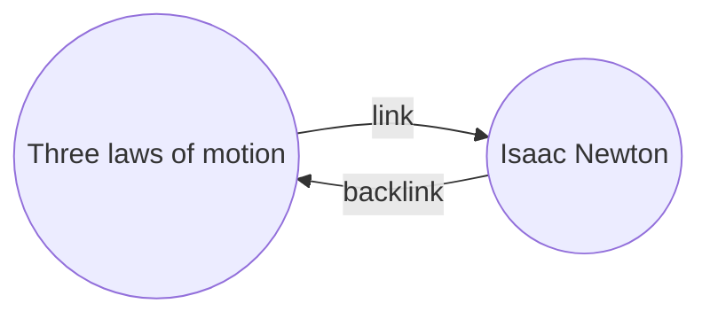

With the Backlinks plugin, you can see all the _backlinks_ for the active note.

A backlink for a note is a link from another note to that note. In the following example, the "Three laws of motion" note contains a link to the "Isaac Newton" note. The corresponding backlink would link from "Isaac Newton" back to "Three laws of motion".

Backlinks can be useful to find notes that reference the note you're writing. Just imagine if you could list the backlinks for any website on the internet!

## The backlinks pane

You can see all the backlinks for the active note from the _backlinks pane_. The backlinks pane has two collapsible sections: **Linked mentions** and **Unlinked mentions**.

- **Linked mentions** are backlinks to the notes that contain an internal link to the active note.
- **Unlinked mentions** are backlinks to any unlinked occurrence of the name of the active note.

The backlinks pane have the following options:

- **Collapse results** toggles whether to expand each note to display the mentions in it.
- **Show more context** toggles whether to truncate or display the full paragraph that contains the mention.
- **Change sort order** determines how to sort the mentions.
- **Show search filter** toggles a text field that lets you filter the mentions.

## View backlinks for a note

To view the backlinks for the active note, click the **Backlinks** (link and arrow icon) tab in the right side bar.

> **Note:** If you can't see the Backlinks tab, you can make it visible by opening the [[Command palette]] and running the **Backlinks: Show backlinks pane** command.
