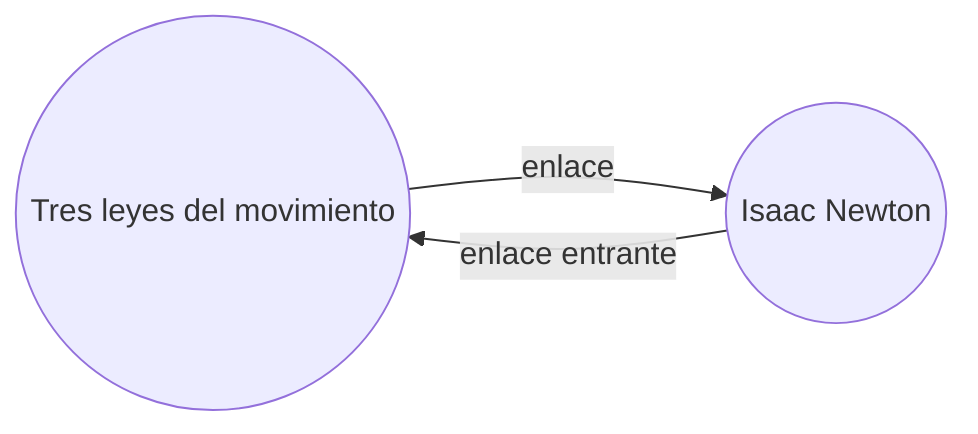

Con el [[Complementos principales|complemento]] de Enlaces entrantes, puedes ver todos los _enlaces entrantes_ de la nota activa.

Un enlace entrante de una nota es un enlace desde otra nota hacia esa nota. En el siguiente ejemplo, la nota "Tres leyes del movimiento" contiene un enlace a la nota "Isaac Newton". El enlace entrante correspondiente enlazaría desde "Isaac Newton" de vuelta a "Tres leyes del movimiento".

Los enlaces entrantes pueden ser útiles para encontrar notas que hacen referencia a la nota que estás escribiendo. Imagina si pudieras listar los enlaces entrantes de cualquier sitio web en internet.

## Mostrar enlaces entrantes

El complemento de Enlaces entrantes muestra los enlaces entrantes de las pestañas activas. Hay dos secciones contraíbles: **Menciones con enlaces** y **Menciones no enlazadas**.

- **Menciones con enlaces** son enlaces entrantes a las notas que contienen un enlace interno a la nota activa.
- **Menciones no enlazadas** son enlaces entrantes a cualquier aparición no enlazada del nombre de la nota activa.

Proporciona las siguientes opciones:

- **Colapsar resultados** alterna si expandir cada nota para mostrar las menciones en ella.
- **Mostrar más contexto** alterna si truncar o mostrar el párrafo completo que contiene la mención.
- **Cambiar el orden** determina cómo ordenar las menciones.
- **Mostrar filtro de búsqueda** alterna un campo de texto que te permite filtrar las menciones. Para más información sobre cómo construir un término de búsqueda, consulta [[Búsqueda]].

## Ver enlaces entrantes de una nota

Para ver los enlaces entrantes de la nota activa, haz clic en la pestaña **Enlaces entrantes** ( ![[obsidian-icon-links-coming-in.svg#icon]] ) en la barra lateral derecha.

> [!note] Nota
> Si no puedes ver la pestaña de Enlaces entrantes, puedes hacerla visible abriendo la [[Paleta de comandos]] y ejecutando el comando **Enlaces entrantes: Mostrar enlaces entrantes**.

> [!info] Archivos excluidos
> Los archivos que coincidan con tus patrones de [[Configuración#Archivos excluidos|Archivos excluidos]] no aparecerán en las Menciones no enlazadas.

## Ver enlaces entrantes de una nota específica

La pestaña de enlaces entrantes lista los enlaces entrantes de la nota activa y se actualiza cuando cambias a una nota diferente. Si quieres ver los enlaces entrantes de una nota específica, independientemente de si está activa o no, puedes abrir una pestaña de enlaces entrantes _vinculada_.

Para abrir una pestaña de enlaces entrantes vinculada:

1. Abre la [[Paleta de comandos]].
2. Selecciona **Enlaces entrantes: Abrir enlaces entrantes para el archivo actual**.

Se abre una pestaña separada junto a tu nota activa. La pestaña muestra un icono de enlace para indicarte que está vinculada a una nota.

## Mostrar enlaces entrantes en una nota

En lugar de mostrar los enlaces entrantes en una pestaña separada, puedes mostrar los enlaces entrantes en la parte inferior de tu nota.

Para mostrar enlaces entrantes en una nota:

1. Abre la [[Paleta de comandos]].
2. Selecciona **Enlaces entrantes: Alternar enlaces entrantes en el documento**.

O bien, habilita **Enlaces entrantes en el documento** en las opciones del complemento de Enlaces entrantes para alternar automáticamente los enlaces entrantes cuando abras una nueva nota.
