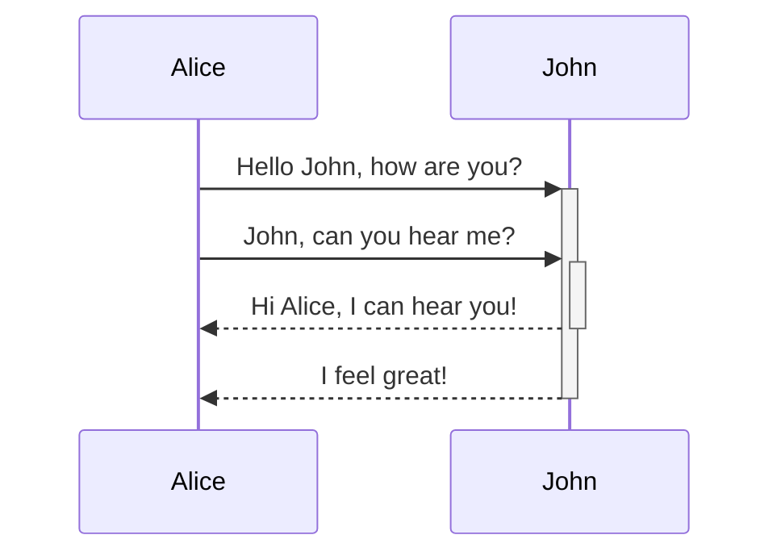
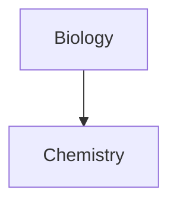

Aprende cómo añadir sintaxis de formato avanzado a tus notas.

## Tablas

Puedes crear tablas usando barras verticales (`|`) para separar columnas y guiones (`-`) para definir encabezados. Aquí tienes un ejemplo:

```md
| Nombre | Apellido |
| ---------- | --------- |
| Max        | Planck    |
| Marie      | Curie     |
```

| Nombre | Apellido |
| ---------- | --------- |
| Max        | Planck    |
| Marie      | Curie     |

Aunque las barras verticales a cada lado de la tabla son opcionales, se recomienda incluirlas para mayor legibilidad.

> [!tip] En la _vista previa en vivo_, puedes hacer clic derecho en una tabla para añadir o eliminar columnas y filas. También puedes ordenarlas y moverlas usando el menú contextual.

Puedes insertar una tabla usando el comando **Insertar tabla** desde la [[Paleta de comandos]] o haciendo clic derecho y seleccionando _Insertar → Tabla_. Esto te dará una tabla básica y editable:

```md
|     |     |
| --- | --- |
|     |     |
```

Ten en cuenta que las celdas no necesitan estar perfectamente alineadas, pero la fila de encabezado debe contener al menos dos guiones:

```md
Nombre | Apellido
-- | --
Max | Planck
Marie | Curie
```


### Dar formato al contenido dentro de una tabla

Puedes usar la [[Sintaxis de formato básico|sintaxis de formato básico]] para dar estilo al contenido dentro de una tabla.

| Primera columna       | Segunda columna                           |
| ------------------ | --------------------------------------- |
| [[Enlaces internos]] | Enlace a un archivo _dentro_ de tu **bóveda**. |
| [[Incrustar archivos]]    | ![[Engelbart.jpg\|100]]                 |

> [!note] Barras verticales en tablas
> Si quieres usar [[Alias|alias]], o [[Sintaxis de formato básico#Imágenes externas|redimensionar una imagen]] en tu tabla, necesitas añadir un `\` antes de la barra vertical.
>
> ```md
> Primera columna | Segunda columna
> -- | --
> [[Sintaxis de formato básico\|Sintaxis Markdown]] | ![[Engelbart.jpg\|200]]
> ```
>
> Primera columna | Segunda columna
> -- | --
> [[Sintaxis de formato básico\|Sintaxis Markdown]] | ![[Engelbart.jpg\|200]]

Alinea el texto en las columnas añadiendo dos puntos (`:`) a la fila de encabezado. También puedes alinear el contenido en la _vista previa en vivo_ a través del menú contextual.

```md
Texto alineado a la izquierda | Texto centrado | Texto alineado a la derecha
:-- | :--: | --:
Contenido | Contenido | Contenido
```

Texto alineado a la izquierda | Texto centrado | Texto alineado a la derecha
:-- | :--: | --:
Contenido | Contenido | Contenido

## Diagramas

Puedes añadir diagramas y gráficos a tus notas, usando [Mermaid](https://mermaid-js.github.io/). Mermaid soporta una variedad de diagramas, como [diagramas de flujo](https://mermaid.js.org/syntax/flowchart.html), [diagramas de secuencia](https://mermaid.js.org/syntax/sequenceDiagram.html) y [líneas de tiempo](https://mermaid.js.org/syntax/timeline.html).

> [!tip] Consejo
> También puedes probar el [Editor en vivo](https://mermaid-js.github.io/mermaid-live-editor) de Mermaid para ayudarte a construir diagramas antes de incluirlos en tus notas.

Para añadir un diagrama de Mermaid, crea un [[Sintaxis de formato básico#Bloques de código|bloque de código]] `mermaid`.

````md

````


````md

````


### Vincular archivos en un diagrama

Puedes crear [[Enlaces internos|enlaces internos]] en tus diagramas adjuntando la [clase](https://mermaid.js.org/syntax/flowchart.html#classes) `internal-link` a tus nodos.

````md

````


> [!note] Nota
> Los enlaces internos desde diagramas no aparecen en la [[Vista de grafo]].

Si tienes muchos nodos en tus diagramas, puedes usar el siguiente fragmento.

````md

````

De esta forma, cada nodo de letra se convierte en un enlace interno, con el [texto del nodo](https://mermaid.js.org/syntax/flowchart.html#a-node-with-text) como texto del enlace.

> [!note] Nota
> Si usas caracteres especiales en los nombres de tus notas, necesitas poner el nombre de la nota entre comillas dobles.
>
> ```
> class "⨳ special character" internal-link
> ```
>
> O bien, `A["⨳ special character"]`.

Para más información sobre la creación de diagramas, consulta la [documentación oficial de Mermaid](https://mermaid.js.org/intro/).

## Ecuaciones

Puedes añadir expresiones matemáticas a tus notas usando [MathJax](http://docs.mathjax.org/en/latest/basic/mathjax.html) y la notación LaTeX.

Para añadir una expresión MathJax a tu nota, rodéala con signos de doble dólar (`$$`).

```md
$$
\begin{vmatrix}a & b\\
c & d
\end{vmatrix}=ad-bc
$$
```

$$
\begin{vmatrix}a & b\\
c & d
\end{vmatrix}=ad-bc
$$

También puedes incluir expresiones matemáticas en línea envolviéndolas con símbolos `$`.

```md
Esta es una expresión matemática en línea $e^{2i\pi} = 1$.
```

Esta es una expresión matemática en línea $e^{2i\pi} = 1$.

Para más información sobre la sintaxis, consulta el [tutorial básico y referencia rápida de MathJax](https://math.meta.stackexchange.com/questions/5020/mathjax-basic-tutorial-and-quick-reference).

Para una lista de paquetes MathJax soportados, consulta [La lista de extensiones TeX/LaTeX](http://docs.mathjax.org/en/latest/input/tex/extensions/index.html).
