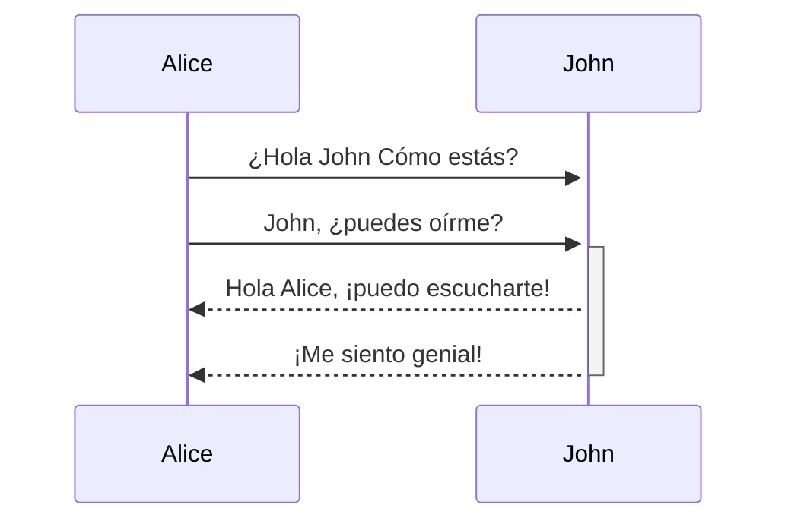
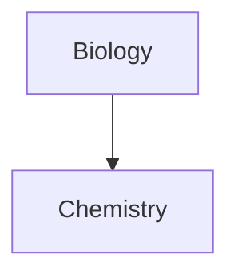

Obsidian es una aplicación de base de conocimientos y toma de notas basada en Markdown.

Actualmente admitimos los siguientes formatos:

---

### Enlace interno

```md
Enlace a una página: [[Enlace interno]].
```

Enlace a una página: [[Enlace interno]].

---

### Incrustar

Incrustar otro archivo (leer más sobre [[Incrustar archivos]]). Aquí hay una sección incrustada:

```md
![[Obsidian#¿Qué es Obsidian]]
```

![[Obsidian#¿Qué es Obsidian]]

---

### Encabezados

```md
# Este es un título 1
## Este es un título 2
### Este es un título 3
#### Este es un título 4
##### Este es un título 5
###### Este es un título 6
```

# Este es un título 1
## Este es un título 2
### Este es un título 3
#### Este es un título 4
##### Este es un título 5
###### Este es un título 6

---

### Énfasis

```md
* Este texto estará en cursiva *
_Esto también estará en cursiva_
```

*Este texto estará en cursiva*
_Esto también estará en cursiva_

```md
** Este texto aparecerá en negrita **
__ Esto también estará en negrita__
```

** Este texto aparecerá en negrita **
__ Esto también estará en negrita__

```md
_Tu **puedes** combinarlos_
```

_Tu **puedes** combinarlos_

---

### Listas

```md
- Item 1
- Item 2
  - Item 2a
  - Item 2b

1. Item 1
1. Item 2
1. Item 3
   1. Item 3a
   1. Item 3b
```

- Item 1
- Item 2
  - Item 2a
  - Item 2b

1. Item 1
1. Item 2
1. Item 3
   1. Item 3a
   1. Item 3b

--- 

### Imagenes

```md

```


#### Cambiar el tamaño de las imágenes

Ejemplo de esta imagen anterior redimensionada a 100 píxeles de ancho:

```md

```


---

### Enlaces

#### Enlaces externos

Los enlaces de estilo Markdown se pueden utilizar para hacer referencia a objetos externos, como páginas web, o una página o imagen interna.

```md
http://obsidian.md - automatic!
[Obsidian](http://obsidian.md)
```

http://obsidian.md - automatic!
[Obsidian](http://obsidian.md)

#### Enlaces URI de Obsidian

[[Usando URI de Obsidian|Obsidian URI]] Los enlaces se pueden usar para abrir notas en Obsidian desde otra bóveda de Obsidian o desde otro programa.

Por ejemplo, puede vincular a un archivo en una bóveda como esta (por favor tenga en cuenta la [[Usando URI de Obsidian#Encoding|codificación requerida]]):

```md
[Link to note](obsidian://open?path=D:%2Fpath%2Fto%2Ffile.md)
```

[Enlace a nota](obsidian://open?path=D:%2Fpath%2Fto%2Ffile.md)

También puede vincular a una nota por su nombre de bóveda y nombre de archivo en lugar de la ruta:

```md
[Link to note](obsidian://open?vault=MainVault&file=MyNote.md)
```

[Enlace a nota](obsidian://open?vault=MainVault&file=MyNote.md)

#### Escapando

Si hay espacios en la URL, se pueden escapar usando `%20` como espacio, como por ejemplo:

```md
[Export options](Pasted%20image)
```

[[Export options]] (Pasted%20image)

O puede encerrar el objetivo en `<>`, como:

```md
[Slides Demo](<Slides Demo>)
```

[[Demostración de diapositivas]] (Demostración%20de%20diapositivas.md Demo>)

---

### Bloques de citas

```md
> Los seres humanos se enfrentan a problemas cada vez más complejos y urgentes, y su eficacia en el tratamiento de estos problemas es una cuestión fundamental para la estabilidad y el progreso continuo de la sociedad.

\- Doug Engelbart, 1961
```

> Los seres humanos se enfrentan a problemas cada vez más complejos y urgentes, y su eficacia en el tratamiento de estos problemas es una cuestión fundamental para la estabilidad y el progreso continuo de la sociedad.

\ - Doug Engelbart, 1961

---

### Código en línea

```md
El texto dentro de `comillas invertidas` en una línea tendrá el formato de código.
```

El texto dentro de `comillas invertidas` en una línea tendrá el formato de código.


---

### Bloques de código

El resaltado de sintaxis es compatible con el idioma especificado después del primer conjunto de comillas invertidas. Usamos prismjs para resaltar la sintaxis, se puede encontrar una lista de idiomas compatibles [en su sitio](https://prismjs.com/#supported-languages)

<pre><code>```js
function fancyAlert(arg) {
  if(arg) {
    $.facebox({div:'#foo'})
  }
}
```</code></pre>

```js
function fancyAlert(arg) {
  if(arg) {
    $.facebox({div:'#foo'})
  }
}
```
    
	
```md
    El texto sangrado con una pestaña tiene este formato y también se verá como un bloque de código en la vista previa.
```

	El texto sangrado con una pestaña tiene este formato y también se verá como un bloque de código en la vista previa.
    
---

### Lista de tareas

```md
- [x] #tags, [links] (), ** formato ** admitido
- [x] es requerida en la sintaxis de lista (se admite cualquier lista ordenada o desordenada)
- [x] este es un artículo completo
- [?] este también es un elemento completo (funciona con todos los caracteres)
- [ ] este es un elemento incompleto
- [ ] Se puede hacer clic en [ ] tareas en Vista previa para marcarlas
```

- [x] #tags, [links](), **formato**  compatible
- [x] es requerida en la sintaxis de lista (se admite cualquier lista ordenada o desordenada)
- [x] este es un artículo completo
- [?] este también es un elemento completo (funciona con todos los caracteres)
- [ ] este es un elemento incompleto
- [ ] Se puede hacer clic en  tareas en Vista previa para marcarlas

---

### Tablas

Puede crear tablas reuniendo una lista de palabras y dividiéndolas con guiones `-` (para la primera fila), y luego separando cada columna con una barra vertical `|`:
```md
Primer encabezado | Segundo encabezado
------------ | ------------
Contenido de la celda 1 | Contenido de la celda 2
Contenido en la primera columna | Contenido en la segunda columna

```

Primer encabezado | Segundo encabezado
------------ | ------------
Contenido de la celda 1 | Contenido de la celda 2
Contenido en la primera columna | Contenido en la segunda columna

---

```md
Las tablas se pueden justificar con dos puntos | Otro ejemplo con un título largo:----------------|-------------:
debido al `:` | estos serán justificados

Si coloca enlaces en tablas, funcionarán, pero si usa enlaces canalizados, la tubería debe escaparse con un `\` para evitar que se lea como un elemento de la tabla.
```

Las tablas se pueden justificar con dos puntos | Otro ejemplo con un título largo 
:----------------|-------------:
debido al `:` | estos serán justificados

Si coloca enlaces en tablas, funcionarán, pero si usa enlaces canalizados, la tubería debe escaparse con un `\` para evitar que se lea como un elemento de la tabla.

```md
Primer encabezado | Segundo encabezado
------------ | ------------
[[Formatear tus notas\|Formateo]]	|  [[Atajo de teclado\|Atajo de teclado]]
```

Primer encabezado | Segundo encabezado
------------ | ------------
[[Formatear tus notas\|Formateo]]	|  [[Atajo de teclado\|Atajo de teclado]]	

---

### Tachado

```md
Cualquier palabra envuelta con dos tildes (como ~~esto ~~) aparecerá tachada.
```

Cualquier palabra envuelta con dos tildes (como ~~esto~~) aparecerá tachada.

---

### Resaltado

```md
Utilice dos signos de igual para ==resaltar texto==.
```

Utilice dos signos de igual para ==resaltar texto==.

---

### Notas al pie

```md
Aquí hay una nota a pie de página simple, [^1] y aquí hay una más larga. [^Bignote]

[^1]: ¡significativo!

[^bignote]: Aquí hay uno con varios párrafos y código.

     Ponga sangría en los párrafos para incluirlos en la nota a pie de página.

     `{mi código}`

     Agrega tantos párrafos como quieras.
```

Aquí hay una nota a pie de página simple, [^1] y aquí hay una más larga. [^Bignote]

[^1]: ¡significativo!

[^bignote]: Aquí hay uno con varios párrafos y código.

     Ponga sangría en los párrafos para incluirlos en la nota a pie de página.

     `{mi código}`

     Agrega tantos párrafos como quieras.
	
```md
También puede utilizar notas al pie en línea. ^ [observe que el quilate sale de los corchetes en este].
```

También puede utilizar notas al pie en línea. ^[observe que el quilate sale de los corchetes en este].

### Matemáticas

```md
$$\begin{vmatrix}a & b\\
c & d
\end{vmatrix}=ad-bc$$
```

$$\begin{vmatrix}a & b\\
c & d
\end{vmatrix}=ad-bc$$

También puedes hacer matemáticas en línea como $e^{2i\pi} = 1$ .

Usos de Obsidian [Mathjax](http://docs.mathjax.org/en/latest/basic/mathjax.html). Puede comprobar qué paquetes son compatibles con Mathjax [aquí](http://docs.mathjax.org/en/latest/input/tex/extensions/index.html).

### Comentarios

Utilice `%%` para incluir comentarios, que se analizarán como Markdown, pero no se mostrarán en la vista previa.

```md
Aquí hay algunos comentarios en línea: %% No puede ver este texto %% (No puedo verlo)

Aquí hay un comentario de bloque:
%%
Puede abarcar
varias líneas
%%
```

Aquí hay algunos comentarios en línea: %% No puede ver este texto %% (No puedo verlo)

Aquí hay un comentario de bloque:
%%
Puede abarcar
varias líneas
%%

### Diagrama

Obsidian usa [Mermaid](https://mermaid-js.github.io/) para representar diagramas y gráficos. Mermaid también proporciona [un útil editor en vivo](https://mermaid-js.github.io/mermaid-live-editor).

<pre><code>```mermaid
sequenceDiagram
	Alice->>+John: ¿Hola John Cómo estás?
    Alice->>+John: John, ¿puedes oírme?
    John-->>-Alice: Hola Alice, ¡puedo escucharte!
    John-->>-Alice: ¡Me siento genial!
```</code></pre>



Obsidian admite la vinculación a notas en Mermaid:
<pre><code>```mermaid
graph TD

Biology --> Chemistry

class Biology, Chemistry, internal-link;
```</code></pre>



Una forma más sencilla de hacerlo es la siguiente: ^376b9d
<pre><code>```mermaid
graph TD

A[Biology]
B[Chemistry]

A --> B

class A,B,C,D,E,F,G,H,I,J,K,L,M,N,O,P,Q,R,S,T,U,V,W,X,Y,Z internal-link;
```</code></pre>


De esta forma, todos los nombres de las notas (al menos hasta`Z[nombre de la nota]`) se asignan automáticamente a la clase `internal-link` cuando usa este fragmento.

Si usa caracteres especiales en los nombres de sus notas, debe poner el nombre de la nota entre comillas dobles.
`"⨳ caracter especial"`
Se ve así si sigue la [[Formatear tus notas#^376b9d|segunda opción]]:
`A["⨳ caracter especial"]`

## Notas del desarrollador

Nos esforzamos por lograr la máxima capacidad sin romper ningún formato existente, por lo tanto, utilizamos una combinación poco ortodoxa de gustos Markdown. En general, es CommonMark, con la adición de algunas funciones de GitHub Flavored Markdown (GFM), algo de soporte de látex y nuestra sintaxis de incrustación elegida, sobre la que puede leer más en [[Formatos de archivo aceptados]].
