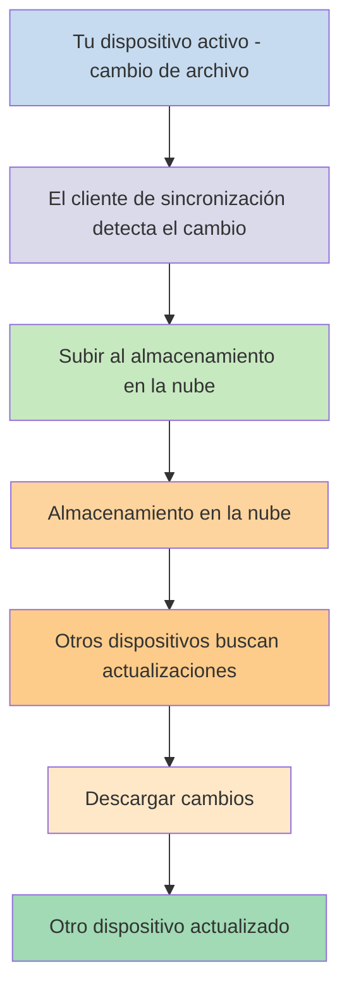
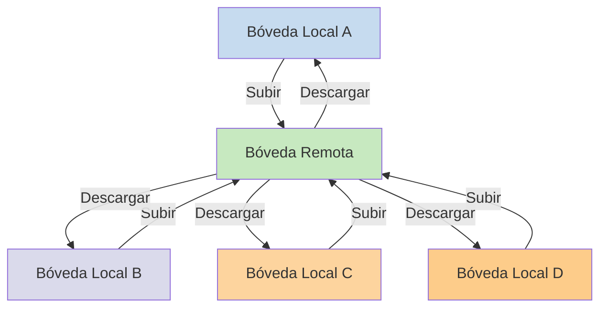

Si deseas usar tus notas en diferentes dispositivos, una de las opciones que tienes es [[Sincronizar notas entre dispositivos]]. Obsidian ofrece un servicio de este tipo, [[Introducción a Obsidian Sync|Obsidian Sync]], que funciona de manera diferente a otros servicios de sincronización, como [[Sincronizar notas entre dispositivos#iCloud|iCloud]] y [[Sincronizar notas entre dispositivos#OneDrive|OneDrive]].

Estos son algunos términos clave:

- Una **bóveda** es una carpeta en tu sistema de archivos que contiene notas y una carpeta `.obsidian` con configuración específica de Obsidian.
- Una **bóveda local** es la copia de tu bóveda que existe en cada uno de tus dispositivos. Al usar servicios de sincronización, conectas estas bóvedas locales para habilitar la sincronización.
- Una **bóveda remota** es un almacenamiento centralizado al que las bóvedas locales se conectan directamente a través de Obsidian Sync.

Hay dos enfoques comunes para la sincronización:

- **[[#Servicios de sincronización basados en archivos]]**: Las bóvedas locales deben estar en carpetas monitoreadas, la sincronización ocurre a través del sistema de archivos
- **[[#Obsidian Sync|Bóvedas remotas]]**: Almacenamiento centralizado al que las bóvedas locales se conectan directamente a través de Obsidian

## Servicios de sincronización basados en archivos

Servicios como Dropbox, Google Drive, iCloud y OneDrive están basados en carpetas. Estos servicios monitorean carpetas específicas y sincronizan automáticamente cualquier archivo colocado dentro de ellas. Los archivos deben estar en las carpetas designadas del servicio en la nube para sincronizarse. Con los servicios de sincronización basados en archivos, tu bóveda local actúa como una carpeta más siendo monitoreada. No hay una bóveda remota dedicada; en su lugar, el almacenamiento en la nube sirve como intermediario, copiando archivos entre bóvedas locales en diferentes dispositivos.

El diagrama a continuación muestra una versión simplificada de cómo funcionan estos servicios:

Si el servicio en la nube tiene sincronización en segundo plano, entonces algunos de estos procesos pueden estar ocurriendo incluso cuando no estás usando activamente las aplicaciones para ver los archivos. Estos servicios monitorean carpetas específicas y sincronizan automáticamente cualquier archivo colocado dentro de ellas. Los archivos deben estar en las carpetas designadas del servicio en la nube para sincronizarse.

## Obsidian Sync

Obsidian Sync te permite crear una bóveda remota que sirve como almacenamiento centralizado a través de su servicio [[Introducción a Obsidian Sync|Obsidian Sync]]. Esto te permite elegir casi cualquier carpeta en cualquiera de tus dispositivos para almacenar tus archivos, ya sea en un disco duro externo, en `C:\`, o en el almacenamiento de la aplicación en Android.

Sin embargo, tenemos una lista de ubicaciones recomendadas para tu bóveda local si también usas [[#Servicios de sincronización basados en archivos]] en el mismo dispositivo, principalmente, cualquier lugar que no esté en un [[Cambiar a Obsidian Sync#Mueve tu bóveda fuera de tu servicio de sincronización de terceros o almacenamiento en la nube|servicio de sincronización de terceros]].

El diagrama a continuación muestra una versión simplificada de cómo funciona Obsidian Sync:

La fortaleza de este sistema se hace más evidente con más tipos de dispositivos. Los [[#Servicios de sincronización basados en archivos]] pueden implementarse de manera inconsistente entre sistemas operativos, y los dispositivos móviles tienen sus propias reglas sobre cómo las aplicaciones pueden ser aisladas y limitadas en consumo de energía, lo que hace mucho más difícil que los servicios tradicionales basados en archivos funcionen sin problemas.

Con Obsidian Sync, el servicio maneja la sincronización directamente a través de la aplicación, proporcionando un comportamiento consistente independientemente del tipo de dispositivo o las limitaciones del sistema operativo, mientras prioriza mantener una copia local de tus datos como una [[Respaldar tus archivos de Obsidian|copia de seguridad parcial]].

### Comportamiento de sincronización

Cuando realizas cambios en archivos de tu bóveda local, Obsidian Sync detecta estos cambios y los sube a la bóveda remota. Otros dispositivos conectados a la misma bóveda remota descargarán estos cambios y los aplicarán a sus bóvedas locales. Obsidian Sync rastrea cambios a nivel de archivo y solo transfiere los archivos que han sido modificados, en lugar de sincronizar carpetas enteras. Esto reduce el uso de ancho de banda y el tiempo de sincronización.

Cuando ocurren conflictos o cuando necesitas controlar qué archivos se sincronizan, Obsidian Sync proporciona mecanismos específicos para manejar estas situaciones:

![[Solución de problemas de Obsidian Sync#Resolución de conflictos|Resolución de conflictos]]

![[Ajustes de Sync y sincronización selectiva#Sincronización selectiva#Excluir una carpeta de la sincronización]]

### Comportamiento sin conexión

Los cambios realizados mientras estás sin conexión se ponen en cola y se sincronizan automáticamente cuando tu dispositivo se reconecta a internet y Obsidian está abierto. Tu bóveda local permanece completamente funcional durante los períodos sin conexión.

## Siguientes pasos

- [[Configurar Obsidian Sync]] para comenzar con las bóvedas remotas.
- [[Cambiar a Obsidian Sync]] si actualmente usas sincronización basada en archivos y deseas usar Obsidian Sync.
- [[Sincronizar notas entre dispositivos|Explorar otras opciones de sincronización]] si aún estás decidiendo.
