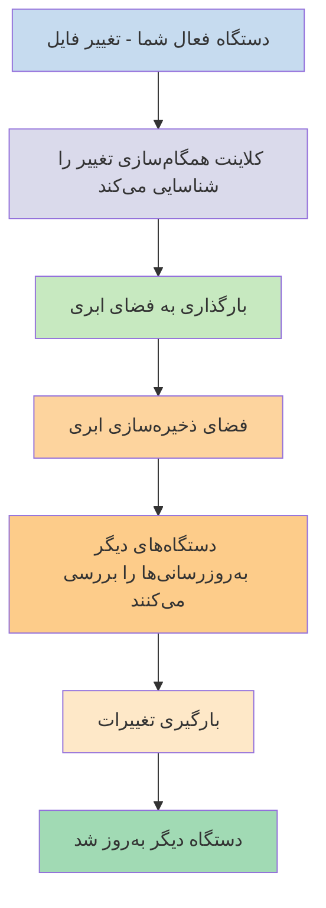
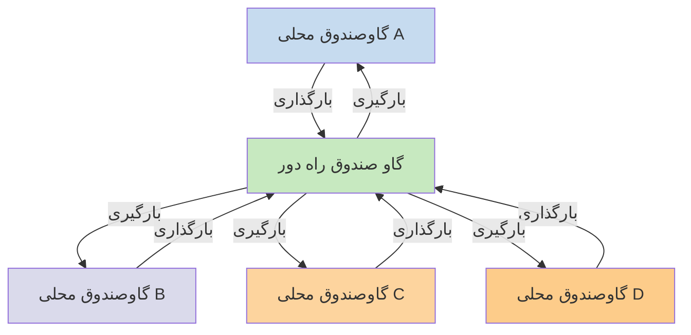

اگر می‌خواهید از یادداشت‌هایتان در دستگاه‌های مختلف استفاده کنید، یکی از گزینه‌هایی که دارید [[همگام‌سازی یادداشت‌ها در دستگاه‌ها|همگام‌سازی یادداشت‌ها در دستگاه‌ها]] است. Obsidian یک سرویس این‌چنینی به نام [[معرفی Obsidian Sync|Obsidian Sync]] ارائه می‌دهد که متفاوت از سایر سرویس‌های همگام‌سازی مانند [[همگام‌سازی یادداشت‌ها در دستگاه‌ها#iCloud|iCloud]] و [[همگام‌سازی یادداشت‌ها در دستگاه‌ها#OneDrive|OneDrive]] کار می‌کند.

در اینجا برخی اصطلاحات کلیدی آمده است:

- **گاوصندوق** پوشه‌ای در سیستم فایل شماست که شامل یادداشت‌ها و یک پوشه `.obsidian` با پیکربندی مخصوص Obsidian است.
- **گاوصندوق محلی** نسخه‌ای از گاوصندوق شماست که روی هر یک از دستگاه‌هایتان وجود دارد. هنگام استفاده از سرویس‌های همگام‌سازی، شما این گاوصندوق‌های محلی را متصل می‌کنید تا همگام‌سازی فعال شود.
- **گاو صندوق راه دور** فضای ذخیره‌سازی متمرکزی است که گاوصندوق‌های محلی مستقیماً از طریق Obsidian Sync به آن متصل می‌شوند.

دو رویکرد رایج برای همگام‌سازی وجود دارد:

- **[[#سرویس‌های همگام‌سازی مبتنی بر فایل]]**: گاوصندوق‌های محلی باید در پوشه‌های تحت نظارت باشند، همگام‌سازی از طریق سیستم فایل انجام می‌شود
- **[[#Obsidian Sync|گاوصندوق‌های راه‌دور]]**: فضای ذخیره‌سازی متمرکز که گاوصندوق‌های محلی مستقیماً از طریق Obsidian به آن متصل می‌شوند

## سرویس‌های همگام‌سازی مبتنی بر فایل

سرویس‌هایی مانند Dropbox، Google Drive، iCloud و OneDrive مبتنی بر پوشه هستند. این سرویس‌ها پوشه‌های خاصی را تحت نظارت قرار می‌دهند و به طور خودکار هر فایلی که در آن‌ها قرار بگیرد را همگام‌سازی می‌کنند. فایل‌ها باید در پوشه‌های تعیین‌شده سرویس ابری باشند تا همگام‌سازی شوند. با سرویس‌های همگام‌سازی مبتنی بر فایل، گاوصندوق محلی شما فقط یک پوشه دیگر تحت نظارت است. هیچ گاو صندوق راه دور اختصاصی وجود ندارد - در عوض، فضای ذخیره‌سازی ابری به عنوان یک واسطه عمل می‌کند و فایل‌ها را بین گاوصندوق‌های محلی در دستگاه‌های مختلف کپی می‌کند.

نمودار زیر نسخه ساده‌شده‌ای از نحوه کار این سرویس‌ها را نشان می‌دهد:

اگر سرویس ابری همگام‌سازی پس‌زمینه داشته باشد، برخی از این فرآیندها ممکن است حتی زمانی که شما به طور فعال از اپلیکیشن‌ها برای مشاهده فایل‌ها استفاده نمی‌کنید در حال انجام باشند. این سرویس‌ها پوشه‌های خاصی را تحت نظارت قرار می‌دهند و به طور خودکار هر فایلی که در آن‌ها قرار بگیرد را همگام‌سازی می‌کنند. فایل‌ها باید در پوشه‌های تعیین‌شده سرویس ابری باشند تا همگام‌سازی شوند.

## Obsidian Sync

Obsidian Sync به شما امکان می‌دهد یک گاو صندوق راه دور ایجاد کنید که از طریق سرویس [[معرفی Obsidian Sync|Obsidian Sync]] به عنوان فضای ذخیره‌سازی متمرکز عمل می‌کند. این به شما امکان می‌دهد تقریباً هر پوشه‌ای را در هر یک از دستگاه‌هایتان برای ذخیره فایل‌هایتان انتخاب کنید - چه روی یک هارد اکسترنال، در `C:\`، یا در حافظهٔ اپلیکیشن در Android.

با این حال، اگر از [[#سرویس‌های همگام‌سازی مبتنی بر فایل]] نیز در همان دستگاه استفاده می‌کنید، فهرستی از مکان‌های پیشنهادی برای گاوصندوق محلی شما داریم - عمدتاً هر جایی که در [[مهاجرت به Obsidian Sync#خزانه خود را از سرویس همگام‌سازی شخص ثالث یا فضای ذخیره‌سازی ابری خارج کنید|سرویس همگام‌سازی شخص ثالث]] نباشد.

نمودار زیر نسخه ساده‌شده‌ای از نحوه کار Obsidian Sync را نشان می‌دهد:

قدرت این سیستم با افزایش انواع دستگاه‌ها بیشتر آشکار می‌شود. [[#سرویس‌های همگام‌سازی مبتنی بر فایل]] ممکن است در سیستم‌عامل‌های مختلف به صورت ناسازگار پیاده‌سازی شوند، و دستگاه‌های موبایل قوانین خاص خود را دارند از جمله اینکه چگونه اپلیکیشن‌ها می‌توانند سندباکس شوند و مصرف انرژی آن‌ها محدود شود، که کار سرویس‌های سنتی مبتنی بر فایل را برای عملکرد یکپارچه بسیار سخت‌تر می‌کند.

با Obsidian Sync، سرویس همگام‌سازی را مستقیماً از طریق اپلیکیشن مدیریت می‌کند و رفتار یکسانی را بدون توجه به نوع دستگاه یا محدودیت‌های سیستم‌عامل ارائه می‌دهد، در حالی که اولویت را بر نگهداری یک نسخه محلی از داده‌هایتان به عنوان [[پشتیبان‌گیری از فایل‌های Obsidian|پشتیبان نرم]] قرار می‌دهد.

### رفتار همگام‌سازی

وقتی در گاوصندوق محلی خود تغییراتی ایجاد می‌کنید، Obsidian Sync این تغییرات را شناسایی کرده و آن‌ها را به گاو صندوق راه دور بارگذاری می‌کند. سایر دستگاه‌های متصل به همان گاو صندوق راه دور سپس این تغییرات را بارگیری کرده و در گاوصندوق‌های محلی خود اعمال می‌کنند. Obsidian Sync تغییرات را در سطح فایل ردیابی می‌کند و فقط فایل‌هایی را که تغییر کرده‌اند انتقال می‌دهد، نه اینکه پوشه‌های کامل را همگام‌سازی کند. این کار مصرف پهنای باند و زمان همگام‌سازی را کاهش می‌دهد.

هنگامی که تعارض رخ می‌دهد یا وقتی نیاز دارید کنترل کنید کدام فایل‌ها همگام‌سازی شوند، Obsidian Sync مکانیزم‌های خاصی برای مدیریت این شرایط ارائه می‌دهد:

![[عیب‌یابی Obsidian Sync#حل تعارض‌ها|حل تعارض‌ها]]

![[تنظیمات همگام‌سازی و همگام‌سازی گزینشی#همگام‌سازی گزینشی#مستثنا کردن یک پوشه از همگام‌سازی]]

### رفتار آفلاین

تغییراتی که در حالت آفلاین انجام می‌شوند در صف قرار می‌گیرند و وقتی دستگاه شما دوباره به اینترنت متصل شود و Obsidian باز باشد، به طور خودکار همگام‌سازی می‌شوند. گاوصندوق محلی شما در دوره‌های آفلاین کاملاً کاربردی باقی می‌ماند.

## گام‌های بعدی

- [[راه‌اندازی Obsidian Sync]] برای شروع کار با گاوصندوق‌های راه‌دور.
- [[مهاجرت به Obsidian Sync]] اگر در حال حاضر از همگام‌سازی مبتنی بر فایل استفاده می‌کنید و می‌خواهید از Obsidian Sync استفاده کنید.
- [[همگام‌سازی یادداشت‌ها در دستگاه‌ها|کاوش سایر گزینه‌های همگام‌سازی]] اگر هنوز در حال تصمیم‌گیری هستید.
