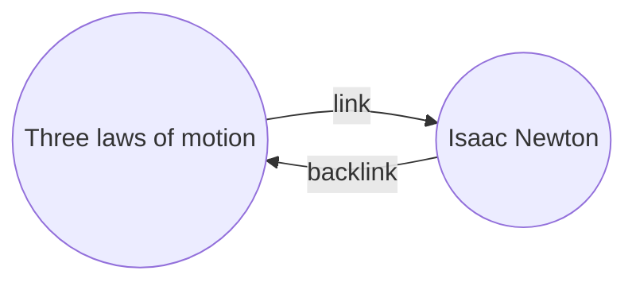

With the Backlinks plugin, you can see all the _backlinks_ for the active note.

A backlink for a note is a link from another note to that note. In the following example, the "Three laws of motion" note contains a link to the "Isaac Newton" note. The corresponding backlink would link from "Isaac Newton" back to "Three laws of motion".

Backlinks can be useful to find notes that reference the note you're writing. Just imagine if you could list the backlinks for any website on the internet.

## Show backlinks

The Backlinks plugin displays the backlinks for the active tabs. There are two collapsible sections: **Linked mentions** and **Unlinked mentions**.

- **Linked mentions** are backlinks to the notes that contain an internal link to the active note.
- **Unlinked mentions** are backlinks to any unlinked occurrence of the name of the active note.

It provides the following options:

- **Collapse results** toggles whether to expand each note to display the mentions in it.
- **Show more context** toggles whether to truncate or display the full paragraph that contains the mention.
- **Change sort order** determines how to sort the mentions.
- **Show search filter** toggles a text field that lets you filter the mentions. For more information on how to build a search query, refer to [[Search]].

## View backlinks for a note

To view the backlinks for the active note, click the **Backlinks** (link and arrow icon) tab in the right sidebar.

> [!note]
> If you can't see the Backlinks tab, you can make it visible by opening the [[Command palette]] and running the **Backlinks: Show backlinks** command.

## See backlinks of a specific note

The backlinks tab lists backlinks for the active note and updates when you switch to a different note. If you want to see the backlinks for a specific note, regardless of whether it's active or note, you can open a _linked_ backlinks tab.

To open a linked backlinks tab:

1. Open the [[Command palette]].
2. Select **Backlinks: Open backlinks for the current note**.

A separate tab opens next to your active note. The tab shows a link icon to let you know it's linked to a note.

## Show backlinks in a note

Instead of showing the backlinks in a separate tab, you can show the backlinks at the bottom of your note.

To show backlinks in a note:

1. Open the [[Command palette]].
2. Select **Backlinks: Toggle backlinks in document**.

Or, enable **Backlink in document** under the Backlinks plugin options to automatically toggle backlinks when you open a new note.
