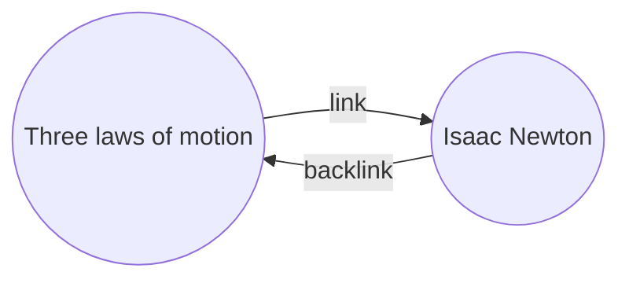

با افزونه [[افزونه‌های اصلی|پشت‌وندها]] می‌توانید تمام _بک‌لینک‌ها_ را برای یادداشت فعال مشاهده کنید.

بک‌لینک یک یادداشت، پیوندی از یادداشت دیگری به آن یادداشت است. در نمونه زیر، یادداشت «سه قانون حرکت» شامل یک پیوند به یادداشت «ایزاک نیوتن» است. بک‌لینک متناظر از «ایزاک نیوتن» به «سه قانون حرکت» پیوند می‌دهد.

بک‌لینک‌ها می‌توانند برای یافتن یادداشت‌هایی که به یادداشت در حال نوشتن شما ارجاع می‌دهند مفید باشند. تصور کنید بتوانید بک‌لینک‌های هر وبسایتی در اینترنت را فهرست کنید.

## نمایش پشت‌وندها

افزونه پشت‌وندها، بک‌لینک‌های زبانه‌های فعال را نمایش می‌دهد. دو بخش جمع‌شدنی وجود دارد: **یادکردهای پیوندشده** و **یادکردهای پیوندنشده**.

- **یادکردهای پیوندشده** بک‌لینک‌هایی به یادداشت‌هایی هستند که حاوی یک پیوند داخلی به یادداشت فعال می‌باشند.
- **یادکردهای پیوندنشده** بک‌لینک‌هایی به هر نمونه‌ی بدون پیوند از نام یادداشت فعال هستند.

گزینه‌های زیر را ارائه می‌دهد:

- **پنهان کردن نتایج** مشخص می‌کند که آیا هر یادداشت باز شود تا یادکردهای داخل آن نمایش داده شوند یا خیر.
- **نمایش محتوای بیشتر** مشخص می‌کند که پاراگراف حاوی یادکرد به‌صورت کامل نمایش داده شود یا کوتاه شود.
- **تغییر ترتیب چینش** نحوه مرتب‌سازی یادکردها را تعیین می‌کند.
- **نمایش پالایه‌های جست‌وجو** یک فیلد متنی را نشان می‌دهد که امکان فیلتر کردن یادکردها را فراهم می‌کند. برای اطلاعات بیشتر درباره ساخت عبارت جستجو، به [[جستجو]] مراجعه کنید.

## مشاهده پشت‌وندهای یک یادداشت

برای مشاهده بک‌لینک‌های یادداشت فعال، روی زبانه **پشت‌وندها** ![[obsidian-icon-links-coming-in.svg#icon]] در نوار کناری راست کلیک کنید.

> [!note] توجه
> اگر زبانه پشت‌وندها را نمی‌بینید، می‌توانید با گشودن [[فرمان‌دان|پالت فرمان‌ها]] و اجرای دستور **Backlinks: Show backlinks** آن را آشکار کنید.

> [!info] پرونده‌های مستثنا
> فایل‌هایی که با الگوهای [[تنظیمات#پرونده‌های مستثنا|پرونده‌های مستثنا]] مطابقت دارند، در یادکردهای پیوندنشده ظاهر نخواهند شد.

## مشاهده پشت‌وندهای یک یادداشت خاص

زبانه پشت‌وندها، بک‌لینک‌های یادداشت فعال را نمایش می‌دهد و هنگام تغییر به یادداشت دیگر به‌روزرسانی می‌شود. اگر می‌خواهید بک‌لینک‌های یک یادداشت خاص را ببینید، صرف‌نظر از اینکه فعال باشد یا نه، می‌توانید یک زبانه پشت‌وندهای _متصل_ باز کنید.

برای گشودن زبانه پشت‌وندهای متصل:

1. [[فرمان‌دان|پالت فرمان‌ها]] را باز کنید.
2. **Backlinks: Open backlinks for the current note** را انتخاب کنید.

یک زبانه جداگانه در کنار یادداشت فعال شما باز می‌شود. این زبانه یک آیکون پیوند نمایش می‌دهد تا بدانید به یک یادداشت متصل است.

## نمایش پشت‌وندها در یادداشت

به جای نمایش بک‌لینک‌ها در یک زبانه جداگانه، می‌توانید بک‌لینک‌ها را در پایین یادداشت خود نمایش دهید.

برای نمایش بک‌لینک‌ها در یادداشت:

1. [[فرمان‌دان|پالت فرمان‌ها]] را باز کنید.
2. **Backlinks: Toggle backlinks in document** را انتخاب کنید.

یا **Backlink in document** را در تنظیمات افزونه پشت‌وندها فعال کنید تا هنگام گشودن یادداشت جدید، بک‌لینک‌ها به‌صورت خودکار نمایش داده شوند.
