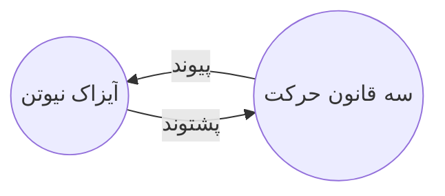

با افزونه‌ی پشت‌وندها، می‌توانید تمامِ پشت‌وندهای یادداشتِ فعّال را ببینید.

پُشت‌وَند (backlink) پیوندی‌ست از یادداشتی دیگر به یادداشتِ فعّال. در نمونه‌ی زیر، یادداشتِ «سه قانونِ حرکت» پیوندی به «آیزاک نیوتن» دارد. پشت‌وندِ همانندی یادداشتِ «آیزاک نیوتن» را باز به «سه قانونِ حرکت» پیوند می‌زند.

پشت‌وندها به کارِ یافتنِ یادداشت‌هایی که به یادداشتِ کنونی ارجاع می‌دهند، می‌آیند. مثلِ این است که بتوانید پشت‌وندها را برای هر وبگاهی که در اینترنت می‌بینید، فهرست کنید.  
## نمایشِ پشت‌وندها
افزونه‌ی پشت‌وندها پشت‌وندهای زبانه‌ی فعّال را نشان می‌دهد. دو بخشِ جمع‌کردنی داریم: **یادکردهای پیوندشده** و **یادکردهای پیوندنشده**.
- **یادکردهای پیوندشده** پشت‌وندهایی به یادداشت‌هایی‌اند که پیوندِ درونی‌ای به یادداشتِ فعّال دارند.
- **یادکردهای پیوندنشده** 
- **Unlinked mentions** are backlinks to any unlinked occurrence of the name of the active note.

این افزونه گزینه‌های زیر را ارائه می‌کند:
- **Collapse results** toggles whether to expand each note to display the mentions in it. 
- **Show more context** toggles whether to truncate or display the full paragraph that contains the mention.
- **Change sort order** determines how to sort the mentions.
- **Show search filter** toggles a text field that lets you filter the mentions. For more information on how to build a search query, refer to [[جست‌وجو]].
- جمع کردن
## نمایشِ پشت‌وندهای یادداشت

برای دیدنِ پشت‌وندهای یادداشتِ فعّال، روی زبانه‌ی «پشت‌وندها» (با نشانِ پیوند و پیکان) در نوارِ کناریِ راست بزنید.

> [!note] نکته
> اگر زبانه‌ی پشت‌وندها را نمی‌بینید، می‌توانید با گشودنِ [[فرمان‌دان]] و اجرای فرمانِ **پشت‌وندها: نمایشِ پشت‌وندها**، ظاهرش کنید.

## دیدنِ پشت‌وندهای یک یادداشتِ خاص

زبانه‌ی پشت‌وندها پشت‌وندهای یادداشتِ فعّال را فهرست کرده و هرگاه به یادداشتِ دیگری می‌روید، آن فهرست را به‌روز می‌کند. اگر می‌خواهید پشت‌وندهای یک یادداشتِ خاص را جدایِ فعّال بودن یا نبودنش ببینید، می‌توانید یک زبانه‌ی پشت‌وندهای پیوندشده باز کنید. 
برای گشودنِ زبانه‌ی پشت‌وندهای پیوندشده: 
1. [[فرمان‌دان]] را بگشایید.
2. فرمانِ **پشت‌وندها: گشودنِ پشت‌وندها برای یادداشتِ کنونی** را برگزینید.

زبانه‌ی جدایی در کنارِ یادداشتِ فعّال باز می‌شود. زبانه یک نمادِ پیوند نشان می‌دهد که بدانید به یک یادداشت پیوند خورده است. 
## نمایشِ ‌پشت‌وندها درونِ یادداشت

به‌جای نمایشِ پشت‌وندها در زبانه‌ای جدا، می‌توان آن‌ها را در پایینِ یادداشت نمایش داد.
برای نمایشِ پشت‌وندها درونِ یادداشت:
1. [[فرمان‌دان]] را بگشایید.
2. فرمانِ **پشت‌وندها: تاگِلِ پشت‌وندها در این نوشته** را برگزینید.

یا در تنظیماتِ افزونه‌ی پشت‌وندها، گزینه‌ی **پشت‌وندها در نوشته** را فعّال کنید تا هرگاه یادداشتِ نویی را باز می‌کنید، پشت‌وندها فعّال شوند.