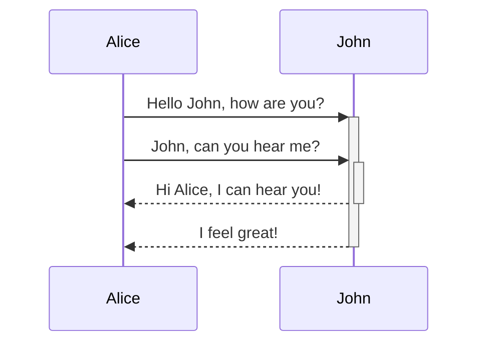
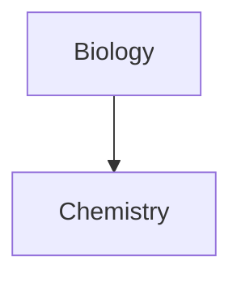

بیاموزید چگونه سینتکس قالب‌بندی پیشرفته را به یادداشت‌های خود اضافه کنید.

## جدول‌ها

می‌توانید با استفاده از خطوط عمودی (`|`) برای جدا کردن ستون‌ها و خط تیره (`-`) برای تعریف سرفصل‌ها، جدول بسازید. مثال:

```md
| First name | Last name |
| ---------- | --------- |
| Max        | Planck    |
| Marie      | Curie     |
```

| First name | Last name |
| ---------- | --------- |
| Max        | Planck    |
| Marie      | Curie     |

اگرچه خطوط عمودی در دو طرف جدول اختیاری هستند، استفاده از آن‌ها برای خوانایی بهتر توصیه می‌شود.

> [!tip] در _پیش‌نمایش زنده_، می‌توانید روی جدول کلیک راست کنید تا ستون‌ها و ردیف‌ها را اضافه یا حذف کنید. همچنین می‌توانید با منوی زمینه‌ای آن‌ها را مرتب‌سازی و جابه‌جا کنید.

می‌توانید با استفاده از دستور **درج جدول** از [[فرمان‌دان|پالت فرمان‌ها]] یا با کلیک راست و انتخاب _درج ← جدول_ یک جدول وارد کنید. این کار یک جدول پایه و قابل ویرایش به شما می‌دهد:

```md
|     |     |
| --- | --- |
|     |     |
```

توجه داشته باشید که سلول‌ها نیازی به تراز کامل ندارند، اما ردیف سرفصل باید حداقل دو خط تیره داشته باشد:

```md
First name | Last name
-- | --
Max | Planck
Marie | Curie
```


### قالب‌بندی محتوا در داخل جدول

می‌توانید از [[سینتکس قالب‌بندی پایه]] برای سبک‌دهی محتوا در داخل جدول استفاده کنید.

| ستون اول       | ستون دوم                           |
| ------------------ | --------------------------------------- |
| [[پیوندهای داخلی]] | پیوند به فایلی _در داخل_ **گاوصندوق** شما. |
| [[جاسازی فایل‌ها]]    | ![[Engelbart.jpg\|100]]                 |

> [!note] خطوط عمودی در جدول‌ها
> اگر می‌خواهید از [[دگرنام]] استفاده کنید، یا [[سینتکس قالب‌بندی پایه#تصاویر خارجی|اندازهٔ تصویر را تغییر دهید]] در جدول خود، باید قبل از خط عمودی یک `\` اضافه کنید.
>
> ```md
> First column | Second column
> -- | --
> [[سینتکس قالب‌بندی پایه\|سینتکس Markdown]] | ![[Engelbart.jpg\|200]]
> ```
>
> First column | Second column
> -- | --
> [[سینتکس قالب‌بندی پایه\|سینتکس Markdown]] | ![[Engelbart.jpg\|200]]

با افزودن دونقطه (`:`) به ردیف سرفصل، متن را در ستون‌ها تراز کنید. همچنین می‌توانید محتوا را در _پیش‌نمایش زنده_ از طریق منوی زمینه‌ای تراز کنید.

```md
Left-aligned text | Center-aligned text | Right-aligned text
:-- | :--: | --:
Content | Content | Content
```

Left-aligned text | Center-aligned text | Right-aligned text
:-- | :--: | --:
Content | Content | Content

## نمودار

می‌توانید با استفاده از [Mermaid](https://mermaid-js.github.io/) نمودارها و چارت‌ها را به یادداشت‌های خود اضافه کنید. Mermaid از انواع مختلفی از نمودارها پشتیبانی می‌کند، مانند [فلوچارت‌ها](https://mermaid.js.org/syntax/flowchart.html)، [نمودارهای توالی](https://mermaid.js.org/syntax/sequenceDiagram.html) و [خطوط زمانی](https://mermaid.js.org/syntax/timeline.html).

> [!tip] نکته
> همچنین می‌توانید [ویرایشگر زنده](https://mermaid-js.github.io/mermaid-live-editor) Mermaid را امتحان کنید تا قبل از قرار دادن نمودار در یادداشت‌ها، آن را بسازید.

برای افزودن نمودار Mermaid، یک [[سینتکس قالب‌بندی پایه#بلوک‌های کد|بلوک کد]] `mermaid` ایجاد کنید.

````md

````


````md

````


### پیوند دادن فایل‌ها در نمودار

می‌توانید با اتصال [کلاس](https://mermaid.js.org/syntax/flowchart.html#classes) `internal-link` به گره‌های خود، [[پیوندهای داخلی]] در نمودارهایتان ایجاد کنید.

````md

````


> [!note] توجه
> پیوندهای داخلی از نمودارها در [[نمای نمودار]] نمایش داده نمی‌شوند.

اگر گره‌های زیادی در نمودارهای خود دارید، می‌توانید از قطعه کد زیر استفاده کنید.

````md

````

به این ترتیب، هر گره حرفی به یک پیوند داخلی تبدیل می‌شود و [متن گره](https://mermaid.js.org/syntax/flowchart.html#a-node-with-text) به عنوان متن پیوند استفاده می‌شود.

> [!note] توجه
> اگر از کاراکترهای خاص در نام یادداشت‌های خود استفاده می‌کنید، باید نام یادداشت را در دو علامت نقل‌قول قرار دهید.
>
> ```
> class "⨳ special character" internal-link
> ```
>
> یا `A["⨳ special character"]`.

برای اطلاعات بیشتر درباره ساختن نمودارها، به [مستندات رسمی Mermaid](https://mermaid.js.org/intro/) مراجعه کنید.

## ریاضی

می‌توانید با استفاده از [MathJax](http://docs.mathjax.org/en/latest/basic/mathjax.html) و نشان‌گذاری LaTeX، عبارات ریاضی را به یادداشت‌های خود اضافه کنید.

برای افزودن عبارت MathJax به یادداشت خود، آن را با دو علامت دلار (`$$`) محصور کنید.

```md
$$
\begin{vmatrix}a & b\\
c & d
\end{vmatrix}=ad-bc
$$
```

$$
\begin{vmatrix}a & b\\
c & d
\end{vmatrix}=ad-bc
$$

همچنین می‌توانید عبارات ریاضی درون‌خطی را با محصور کردن آن‌ها در نمادهای `$` ایجاد کنید.

```md
This is an inline math expression $e^{2i\pi} = 1$.
```

This is an inline math expression $e^{2i\pi} = 1$.

برای اطلاعات بیشتر درباره سینتکس، به [آموزش پایه و مرجع سریع MathJax](https://math.meta.stackexchange.com/questions/5020/mathjax-basic-tutorial-and-quick-reference) مراجعه کنید.

برای فهرست بسته‌های پشتیبانی‌شده MathJax، به [فهرست افزونه‌های TeX/LaTeX](http://docs.mathjax.org/en/latest/input/tex/extensions/index.html) مراجعه کنید.
