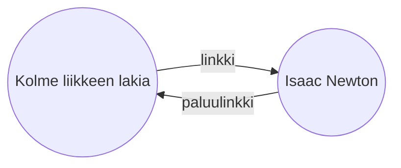

[[Sisäänrakennetut lisäosat|Paluulinkit-lisäosalla]] voit nähdä kaikki aktiivisen muistiinpanon _paluulinkit_.

Muistiinpanon paluulinkki on linkki toisesta muistiinpanosta kyseiseen muistiinpanoon. Seuraavassa esimerkissä "Kolme liikkeen lakia" -muistiinpano sisältää linkin "Isaac Newton" -muistiinpanoon. Vastaava paluulinkki johtaisi "Isaac Newtonista" takaisin "Kolmeen liikkeen lakiin".

Paluulinkit voivat olla hyödyllisiä sellaisten muistiinpanojen löytämiseen, jotka viittaavat kirjoittamaasi muistiinpanoon. Kuvittele, jos voisit luetteloida minkä tahansa internetsivuston paluulinkit.

## Näytä paluulinkit

Paluulinkit-lisäosa näyttää aktiivisten välilehtien paluulinkit. Siinä on kaksi kutistettavaa osiota: **Linkilliset maininnat** ja **Linkittömät maininnat**.

- **Linkilliset maininnat** ovat paluulinkkejä muistiinpanoista, jotka sisältävät sisäisen linkin aktiiviseen muistiinpanoon.
- **Linkittömät maininnat** ovat paluulinkkejä mihin tahansa linkittömään esiintymään aktiivisen muistiinpanon nimestä.

Käytettävissä ovat seuraavat vaihtoehdot:

- **Kutista tulokset** vaihtaa, laajennetaanko jokainen muistiinpano näyttämään siinä olevat maininnat.
- **Näytä enemmän kontekstia** vaihtaa, lyhennetäänkö vai näytetäänkö kokonaan se kappale, joka sisältää maininnan.
- **Vaihda järjestystä** määrittää, miten maininnat järjestetään.
- **Näytä hakusuodatin** näyttää tai piilottaa tekstikentän, jolla voit suodattaa mainintoja. Lisätietoja hakutermin muodostamisesta on kohdassa [[Hae]].

## Muistiinpanon paluulinkkien tarkastelu

Nähdäksesi aktiivisen muistiinpanon paluulinkit, napsauta **Paluulinkit** ![[obsidian-icon-links-coming-in.svg#icon]] -välilehteä oikeassa sivupalkissa.

> [!note] Huomautus
> Jos et näe Paluulinkit-välilehteä, voit tehdä sen näkyväksi avaamalla [[Komentovalikko|komentovalikon]] ja suorittamalla **Paluulinkit: Näytä paluulinkit** -komennon.

> [!info] Pois jätettävät tiedostot
> Tiedostot, jotka vastaavat [[Asetukset#Pois jätettävät tiedostot|Pois jätettävät tiedostot]] -kuvioitasi, eivät näy linkittömissä maininnoissa.

## Tietyn muistiinpanon paluulinkkien näyttäminen

Paluulinkit-välilehti luettelee aktiivisen muistiinpanon paluulinkit ja päivittyy, kun vaihdat toiseen muistiinpanoon. Jos haluat nähdä tietyn muistiinpanon paluulinkit riippumatta siitä, onko se aktiivinen vai ei, voit avata _linkitetyn_ paluulinkit-välilehden.

Linkitetyn paluulinkit-välilehden avaaminen:

1. Avaa [[Komentovalikko]].
2. Valitse **Paluulinkit: Avaa nykyisen tiedoston paluulinkit**.

Erillinen välilehti avautuu aktiivisen muistiinpanosi viereen. Välilehdessä näkyy linkkikuvake, joka kertoo sen olevan linkitetty muistiinpanoon.

## Paluulinkkien näyttäminen muistiinpanossa

Sen sijaan, että näyttäisit paluulinkit erillisellä välilehdellä, voit näyttää ne muistiinpanosi alaosassa.

Paluulinkkien näyttäminen muistiinpanossa:

1. Avaa [[Komentovalikko]].
2. Valitse **Paluulinkit: Näytä tai piilota tiedoston paluulinkit**.

Vaihtoehtoisesti voit ottaa käyttöön **Tiedoston paluulinkit** Paluulinkit-lisäosan asetuksista, jolloin paluulinkit näytetään automaattisesti uuden muistiinpanon avaamisen yhteydessä.
