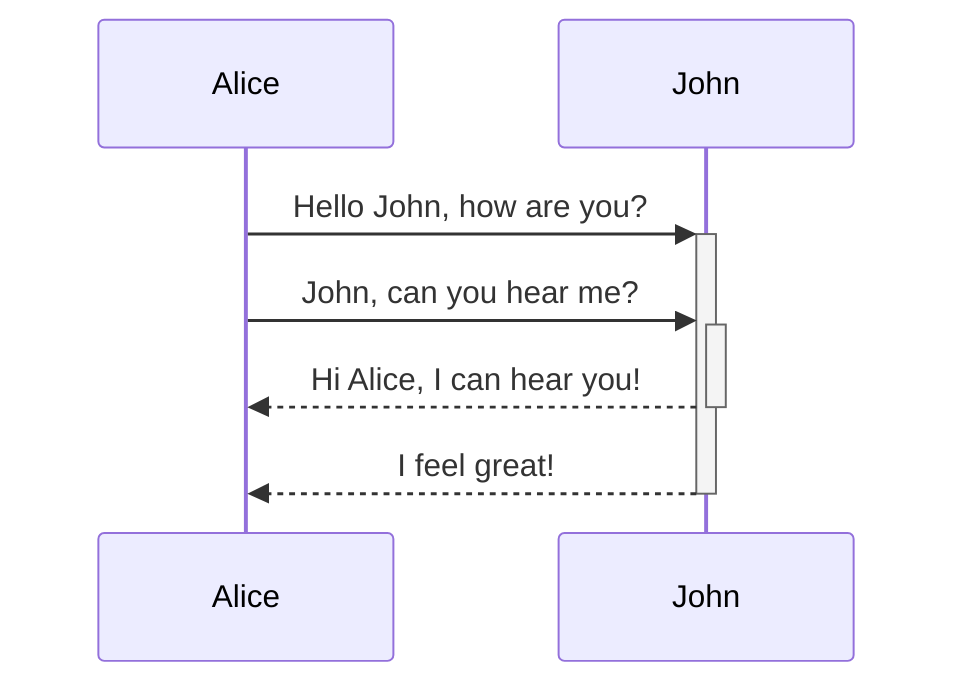
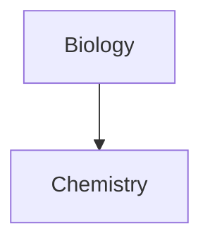

Opi lisäämään muistiinpanoihisi muotoilun lisäsyntaksia.

## Taulukot

Voit luoda taulukoita käyttämällä pystyviivoja (`|`) sarakkeiden erottamiseen ja tavuviivoja (`-`) otsikoiden määrittämiseen. Tässä esimerkki:

```md
| Etunimi | Sukunimi |
| ------- | -------- |
| Max     | Planck   |
| Marie   | Curie    |
```

| Etunimi | Sukunimi |
| ------- | -------- |
| Max     | Planck   |
| Marie   | Curie    |

Vaikka taulukon reunojen pystyviivat ovat valinnaisia, niiden käyttöä suositellaan luettavuuden vuoksi.

> [!tip] *Visuaalisessa muokkauksessa* voit napsauttaa taulukkoa hiiren oikealla painikkeella lisätäksesi tai poistaaksesi sarakkeita ja rivejä. Voit myös järjestää ja siirtää niitä kontekstivalikon avulla.

Voit lisätä taulukon **Lisää taulukko** -komennolla [[Komentovalikko|komentovalikosta]] tai napsauttamalla hiiren oikealla painikkeella ja valitsemalla _Lisää → Taulukko_. Tämä antaa sinulle perusmuotoisen, muokattavan taulukon:

```md
|     |     |
| --- | --- |
|     |     |
```

Huomaa, että solujen ei tarvitse olla täydellisesti tasattuja, mutta otsikkorivillä on oltava vähintään kaksi tavuviivaa:

```md
Etunimi | Sukunimi
-- | --
Max | Planck
Marie | Curie
```


### Sisällön muotoilu taulukossa

Voit käyttää [[Muotoilun perussyntaksi|muotoilun perussyntaksia]] taulukon sisällön tyylittelyyn.

| Ensimmäinen sarake  | Toinen sarake                                         |
| ------------------- | ----------------------------------------------------- |
| [[Sisäiset linkit]] | Linkki tiedostoon **holvin** _sisällä_.                |
| [[Upota tiedostoja]]| ![[Engelbart.jpg\|100]]                               |

> [!note] Pystyviivat taulukoissa
> Jos haluat käyttää [[Aliakset|aliaksia]] tai [[Muotoilun perussyntaksi#Ulkoiset kuvat|muuttaa kuvan kokoa]] taulukossa, sinun on lisättävä `\` pystyviivan eteen.
>
> ```md
> Ensimmäinen sarake | Toinen sarake
> -- | --
> [[Muotoilun perussyntaksi\|Markdown-syntaksi]] | ![[Engelbart.jpg\|200]]
> ```
>
> Ensimmäinen sarake | Toinen sarake
> -- | --
> [[Muotoilun perussyntaksi\|Markdown-syntaksi]] | ![[Engelbart.jpg\|200]]

Tasaa sarakkeiden teksti lisäämällä kaksoispisteitä (`:`) otsikkoriville. Voit myös tasata sisältöä *visuaalisessa muokkauksessa* kontekstivalikon kautta.

```md
Vasemmalle tasattu teksti | Keskelle tasattu teksti | Oikealle tasattu teksti
:-- | :--: | --:
Sisältö | Sisältö | Sisältö
```

Vasemmalle tasattu teksti | Keskelle tasattu teksti | Oikealle tasattu teksti
:-- | :--: | --:
Sisältö | Sisältö | Sisältö

## Kaaviot

Voit lisätä kaavioita muistiinpanoihisi käyttämällä [Mermaidia](https://mermaid-js.github.io/). Mermaid tukee monenlaisia kaavioita, kuten [vuokaavioita](https://mermaid.js.org/syntax/flowchart.html), [sekvenssikaavioita](https://mermaid.js.org/syntax/sequenceDiagram.html) ja [aikajanakaavioita](https://mermaid.js.org/syntax/timeline.html).

> [!tip] Vinkki
> Voit myös kokeilla Mermaidin [Live Editoria](https://mermaid-js.github.io/mermaid-live-editor) kaavioiden rakentamiseen ennen kuin lisäät ne muistiinpanoihisi.

Lisää Mermaid-kaavio luomalla `mermaid`-[[Muotoilun perussyntaksi#Koodilohkot|koodilohko]].

````md

````


````md

````


### Tiedostojen linkittäminen kaaviossa

Voit luoda [[Sisäiset linkit|sisäisiä linkkejä]] kaavioihisi liittämällä `internal-link`-[luokan](https://mermaid.js.org/syntax/flowchart.html#classes) solmuihin.

````md

````


> [!note] Huomautus
> Kaavioiden sisäiset linkit eivät näy [[Verkkonäkymä|verkkonäkymässä]].

Jos kaaviossasi on paljon solmuja, voit käyttää seuraavaa pätkää.

````md

````

Tällä tavalla jokaisesta kirjainsolmusta tulee sisäinen linkki, jossa [solmun teksti](https://mermaid.js.org/syntax/flowchart.html#a-node-with-text) toimii linkin tekstinä.

> [!note] Huomautus
> Jos käytät erikoismerkkejä muistiinpanojen nimissä, sinun on laitettava muistiinpanon nimi lainausmerkkeihin.
>
> ```
> class "⨳ special character" internal-link
> ```
>
> Tai `A["⨳ special character"]`.

Lisätietoja kaavioiden luomisesta löydät [Mermaidin virallisesta dokumentaatiosta](https://mermaid.js.org/intro/).

## Matematiikka

Voit lisätä matemaattisia lausekkeita muistiinpanoihisi käyttämällä [MathJaxia](http://docs.mathjax.org/en/latest/basic/mathjax.html) ja LaTeX-merkintätapaa.

Lisää MathJax-lauseke muistiinpanoosi ympäröimällä se kaksoisnumeromerkeillä (`$$`).

```md
$$
\begin{vmatrix}a & b\\
c & d
\end{vmatrix}=ad-bc
$$
```

$$
\begin{vmatrix}a & b\\
c & d
\end{vmatrix}=ad-bc
$$

Voit myös lisätä matemaattisia lausekkeita tekstin sekaan ympäröimällä ne `$`-merkeillä.

```md
Tämä on tekstin sisäinen matemaattinen lauseke $e^{2i\pi} = 1$.
```

Tämä on tekstin sisäinen matemaattinen lauseke $e^{2i\pi} = 1$.

Lisätietoja syntaksista löydät [MathJaxin perusoppaasta ja pikaviitteestä](https://math.meta.stackexchange.com/questions/5020/mathjax-basic-tutorial-and-quick-reference).

Luettelo tuetuista MathJax-paketeista löytyy [TeX/LaTeX-laajennusluettelosta](http://docs.mathjax.org/en/latest/input/tex/extensions/index.html).
