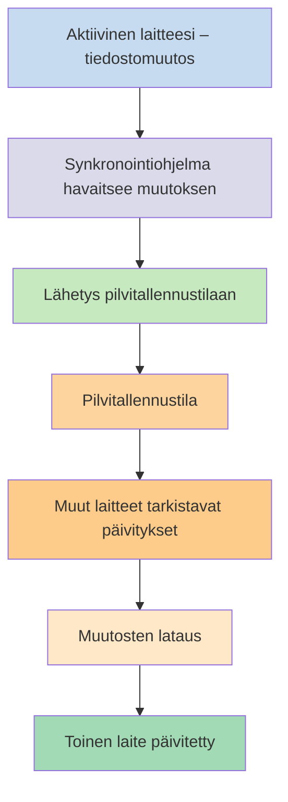
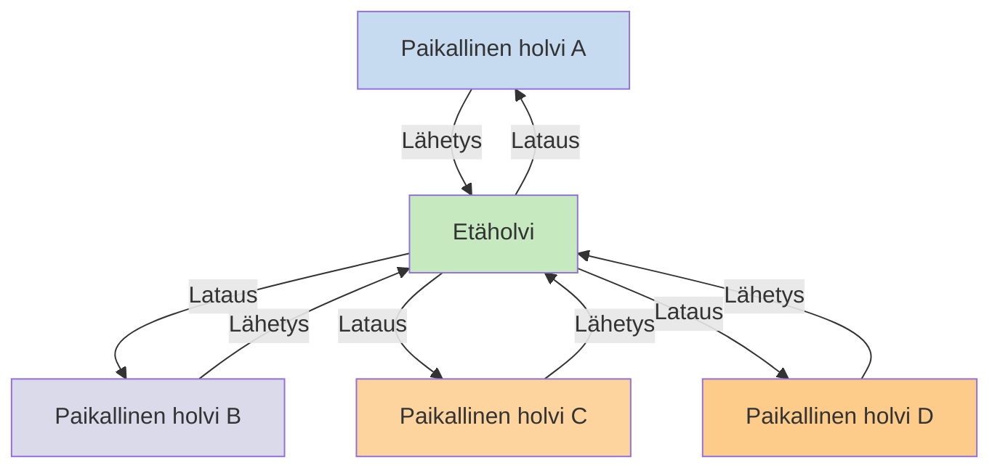

Jos haluat käyttää muistiinpanojasi eri laitteilla, yksi vaihtoehdoista on [[Synkronoi muistiinpanosi laitteiden välillä|synkronoida muistiinpanosi laitteiden välillä]]. Obsidian tarjoaa oman palvelun, [[Johdanto Obsidian Synciin|Obsidian Syncin]], joka toimii eri tavalla kuin muut synkronointipalvelut, kuten [[Synkronoi muistiinpanosi laitteiden välillä#iCloud|iCloud]] ja [[Synkronoi muistiinpanosi laitteiden välillä#OneDrive|OneDrive]].

Tässä joitakin keskeisiä termejä:

- **Holvi** on kansio tiedostojärjestelmässäsi, joka sisältää muistiinpanoja ja `.obsidian`-kansion Obsidianin omilla asetuksilla.
- **Paikallinen holvi** on kopio holvistasi, joka on kullakin laitteellasi. Synkronointipalveluja käytettäessä nämä paikalliset holvit yhdistetään synkronoinnin mahdollistamiseksi.
- **Etäholvi** on keskitetty tallennustila, johon paikalliset holvit yhdistyvät suoraan Obsidian Syncin kautta.

Synkronointiin on kaksi yleistä lähestymistapaa:

- **[[#Tiedostopohjaiset synkronointipalvelut]]**: Paikallisten holvien on sijaittava valvotuissa kansioissa, ja synkronointi tapahtuu tiedostojärjestelmän kautta
- **[[#Obsidian Sync|Etäholvit]]**: Keskitetty tallennustila, johon paikalliset holvit yhdistyvät suoraan Obsidianin kautta

## Tiedostopohjaiset synkronointipalvelut

Palvelut kuten Dropbox, Google Drive, iCloud ja OneDrive ovat kansiopohjaisia. Nämä palvelut valvovat tiettyjä kansioita ja synkronoivat automaattisesti kaikki niihin sijoitetut tiedostot. Tiedostojen on sijaittava pilvipalvelun määrittämissä kansioissa, jotta synkronointi toimii. Tiedostopohjaisissa synkronointipalveluissa paikallinen holvisi on vain yksi valvottava kansio muiden joukossa. Erillistä etäholvia ei ole – sen sijaan pilvitallennustila toimii välittäjänä, joka kopioi tiedostoja paikallisten holvien välillä eri laitteilla.

Alla oleva kaavio näyttää yksinkertaistetun version näiden palvelujen toiminnasta:

Jos pilvipalvelussa on taustasynkronointi, osa näistä prosesseista voi tapahtua, vaikka et aktiivisesti käyttäisi sovelluksia tiedostojen tarkasteluun. Nämä palvelut valvovat tiettyjä kansioita ja synkronoivat automaattisesti kaikki niihin sijoitetut tiedostot. Tiedostojen on sijaittava pilvipalvelun määrittämissä kansioissa, jotta synkronointi toimii.

## Obsidian Sync

Obsidian Sync mahdollistaa etäholvin luomisen keskitettynä tallennustilana [[Johdanto Obsidian Synciin|Obsidian Sync]] -palvelun kautta. Tämän ansiosta voit valita lähes minkä tahansa kansion millä tahansa laitteellasi tiedostojesi tallennuspaikaksi – olipa se ulkoinen kiintolevy, `C:\` tai sovellustallennustila Androidilla.

Meillä on kuitenkin luettelo suositelluista sijainneista paikalliselle holvillesi, jos käytät myös [[#Tiedostopohjaiset synkronointipalvelut|tiedostopohjaisia synkronointipalveluja]] samalla laitteella – pääsääntöisesti mikä tahansa sijainti, joka ei ole [[Siirtyminen Obsidian Synciin#Siirrä holvi pois ulkoisesta synkronointipalvelusta tai pilvitallennuksesta|kolmannen osapuolen synkronointipalvelun tai pilvitallennustilan]] alla.

Alla oleva kaavio näyttää yksinkertaistetun version Obsidian Syncin toiminnasta:

Tämän järjestelmän vahvuus korostuu, kun laitetyyppejä on enemmän. [[#Tiedostopohjaiset synkronointipalvelut]] voivat toimia epäjohdonmukaisesti eri käyttöjärjestelmissä, ja mobiililaitteilla on omat sääntönsä sovellusten eristämisen ja virransäästön suhteen, mikä tekee perinteisten tiedostopohjaisten palvelujen saumattomasta toiminnasta huomattavasti vaikeampaa.

Obsidian Syncissä palvelu hoitaa synkronoinnin suoraan sovelluksen kautta tarjoten yhdenmukaisen toiminnan laitetyypistä tai käyttöjärjestelmän rajoituksista riippumatta, ja pitää samalla paikallisen kopion tiedoistasi [[Varmuuskopioi Obsidian-tiedostosi|pehmeänä varmuuskopiona]].

### Synkronoinnin toiminta

Kun teet muutoksia paikallisen holvin tiedostoihin, Obsidian Sync havaitsee muutokset ja lähettää ne etäholviin. Muut samaan etäholviin yhdistetyt laitteet lataavat sitten nämä muutokset ja soveltavat ne paikallisiin holveihinsa. Obsidian Sync seuraa muutoksia tiedostotasolla ja siirtää vain muokatut tiedostot kokonaisten kansioiden sijaan. Tämä vähentää kaistanleveyden käyttöä ja synkronointiaikaa.

Kun ristiriitoja ilmenee tai kun haluat hallita, mitkä tiedostot synkronoituvat, Obsidian Sync tarjoaa erityiset mekanismit näiden tilanteiden käsittelyyn:

![[Obsidian Syncin vianmääritys#Ristiriitojen ratkaiseminen|Ristiriitojen ratkaisu]]

![[Synkronoinnin asetukset ja valikoiva synkronointi#Selective syncing#Exclude a folder from syncing]]

### Toiminta ilman verkkoyhteyttä

Ilman verkkoyhteyttä tehdyt muutokset asetetaan jonoon ja synkronoituvat automaattisesti, kun laitteesi muodostaa jälleen yhteyden internetiin ja Obsidian on avoinna. Paikallinen holvisi toimii täysin normaalisti offline-jaksojen aikana.

## Seuraavat vaiheet

- [[Obsidian Syncin käyttöönotto|Ota Obsidian Sync käyttöön]] aloittaaksesi etäholvien käytön.
- [[Siirtyminen Obsidian Synciin|Siirry Obsidian Synciin]], jos käytät tällä hetkellä tiedostopohjaista synkronointia ja haluat käyttää Obsidian Syncia.
- [[Synkronoi muistiinpanosi laitteiden välillä|Tutustu muihin synkronointivaihtoehtoihin]], jos olet vielä päättämässä.
