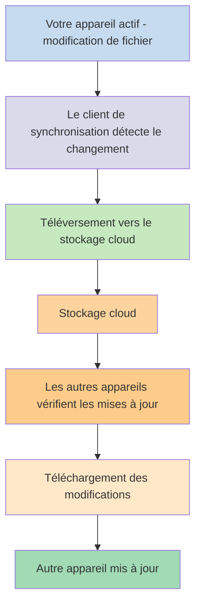
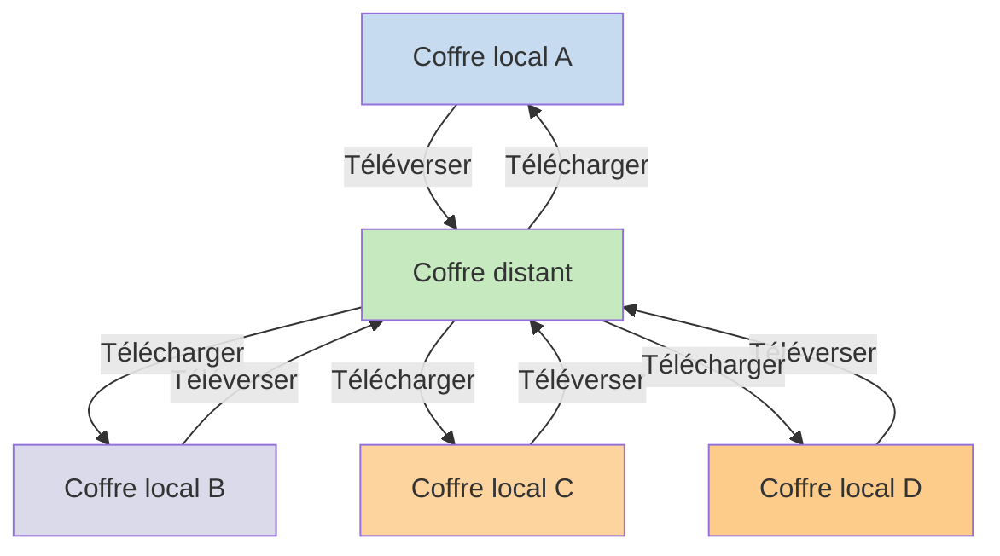

Si vous souhaitez utiliser vos notes sur différents appareils, l'une des options qui s'offre à vous est de [[Synchroniser vos notes entre appareils]]. Obsidian propose un tel service, [[Introduction à Obsidian Sync|Obsidian Sync]], qui fonctionne différemment des autres services de synchronisation, comme [[Synchroniser vos notes entre appareils#iCloud|iCloud]] et [[Synchroniser vos notes entre appareils#OneDrive|OneDrive]].

Voici quelques termes clés :

- Un **coffre** est un dossier sur votre système de fichiers qui contient des notes et un dossier `.obsidian` avec la configuration spécifique à Obsidian.
- Un **coffre local** est la copie de votre coffre qui existe sur chacun de vos appareils. Lorsque vous utilisez des services de synchronisation, vous connectez ces coffres locaux pour activer la synchronisation.
- Un **coffre distant** est un stockage centralisé auquel les coffres locaux se connectent directement via Obsidian Sync.

Il existe deux approches courantes de synchronisation :

- **[[#Services de synchronisation basés sur les fichiers]]** : Les coffres locaux doivent se trouver dans des dossiers surveillés, la synchronisation se fait via le système de fichiers
- **[[#Obsidian Sync|Coffres distants]]** : Stockage centralisé auquel les coffres locaux se connectent directement via Obsidian

## Services de synchronisation basés sur les fichiers

Des services comme Dropbox, Google Drive, iCloud et OneDrive sont basés sur les dossiers. Ces services surveillent des dossiers spécifiques et synchronisent automatiquement tous les fichiers qui y sont placés. Les fichiers doivent se trouver dans les dossiers désignés par le service cloud pour être synchronisés. Avec les services de synchronisation basés sur les fichiers, votre coffre local agit simplement comme un autre dossier surveillé. Il n'y a pas de coffre distant dédié — à la place, le stockage cloud sert de relais, copiant les fichiers entre les coffres locaux sur différents appareils.

Le diagramme ci-dessous montre une version simplifiée du fonctionnement de ces services :

Si le service cloud dispose d'une synchronisation en arrière-plan, certains de ces processus peuvent se produire même lorsque vous n'utilisez pas activement les applications pour consulter les fichiers. Ces services surveillent des dossiers spécifiques et synchronisent automatiquement tous les fichiers qui y sont placés. Les fichiers doivent se trouver dans les dossiers désignés par le service cloud pour être synchronisés.

## Obsidian Sync

Obsidian Sync vous permet de créer un coffre distant qui sert de stockage centralisé via son service [[Introduction à Obsidian Sync|Obsidian Sync]]. Cela vous permet de choisir presque n'importe quel dossier sur n'importe lequel de vos appareils pour stocker vos fichiers — que ce soit sur un disque dur externe, dans `C:\`, ou dans le stockage de l'application sur Android.

Cependant, nous avons une liste d'emplacements recommandés pour votre coffre local si vous utilisez également des [[#Services de synchronisation basés sur les fichiers]] sur le même appareil — principalement, n'importe quel emplacement qui ne se trouve pas dans un [[Passer à Obsidian Sync#Déplacez votre coffre hors de votre service de synchronisation tiers ou de votre stockage cloud|service de synchronisation tiers]].

Le diagramme ci-dessous montre une version simplifiée du fonctionnement d'Obsidian Sync :

La force de ce système devient plus évidente avec davantage de types d'appareils. Les [[#Services de synchronisation basés sur les fichiers]] peuvent être implémentés de manière incohérente selon les systèmes d'exploitation, et les appareils mobiles ont leurs propres règles concernant le sandboxing des applications et la limitation de puissance, ce qui rend beaucoup plus difficile le fonctionnement fluide des services traditionnels basés sur les fichiers.

Avec Obsidian Sync, le service gère la synchronisation directement via l'application, offrant un comportement cohérent quel que soit le type d'appareil ou les limitations du système d'exploitation, tout en donnant la priorité à la conservation d'une copie locale de vos données comme [[Sauvegarder vos fichiers Obsidian|sauvegarde légère]].

### Comportement de la synchronisation

Lorsque vous apportez des modifications aux fichiers de votre coffre local, Obsidian Sync détecte ces changements et les téléverse vers le coffre distant. Les autres appareils connectés au même coffre distant téléchargent ensuite ces modifications et les appliquent à leurs coffres locaux. Obsidian Sync suit les modifications au niveau des fichiers et ne transfère que les fichiers qui ont été modifiés, plutôt que de synchroniser des dossiers entiers. Cela réduit l'utilisation de la bande passante et le temps de synchronisation.

Lorsque des conflits surviennent ou que vous devez contrôler quels fichiers se synchronisent, Obsidian Sync fournit des mécanismes spécifiques pour gérer ces situations :

![[Résoudre les problèmes d'Obsidian Sync#Résolution des conflits|Résolution des conflits]]

![[Paramètres de Sync et synchronisation sélective#Synchronisation sélective#Exclure un dossier de la synchronisation]]

### Comportement hors ligne

Les modifications effectuées hors ligne sont mises en file d'attente et se synchronisent automatiquement lorsque votre appareil se reconnecte à internet et qu'Obsidian est ouvert. Votre coffre local reste entièrement fonctionnel pendant les périodes hors ligne.

## Étapes suivantes

- [[Configurer Obsidian Sync]] pour commencer avec les coffres distants.
- [[Passer à Obsidian Sync]] si vous utilisez actuellement une synchronisation basée sur les fichiers et souhaitez utiliser Obsidian Sync.
- [[Synchroniser vos notes entre appareils|Explorer d'autres options de synchronisation]] si vous êtes encore en phase de décision.
