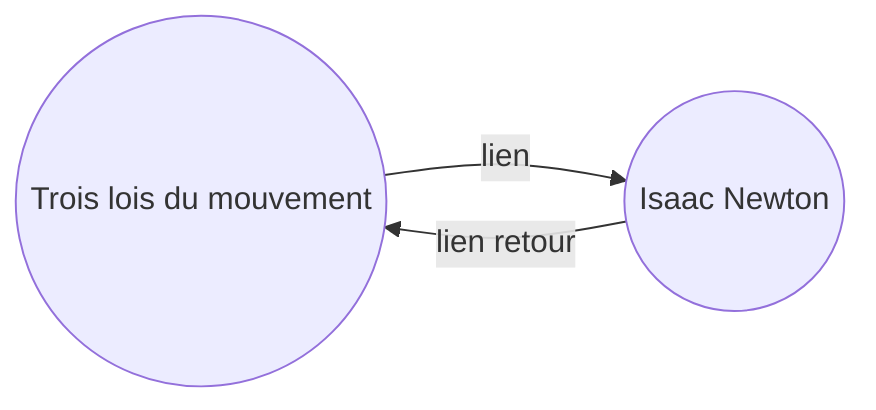

Avec le [[Modules principaux|module]] Rétroliens, vous pouvez voir tous les _liens retour_ pour la note active.

Un lien retour pour une note est un lien provenant d'une autre note vers celle-ci. Dans l'exemple suivant, la note « Trois lois du mouvement » contient un lien vers la note « Isaac Newton ». Le lien retour correspondant relierait « Isaac Newton » à « Trois lois du mouvement ».

Les liens retour peuvent être utiles pour trouver des notes qui font référence à la note que vous êtes en train d'écrire. Imaginez si vous pouviez lister les liens retour de n'importe quel site web sur Internet.

## Afficher les liens retour

Le module Rétroliens affiche les liens retour pour les onglets actifs. Il y a deux sections repliables : **Mentions liées** et **Mentions non liées**.

- Les **Mentions liées** sont des liens retour vers les notes qui contiennent un lien interne vers la note active.
- Les **Mentions non liées** sont des liens retour vers toute occurrence non liée du nom de la note active.

Il propose les options suivantes :

- **Réduire les résultats** permet de plier ou déplier chaque note pour afficher les mentions qu'elle contient.
- **Afficher plus de contexte** permet d'afficher le paragraphe entier contenant la mention ou de le tronquer.
- **Modifier l'ordre de tri** détermine comment trier les mentions.
- **Afficher le filtre de recherche** affiche un champ de texte qui vous permet de filtrer les mentions. Pour plus d'informations sur la construction d'un terme de recherche, consultez [[Rechercher]].

## Voir les liens retour d'une note

Pour voir les liens retour de la note active, cliquez sur l'onglet **Rétroliens** ( ![[obsidian-icon-links-coming-in.svg#icon]] ) dans la barre latérale droite.

> [!note]
> Si vous ne voyez pas l'onglet Rétroliens, vous pouvez le rendre visible en ouvrant la [[Palette de commandes]] et en exécutant la commande **Rétroliens : Afficher les rétroliens**.

> [!info] Fichiers exclus
> Les fichiers correspondant à vos modèles de [[Paramètres#Fichiers exclus|Fichiers exclus]] n'apparaîtront pas dans les mentions non liées.

## Voir les liens retour d'une note spécifique

L'onglet des liens retour liste les liens retour de la note active et se met à jour lorsque vous passez à une autre note. Si vous souhaitez voir les liens retour d'une note spécifique, qu'elle soit active ou non, vous pouvez ouvrir un onglet de liens retour _lié_.

Pour ouvrir un onglet de liens retour lié :

1. Ouvrez la [[Palette de commandes]].
2. Sélectionnez **Rétroliens : Ouvrir les rétroliens pour la note courante**.

Un onglet distinct s'ouvre à côté de votre note active. L'onglet affiche une icône de lien pour vous indiquer qu'il est lié à une note.

## Afficher les liens retour dans une note

Au lieu d'afficher les liens retour dans un onglet séparé, vous pouvez les afficher en bas de votre note.

Pour afficher les liens retour dans une note :

1. Ouvrez la [[Palette de commandes]].
2. Sélectionnez **Rétroliens : Afficher/masquer les rétroliens dans le document**.

Vous pouvez également activer **Rétroliens dans le document** dans les options du module Rétroliens pour afficher automatiquement les liens retour lorsque vous ouvrez une nouvelle note.
