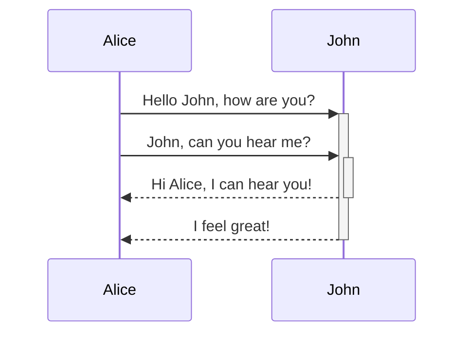
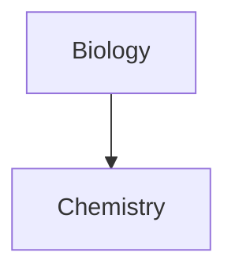

Apprenez à ajouter une syntaxe de mise en forme avancée à vos notes.

## Tableaux

Vous pouvez créer des tableaux en utilisant des barres verticales (`|`) pour séparer les colonnes et des tirets (`-`) pour définir les entêtes. Voici un exemple :

```md
| Prénom | Nom    |
| ------ | ------ |
| Max    | Planck |
| Marie  | Curie  |
```

| Prénom | Nom    |
| ------ | ------ |
| Max    | Planck |
| Marie  | Curie  |

Bien que les barres verticales de chaque côté du tableau soient optionnelles, il est recommandé de les inclure pour une meilleure lisibilité.

> [!tip] En _aperçu en direct_, vous pouvez faire un clic droit sur un tableau pour ajouter ou supprimer des colonnes et des lignes. Vous pouvez également les trier et les déplacer à l'aide du menu contextuel.

Vous pouvez insérer un tableau en utilisant la commande **Insérer un tableau** depuis la [[Palette de commandes]] ou en faisant un clic droit et en sélectionnant _Insérer → Tableau_. Cela vous donnera un tableau basique et modifiable :

```md
|     |     |
| --- | --- |
|     |     |
```

Notez que les cellules n'ont pas besoin d'être parfaitement alignées, mais la ligne d'entête doit contenir au moins deux tirets :

```md
Prénom | Nom
-- | --
Max | Planck
Marie | Curie
```


### Mettre en forme le contenu d'un tableau

Vous pouvez utiliser la [[Syntaxe de mise en forme de base]] pour styliser le contenu d'un tableau.

| Première colonne    | Deuxième colonne                                      |
| ------------------- | ----------------------------------------------------- |
| [[Liens internes]]  | Lien vers un fichier _dans_ votre **coffre**.         |
| [[Incorporer des fichiers]] | ![[Engelbart.jpg\|100]]                        |

> [!note] Barres verticales dans les tableaux
> Si vous souhaitez utiliser des [[Alias|alias]], ou [[Syntaxe de mise en forme de base#Images externes|redimensionner une image]] dans votre tableau, vous devez ajouter un `\` avant la barre verticale.
>
> ```md
> Première colonne | Deuxième colonne
> -- | --
> [[Syntaxe de mise en forme de base\|Syntaxe Markdown]] | ![[Engelbart.jpg\|200]]
> ```
>
> Première colonne | Deuxième colonne
> -- | --
> [[Syntaxe de mise en forme de base\|Syntaxe Markdown]] | ![[Engelbart.jpg\|200]]

Alignez le texte dans les colonnes en ajoutant des deux-points (`:`) à la ligne d'entête. Vous pouvez également aligner le contenu en _aperçu en direct_ via le menu contextuel.

```md
Texte aligné à gauche | Texte centré | Texte aligné à droite
:-- | :--: | --:
Contenu | Contenu | Contenu
```

Texte aligné à gauche | Texte centré | Texte aligné à droite
:-- | :--: | --:
Contenu | Contenu | Contenu

## Diagrammes

Vous pouvez ajouter des diagrammes et des graphiques à vos notes en utilisant [Mermaid](https://mermaid-js.github.io/). Mermaid prend en charge une gamme de diagrammes, tels que les [organigrammes](https://mermaid.js.org/syntax/flowchart.html), les [diagrammes de séquence](https://mermaid.js.org/syntax/sequenceDiagram.html) et les [chronologies](https://mermaid.js.org/syntax/timeline.html).

> [!tip]
> Vous pouvez également essayer l'[éditeur en direct](https://mermaid-js.github.io/mermaid-live-editor) de Mermaid pour vous aider à construire des diagrammes avant de les inclure dans vos notes.

Pour ajouter un diagramme Mermaid, créez un [[Syntaxe de mise en forme de base#Blocs de code|bloc de code]] `mermaid`.

````md

````


````md

````


### Lier des fichiers dans un diagramme

Vous pouvez créer des [[Liens internes|liens internes]] dans vos diagrammes en attachant la [classe](https://mermaid.js.org/syntax/flowchart.html#classes) `internal-link` à vos nœuds.

````md

````


> [!note]
> Les liens internes des diagrammes n'apparaissent pas dans la [[Vue graphique]].

Si vous avez de nombreux nœuds dans vos diagrammes, vous pouvez utiliser l'extrait suivant.

````md

````

De cette façon, chaque nœud lettre devient un lien interne, avec le [texte du nœud](https://mermaid.js.org/syntax/flowchart.html#a-node-with-text) comme texte du lien.

> [!note]
> Si vous utilisez des caractères spéciaux dans les noms de vos notes, vous devez mettre le nom de la note entre guillemets doubles.
>
> ```
> class "⨳ special character" internal-link
> ```
>
> Ou, `A["⨳ special character"]`.

Pour plus d'informations sur la création de diagrammes, consultez la [documentation officielle de Mermaid](https://mermaid.js.org/intro/).

## Mathématiques

Vous pouvez ajouter des expressions mathématiques à vos notes en utilisant [MathJax](http://docs.mathjax.org/en/latest/basic/mathjax.html) et la notation LaTeX.

Pour ajouter une expression MathJax à votre note, entourez-la de doubles signes dollar (`$$`).

```md
$$
\begin{vmatrix}a & b\\
c & d
\end{vmatrix}=ad-bc
$$
```

$$
\begin{vmatrix}a & b\\
c & d
\end{vmatrix}=ad-bc
$$

Vous pouvez également insérer des expressions mathématiques en ligne en les entourant de symboles `$`.

```md
Voici une expression mathématique en ligne $e^{2i\pi} = 1$.
```

Voici une expression mathématique en ligne $e^{2i\pi} = 1$.

Pour plus d'informations sur la syntaxe, consultez le [tutoriel de base et référence rapide MathJax](https://math.meta.stackexchange.com/questions/5020/mathjax-basic-tutorial-and-quick-reference).

Pour une liste des packages MathJax pris en charge, consultez la [liste des extensions TeX/LaTeX](http://docs.mathjax.org/en/latest/input/tex/extensions/index.html).
