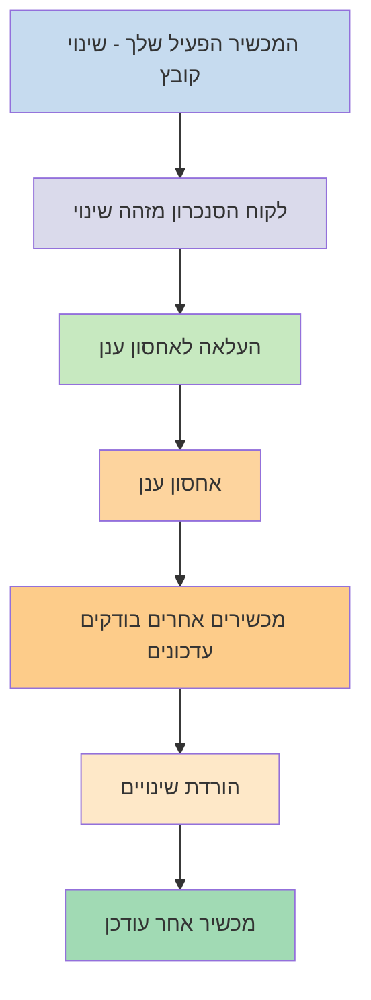
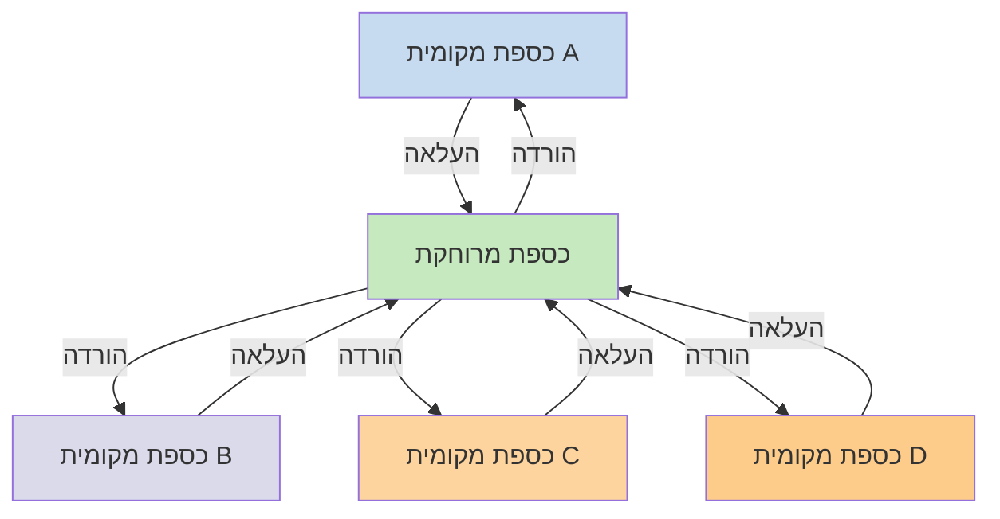

אם אתם רוצים להשתמש בהערות שלכם במכשירים שונים, אחת האפשרויות העומדות בפניכם היא [[סנכרון ההערות שלך בין מכשירים]]. Obsidian מציעה שירות כזה, [[מבוא ל-Obsidian Sync|Obsidian Sync]], שעובד בצורה שונה משירותי סנכרון אחרים, כמו [[סנכרון ההערות שלך בין מכשירים#iCloud|iCloud]] ו-[[סנכרון ההערות שלך בין מכשירים#OneDrive|OneDrive]].

הנה כמה מונחי מפתח:

- **כספת** היא תיקייה במערכת הקבצים שלכם המכילה הערות ותיקיית `.obsidian` עם תצורה ספציפית ל-Obsidian.
- **כספת מקומית** היא העותק של הכספת שלכם הקיים בכל אחד מהמכשירים שלכם. כאשר משתמשים בשירותי סנכרון, מחברים את הכספות המקומיות האלה כדי לאפשר סנכרון.
- **כספת מרוחקת** היא אחסון מרכזי שכספות מקומיות מתחברות אליו ישירות דרך Obsidian Sync.

ישנן שתי גישות נפוצות לסנכרון:

- **[[#שירותי סנכרון מבוססי קבצים]]**: כספות מקומיות חייבות להיות בתיקיות מנוטרות, הסנכרון מתבצע דרך מערכת הקבצים
- **[[#Obsidian Sync|כספות מרוחקות]]**: אחסון מרכזי שכספות מקומיות מתחברות אליו ישירות דרך Obsidian

## שירותי סנכרון מבוססי קבצים

שירותים כמו Dropbox, Google Drive, iCloud ו-OneDrive הם מבוססי תיקיות. שירותים אלה מנטרים תיקיות ספציפיות ומסנכרנים אוטומטית כל קובץ שמוצב בתוכן. קבצים חייבים להיות בתיקיות שירות הענן המיועדות כדי להסתנכרן. עם שירותי סנכרון מבוססי קבצים, הכספת המקומית שלכם פועלת כסתם עוד תיקייה מנוטרת. אין כספת מרוחקת ייעודית - במקום זאת, אחסון הענן משמש כמעביר, שמעתיק קבצים בין כספות מקומיות במכשירים שונים.

התרשים למטה מציג גרסה מפושטת של אופן פעולת שירותים אלה:

אם לשירות הענן יש סנכרון ברקע, חלק מהתהליכים האלה עשויים להתרחש גם כשאינכם משתמשים באפליקציות באופן פעיל כדי לצפות בקבצים. שירותים אלה מנטרים תיקיות ספציפיות ומסנכרנים אוטומטית כל קובץ שמוצב בתוכן. קבצים חייבים להיות בתיקיות שירות הענן המיועדות כדי להסתנכרן.

## Obsidian Sync

Obsidian Sync מאפשר לכם ליצור כספת מרוחקת המשמשת כאחסון מרכזי דרך שירות [[מבוא ל-Obsidian Sync|Obsidian Sync]]. זה מאפשר לכם לבחור כמעט כל תיקייה בכל אחד מהמכשירים שלכם לאחסון הקבצים - בין אם בכונן קשיח חיצוני, ב-`C:\`, או באחסון האפליקציה באנדרואיד.

עם זאת, יש לנו רשימה של מיקומים מומלצים לכספת המקומית שלכם אם אתם גם משתמשים ב[[#שירותי סנכרון מבוססי קבצים]] באותו מכשיר - בעיקר, כל מקום שאינו בתוך [[מעבר ל-Obsidian Sync#העבר את הכספת שלך מחוץ לשירות סנכרון צד שלישי או אחסון ענן|שירות סנכרון צד שלישי]].

התרשים למטה מציג גרסה מפושטת של אופן פעולת Obsidian Sync:

החוזק של מערכת זו הופך בולט יותר ככל שיש יותר סוגי מכשירים. [[#שירותי סנכרון מבוססי קבצים]] יכולים להיות מיושמים בצורה לא עקבית בין מערכות הפעלה, ולמכשירים ניידים יש כללים משלהם לגבי אופן ה-sandboxing וצמצום הצריכה של אפליקציות, מה שמקשה הרבה יותר על שירותים מסורתיים מבוססי קבצים לעבוד בצורה חלקה.

עם Obsidian Sync, השירות מטפל בסנכרון ישירות דרך האפליקציה, ומספק התנהגות עקבית ללא תלות בסוג המכשיר או מגבלות מערכת ההפעלה, תוך מתן עדיפות לשמירת עותק מקומי של הנתונים שלכם כ[[גיבוי קבצי Obsidian|גיבוי רך]].

### התנהגות סנכרון

כאשר אתם מבצעים שינויים בקבצים בכספת המקומית שלכם, Obsidian Sync מזהה שינויים אלה ומעלה אותם לכספת המרוחקת. מכשירים אחרים המחוברים לאותה כספת מרוחקת יורידו אז את השינויים האלה ויחילו אותם על הכספות המקומיות שלהם. Obsidian Sync עוקב אחרי שינויים ברמת הקובץ ומעביר רק את הקבצים שהשתנו, במקום לסנכרן תיקיות שלמות. זה מפחית שימוש ברוחב פס וזמן סנכרון.

כאשר מתרחשות התנגשויות או כאשר אתם צריכים לשלוט באילו קבצים מסתנכרנים, Obsidian Sync מספק מנגנונים ספציפיים לטיפול במצבים אלה:

![[פתרון בעיות ב-Obsidian Sync#פתרון התנגשויות|פתרון התנגשויות]]

![[הגדרות סנכרון וסנכרון סלקטיבי#סנכרון סלקטיבי#אל תכלול תיקיה מסנכרון]]

### התנהגות במצב לא מקוון

שינויים שנעשים בזמן שאתם לא מקוונים נשמרים בתור ומסתנכרנים אוטומטית כאשר המכשיר שלכם מתחבר מחדש לאינטרנט ו-Obsidian פתוח. הכספת המקומית שלכם נשארת פונקציונלית לחלוטין בתקופות ללא חיבור.

## שלבים הבאים

- [[הגדרת Obsidian Sync]] כדי להתחיל עם כספות מרוחקות.
- [[מעבר ל-Obsidian Sync]] אם אתם משתמשים כרגע בסנכרון מבוסס קבצים ורוצים להשתמש ב-Obsidian Sync.
- [[סנכרון ההערות שלך בין מכשירים|חקרו אפשרויות סנכרון אחרות]] אם אתם עדיין מחליטים.
