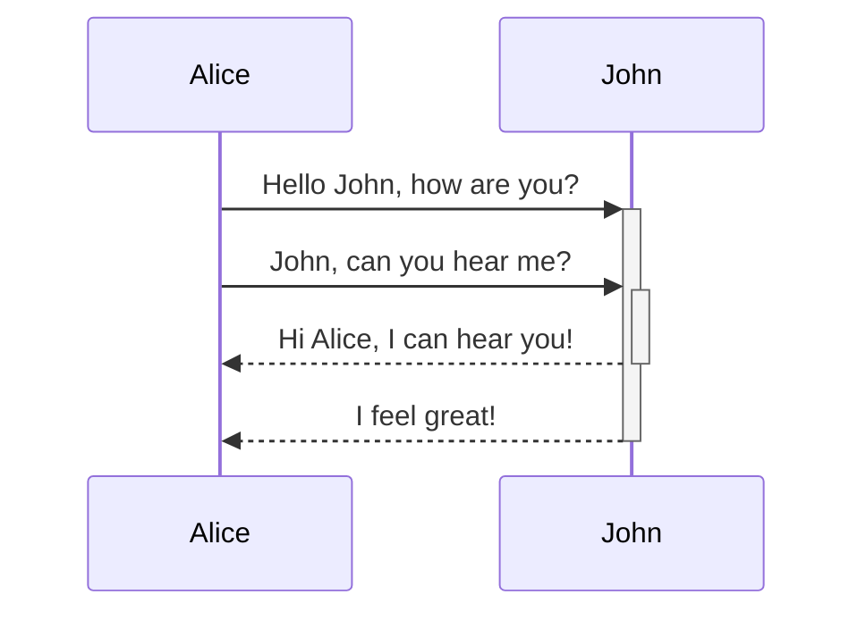
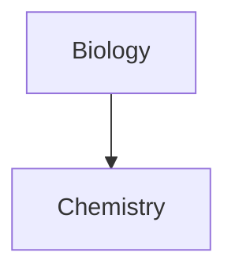

למד כיצד להוסיף תחביר עיצוב מתקדם להערות שלך.

## טבלאות

ניתן ליצור טבלאות באמצעות קווים אנכיים (`|`) כדי להפריד בין עמודות ומקפים (`-`) כדי להגדיר כותרות. הנה דוגמה:

```md
| First name | Last name |
| ---------- | --------- |
| Max        | Planck    |
| Marie      | Curie     |
```

| First name | Last name |
| ---------- | --------- |
| Max        | Planck    |
| Marie      | Curie     |

למרות שהקווים האנכיים בשני צדי הטבלה הם אופציונליים, מומלץ לכלול אותם לשיפור קריאות.

> [!tip] ב-_תצוגה מקדימה חיה_, ניתן ללחוץ לחיצה ימנית על טבלה כדי להוסיף או למחוק עמודות ושורות. ניתן גם למיין ולהזיז אותן באמצעות תפריט ההקשר.

ניתן להכניס טבלה באמצעות הפקודה **הכנס טבלה** מתוך [[לוח פקודות|לוח הפקודות]] או על ידי לחיצה ימנית ובחירה ב-_הכנס → טבלה_. פעולה זו תיתן לך טבלה בסיסית וניתנת לעריכה:

```md
|     |     |
| --- | --- |
|     |     |
```

שים לב שהתאים לא צריכים להיות מיושרים בצורה מושלמת, אך שורת הכותרת חייבת להכיל לפחות שני מקפים:

```md
First name | Last name
-- | --
Max | Planck
Marie | Curie
```


### עיצוב תוכן בתוך טבלה

ניתן להשתמש ב[[תחביר עיצוב בסיסי]] כדי לעצב תוכן בתוך טבלה.

| עמודה ראשונה         | עמודה שנייה                              |
| -------------------- | ---------------------------------------- |
| [[קישורים פנימיים]]  | קישור לקובץ _בתוך_ ה**כספת** שלך.       |
| [[הטמעת קבצים]]      | ![[Engelbart.jpg\|100]]                  |

> [!note] קווים אנכיים בטבלאות
> אם ברצונך להשתמש ב[[כינויים]], או [[תחביר עיצוב בסיסי#תמונות חיצוניות|לשנות גודל תמונה]] בטבלה שלך, עליך להוסיף `\` לפני הקו האנכי.
>
> ```md
> First column | Second column
> -- | --
> [[תחביר עיצוב בסיסי\|תחביר Markdown]] | ![[Engelbart.jpg\|200]]
> ```
>
> First column | Second column
> -- | --
> [[תחביר עיצוב בסיסי\|תחביר Markdown]] | ![[Engelbart.jpg\|200]]

יישר טקסט בעמודות על ידי הוספת נקודתיים (`:`) לשורת הכותרת. ניתן גם ליישר תוכן ב-_תצוגה מקדימה חיה_ דרך תפריט ההקשר.

```md
Left-aligned text | Center-aligned text | Right-aligned text
:-- | :--: | --:
Content | Content | Content
```

Left-aligned text | Center-aligned text | Right-aligned text
:-- | :--: | --:
Content | Content | Content

## דיאגרמות

ניתן להוסיף דיאגרמות ותרשימים להערות שלך, באמצעות [Mermaid](https://mermaid-js.github.io/). Mermaid תומך במגוון דיאגרמות, כגון [תרשימי זרימה](https://mermaid.js.org/syntax/flowchart.html), [דיאגרמות רצף](https://mermaid.js.org/syntax/sequenceDiagram.html), ו[צירי זמן](https://mermaid.js.org/syntax/timeline.html).

> [!tip] עצה
> ניתן גם לנסות את [העורך החי](https://mermaid-js.github.io/mermaid-live-editor) של Mermaid כדי לעזור לך לבנות דיאגרמות לפני שתכלול אותן בהערות שלך.

כדי להוסיף דיאגרמת Mermaid, צור [[תחביר עיצוב בסיסי#קוד מוטבע|בלוק קוד]] מסוג `mermaid`.

````md

````


````md

````


### קישור קבצים בדיאגרמה

ניתן ליצור [[קישורים פנימיים]] בדיאגרמות שלך על ידי צירוף ה[מחלקה](https://mermaid.js.org/syntax/flowchart.html#classes) `internal-link` לצמתים שלך.

````md

````


> [!note] הערה
> קישורים פנימיים מדיאגרמות אינם מופיעים ב[[תצוגת גרף]].

אם יש לך צמתים רבים בדיאגרמות שלך, ניתן להשתמש בקטע הקוד הבא.

````md

````

בדרך זו, כל צומת אות הופך לקישור פנימי, כאשר [טקסט הצומת](https://mermaid.js.org/syntax/flowchart.html#a-node-with-text) משמש כטקסט הקישור.

> [!note] הערה
> אם אתה משתמש בתווים מיוחדים בשמות ההערות שלך, עליך לשים את שם ההערה במרכאות כפולות.
>
> ```
> class "⨳ special character" internal-link
> ```
>
> או, `A["⨳ special character"]`.

למידע נוסף על יצירת דיאגרמות, עיין ב[תיעוד הרשמי של Mermaid](https://mermaid.js.org/intro/).

## מתמטיקה

ניתן להוסיף ביטויים מתמטיים להערות שלך באמצעות [MathJax](http://docs.mathjax.org/en/latest/basic/mathjax.html) וסימון LaTeX.

כדי להוסיף ביטוי MathJax להערה שלך, הקף אותו בסימני דולר כפולים (`$$`).

```md
$$
\begin{vmatrix}a & b\\
c & d
\end{vmatrix}=ad-bc
$$
```

$$
\begin{vmatrix}a & b\\
c & d
\end{vmatrix}=ad-bc
$$

ניתן גם להטמיע ביטויים מתמטיים בתוך שורה על ידי עטיפתם בסימני `$`.

```md
This is an inline math expression $e^{2i\pi} = 1$.
```

This is an inline math expression $e^{2i\pi} = 1$.

למידע נוסף על התחביר, עיין ב[מדריך בסיסי ועיון מהיר ב-MathJax](https://math.meta.stackexchange.com/questions/5020/mathjax-basic-tutorial-and-quick-reference).

לרשימת חבילות MathJax נתמכות, עיין ב[רשימת הרחבות TeX/LaTeX](http://docs.mathjax.org/en/latest/input/tex/extensions/index.html).
