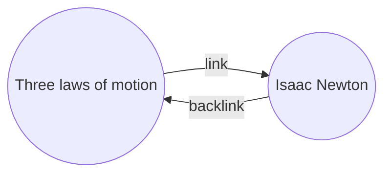

עם [[תוספי ליבה|תוסף]] ה[[קישורים נכנסים]], תוכלו לראות את כל ה_קישורים הנכנסים_ עבור ההערה הפעילה.

קישור נכנס להערה הוא קישור מהערה אחרת אל אותה הערה. בדוגמה הבאה, ההערה "שלושת חוקי התנועה" מכילה קישור להערה "אייזק ניוטון". הקישור הנכנס המתאים יקשר מ"אייזק ניוטון" בחזרה אל "שלושת חוקי התנועה".

קישורים נכנסים יכולים להיות שימושיים למציאת הערות שמתייחסות להערה שאתם כותבים. דמיינו שהייתם יכולים לראות רשימה של קישורים נכנסים לכל אתר באינטרנט.

## הצג קישורים נכנסים

תוסף הקישורים הנכנסים מציג את הקישורים הנכנסים עבור הלשוניות הפעילות. ישנם שני חלקים הניתנים לצמצום: **אזכורים מקושרים** ו**אזכורים לא מקושרים**.

- **אזכורים מקושרים** הם קישורים נכנסים להערות שמכילות קישור פנימי להערה הפעילה.
- **אזכורים לא מקושרים** הם קישורים נכנסים לכל מופע לא מקושר של שם ההערה הפעילה.

התוסף מספק את האפשרויות הבאות:

- **כווץ תוצאות** מחליף בין הרחבה לצמצום של כל הערה כדי להציג את האזכורים בתוכה.
- **הצג יותר הקשר** מחליף בין קיצור להצגת הפסקה המלאה שמכילה את האזכור.
- **שנה סדר מיון** קובע כיצד למיין את האזכורים.
- **הצג מסנן חיפוש** מחליף שדה טקסט שמאפשר לסנן את האזכורים. למידע נוסף על בניית מונח חיפוש, עיינו ב[[חיפוש]].

## הצגת קישורים נכנסים עבור הערה

כדי לראות את הקישורים הנכנסים עבור ההערה הפעילה, לחצו על לשונית **קישורים נכנסים** ![[obsidian-icon-links-coming-in.svg#icon]] בסרגל הצד הימני.

> [!note] הערה
> אם אינכם רואים את לשונית הקישורים הנכנסים, תוכלו להציג אותה על ידי פתיחת [[לוח פקודות|לוח הפקודות]] והפעלת הפקודה **קישורים נכנסים: הצג קישורים נכנסים**.

> [!info] קבצים שלא נכללו
> קבצים התואמים לדפוסי [[הגדרות#קבצים שלא נכללו|קבצים שלא נכללו]] לא יופיעו באזכורים לא מקושרים.

## הצגת קישורים נכנסים של הערה ספציפית

לשונית הקישורים הנכנסים מציגה קישורים נכנסים עבור ההערה הפעילה ומתעדכנת כשאתם עוברים להערה אחרת. אם ברצונכם לראות את הקישורים הנכנסים עבור הערה ספציפית, ללא קשר לשאלה אם היא פעילה או לא, תוכלו לפתוח לשונית קישורים נכנסים _מקושרת_.

כדי לפתוח לשונית קישורים נכנסים מקושרת:

1. פתחו את [[לוח פקודות|לוח הפקודות]].
2. בחרו **קישורים נכנסים: פתח קישורים נכנסים עבור הקובץ הנוכחי**.

לשונית נפרדת תיפתח לצד ההערה הפעילה שלכם. הלשונית מציגה סמל קישור כדי ליידע אתכם שהיא מקושרת להערה.

## הצגת קישורים נכנסים בתוך הערה

במקום להציג את הקישורים הנכנסים בלשונית נפרדת, תוכלו להציג את הקישורים הנכנסים בתחתית ההערה.

כדי להציג קישורים נכנסים בתוך הערה:

1. פתחו את [[לוח פקודות|לוח הפקודות]].
2. בחרו **קישורים נכנסים: החלף קישורים נכנסים במסמך**.

לחלופין, הפעילו **קישורים נכנסים במסמך** תחת אפשרויות תוסף הקישורים הנכנסים כדי להחליף קישורים נכנסים אוטומטית כשאתם פותחים הערה חדשה.
