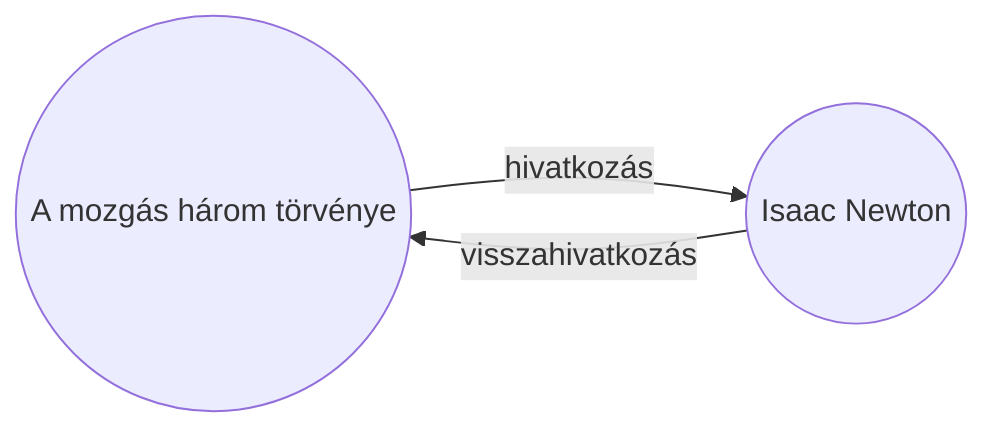

A [[Alap bővítmények|Visszahivatkozások]] bővítménnyel megtekintheted az aktív jegyzet összes _visszahivatkozását_.

Egy jegyzet visszahivatkozása egy másik jegyzetből arra a jegyzetre mutató hivatkozás. A következő példában a "A mozgás három törvénye" jegyzet tartalmaz egy hivatkozást az "Isaac Newton" jegyzetre. A megfelelő visszahivatkozás az "Isaac Newton" jegyzetből mutatna vissza "A mozgás három törvénye" jegyzetre.

A visszahivatkozások hasznosak lehetnek olyan jegyzetek megtalálásához, amelyek hivatkoznak az éppen írt jegyzetedre. Képzeld el, milyen lenne, ha az internet bármely weboldalának visszahivatkozásait listázhatnád.

## Visszahivatkozások megjelenítése

A Visszahivatkozások bővítmény megjeleníti az aktív lapok visszahivatkozásait. Két összecsukható szakasz található: **Kapcsolt említések** és **Nem kapcsolt említések**.

- A **Kapcsolt említések** olyan visszahivatkozások, amelyek belső hivatkozást tartalmaznak az aktív jegyzetre.
- A **Nem kapcsolt említések** az aktív jegyzet nevének bármely nem hivatkozott előfordulására mutató visszahivatkozások.

A következő beállításokat kínálja:

- **Eredmények összecsukása** váltja, hogy az egyes jegyzeteket kibontva jelenítse-e meg az említéseket.
- **Több kontextus mutatása** váltja, hogy csonkolja vagy teljes egészében megjelenítse az említést tartalmazó bekezdést.
- **Rendezés módosítása** meghatározza az említések rendezési módját.
- **Keresési szűrő megjelenítése** egy szövegmezőt kapcsol be, amellyel szűrheted az említéseket. A keresési kifejezés összeállításáról további információt a [[Keresés]] oldalon találsz.

## Visszahivatkozások megtekintése egy jegyzethez

Az aktív jegyzet visszahivatkozásainak megtekintéséhez kattints a **Visszahivatkozások** ![[obsidian-icon-links-coming-in.svg#icon]] lapra a jobb oldalsávban.

> [!note] Megjegyzés
> Ha nem látod a Visszahivatkozások lapot, megjelenítheted a [[Parancspaletta]] megnyitásával és a **Visszahivatkozások: Visszahivatkozások megjelenítése** parancs futtatásával.

> [!info] Kizárt fájlok
> A [[Beállítások#Kizárt fájlok|Kizárt fájlok]] mintáinak megfelelő fájlok nem jelennek meg a Nem kapcsolt említések között.

## Egy adott jegyzet visszahivatkozásainak megtekintése

A visszahivatkozások lap az aktív jegyzet visszahivatkozásait listázza, és frissül, amikor másik jegyzetre váltasz. Ha egy adott jegyzet visszahivatkozásait szeretnéd látni, függetlenül attól, hogy az aktív-e vagy sem, megnyithatsz egy _kapcsolt_ visszahivatkozások lapot.

Kapcsolt visszahivatkozások lap megnyitása:

1. Nyisd meg a [[Parancspaletta|Parancspalettát]].
2. Válaszd a **Visszahivatkozások: Visszahivatkozások megnyitása az aktuális fájlhoz** lehetőséget.

Egy külön lap nyílik meg az aktív jegyzeted mellett. A lap egy hivatkozás ikont mutat, jelezve, hogy egy jegyzethez van kapcsolva.

## Visszahivatkozások megjelenítése egy jegyzetben

Ahelyett, hogy a visszahivatkozásokat külön lapon jelenítenéd meg, megjelenítheted őket a jegyzet alján.

Visszahivatkozások megjelenítése egy jegyzetben:

1. Nyisd meg a [[Parancspaletta|Parancspalettát]].
2. Válaszd a **Visszahivatkozások: Visszahivatkozások ki-/bekapcsolása a dokumentumban** lehetőséget.

Vagy engedélyezd a **Visszahivatkozások a dokumentumban** opciót a Visszahivatkozások bővítmény beállításaiban, hogy automatikusan bekapcsolódjanak a visszahivatkozások új jegyzet megnyitásakor.
