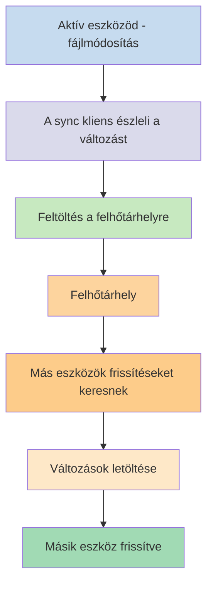
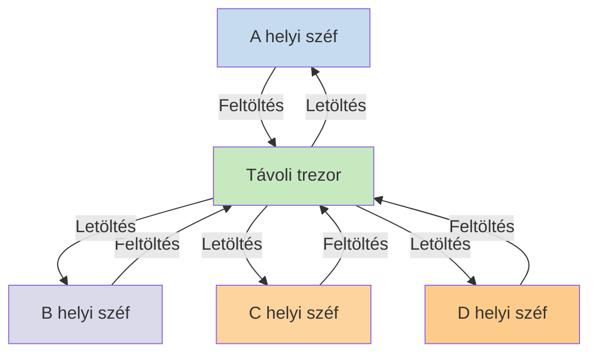

Ha jegyzeteidet különböző eszközökön szeretnéd használni, az egyik lehetőséged a [[Jegyzetek szinkronizálása eszközök között]]. Az Obsidian kínál egy ilyen szolgáltatást, az [[Bevezetés az Obsidian Sync használatába|Obsidian Sync]]-et, amely másképp működik, mint más szinkronizálási szolgáltatások, például az [[Jegyzetek szinkronizálása eszközök között#iCloud|iCloud]] és a [[Jegyzetek szinkronizálása eszközök között#OneDrive|OneDrive]].

Íme néhány kulcsfontosságú kifejezés:

- A **széf** egy mappa a fájlrendszereden, amely jegyzeteket és egy `.obsidian` mappát tartalmaz az Obsidian-specifikus konfigurációval.
- A **helyi széf** a széfed azon másolata, amely az egyes eszközeiden létezik. Szinkronizálási szolgáltatások használatakor ezeket a helyi széfeket kapcsolod össze a szinkronizálás engedélyezéséhez.
- A **távoli trezor** egy központi tárhely, amelyhez a helyi széfek közvetlenül csatlakoznak az Obsidian Sync segítségével.

Két gyakori megközelítés létezik a szinkronizálásra:

- **[[#Fájlalapú szinkronizálási szolgáltatások]]**: A helyi széfeknek megfigyelt mappákban kell lenniük, a szinkronizálás a fájlrendszeren keresztül történik
- **[[#Obsidian Sync|Távoli trezorok]]**: Központi tárhely, amelyhez a helyi széfek közvetlenül csatlakoznak az Obsidianon keresztül

## Fájlalapú szinkronizálási szolgáltatások

Az olyan szolgáltatások, mint a Dropbox, Google Drive, iCloud és OneDrive mappaalapúak. Ezek a szolgáltatások meghatározott mappákat figyelnek, és automatikusan szinkronizálják a bennük elhelyezett fájlokat. A fájloknak a kijelölt felhőszolgáltatási mappákban kell lenniük a szinkronizáláshoz. Fájlalapú szinkronizálási szolgáltatásoknál a helyi széfed egyszerűen egy újabb megfigyelt mappaként működik. Nincs dedikált távoli trezor – ehelyett a felhőtárhely közvetítőként szolgál, és fájlokat másol a különböző eszközökön lévő helyi széfek között.

Az alábbi ábra egyszerűsítve mutatja be, hogyan működnek ezek a szolgáltatások:

Ha a felhőszolgáltatás háttérszinkronizálással rendelkezik, akkor ezek a folyamatok még akkor is végbemehetnek, amikor nem használod aktívan az alkalmazásokat a fájlok megtekintéséhez. Ezek a szolgáltatások meghatározott mappákat figyelnek, és automatikusan szinkronizálják a bennük elhelyezett fájlokat. A fájloknak a kijelölt felhőszolgáltatási mappákban kell lenniük a szinkronizáláshoz.

## Obsidian Sync

Az Obsidian Sync lehetővé teszi, hogy létrehozz egy távoli trezort, amely központi tárhelyként szolgál az [[Bevezetés az Obsidian Sync használatába|Obsidian Sync]] szolgáltatáson keresztül. Ez lehetővé teszi, hogy szinte bármilyen mappát válassz bármely eszközödön a fájljaid tárolásához – legyen az egy külső merevlemez, a `C:\`, vagy az alkalmazástárhely Androidon.

Azonban van egy listánk az ajánlott helyekről a helyi széfed számára, ha [[#Fájlalapú szinkronizálási szolgáltatások|fájlalapú szinkronizálási szolgáltatásokat]] is használsz ugyanazon az eszközön – főként bárhol, ami nem [[Váltás az Obsidian Sync-re#Széf áthelyezése a külső féltől származó szinkronizációs szolgáltatásból vagy felhőtárolóból|külső féltől származó szinkronizációs szolgáltatás]] mappájában van.

Az alábbi ábra egyszerűsítve mutatja be, hogyan működik az Obsidian Sync:

Ennek a rendszernek az erőssége több eszköztípus esetén válik igazán nyilvánvalóvá. A [[#Fájlalapú szinkronizálási szolgáltatások]] operációs rendszerenként eltérően lehetnek megvalósítva, és a mobileszközöknek saját szabályaik vannak az alkalmazások sandboxolásával és energiagazdálkodásával kapcsolatban, ami sokkal nehezebbé teszi a hagyományos fájlalapú szolgáltatások zökkenőmentes működését.

Az Obsidian Sync esetében a szolgáltatás közvetlenül az alkalmazáson keresztül kezeli a szinkronizálást, következetes viselkedést biztosítva az eszköz típusától vagy az operációs rendszer korlátaitól függetlenül, miközben prioritásként kezeli az adataid helyi másolatának megőrzését [[Obsidian fájlok biztonsági mentése|puha biztonsági mentésként]].

### Szinkronizálási viselkedés

Amikor módosítod a helyi széfedben lévő fájlokat, az Obsidian Sync észleli ezeket a változásokat, és feltölti őket a távoli trezorba. Az ugyanahhoz a távoli trezorhoz csatlakozó többi eszköz ezután letölti ezeket a változásokat, és alkalmazza őket a helyi széfjeikre. Az Obsidian Sync fájlszinten követi a változásokat, és csak a módosított fájlokat továbbítja ahelyett, hogy teljes mappákat szinkronizálna. Ez csökkenti a sávszélesség-felhasználást és a szinkronizálási időt.

Amikor ütközések merülnek fel, vagy amikor szabályozni szeretnéd, mely fájlok szinkronizálódjanak, az Obsidian Sync specifikus mechanizmusokat biztosít ezeknek a helyzeteknek a kezelésére:

![[Obsidian Sync hibaelhárítás#Ütközések feloldása|Ütközések feloldása]]

![[Sync beállítások és szelektív szinkronizálás#Selective syncing#Exclude a folder from syncing]]

### Offline viselkedés

Az offline állapotban végzett módosítások várakozási sorba kerülnek, és automatikusan szinkronizálódnak, amikor az eszközöd újra csatlakozik az internethez és az Obsidian meg van nyitva. A helyi széfed offline időszakokban is teljes mértékben működőképes marad.

## Következő lépések

- [[Az Obsidian Sync beállítása]] a távoli trezorok használatának megkezdéséhez.
- [[Váltás az Obsidian Sync-re]], ha jelenleg fájlalapú szinkronizálást használsz, és az Obsidian Sync-re szeretnél váltani.
- [[Jegyzetek szinkronizálása eszközök között|Egyéb szinkronizálási lehetőségek felfedezése]], ha még döntés előtt állsz.
