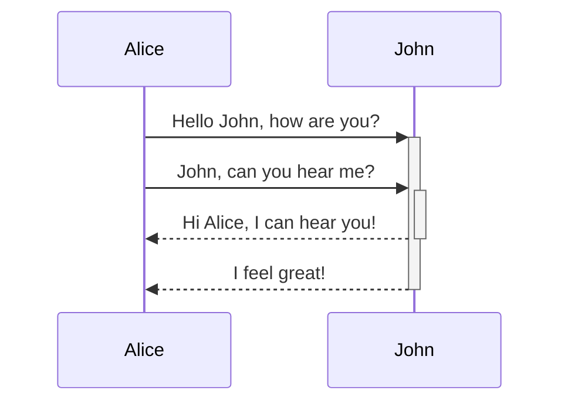
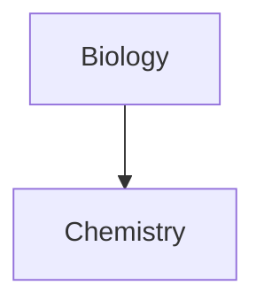

Tanulja meg, hogyan adhat haladó formázási szintaxist a jegyzeteihez.

## Táblázatok

Táblázatokat függőleges vonalak (`|`) segítségével hozhat létre az oszlopok elválasztásához, és kötőjelekkel (`-`) definiálhatja a fejléceket. Íme egy példa:

```md
| Keresztnév | Vezetéknév |
| ---------- | ---------- |
| Max        | Planck     |
| Marie      | Curie      |
```

| Keresztnév | Vezetéknév |
| ---------- | ---------- |
| Max        | Planck     |
| Marie      | Curie      |

Bár a táblázat két oldalán lévő függőleges vonalak opcionálisak, az olvashatóság érdekében ajánlott használni őket.

> [!tip] Az _Élő előnézetben_ jobb egérgombbal kattinthat egy táblázatra oszlopok és sorok hozzáadásához vagy törléséhez. A helyi menü segítségével rendezheti és áthelyezheti őket.

Táblázatot beszúrhat a **Táblázat beszúrása** paranccsal a [[Parancspaletta|Parancspalettáról]], vagy jobb egérgombbal kattintva a _Beszúrás → Táblázat_ lehetőséget választva. Ez egy alap, szerkeszthető táblázatot hoz létre:

```md
|     |     |
| --- | --- |
|     |     |
```

Vegye figyelembe, hogy a celláknak nem kell tökéletesen igazodniuk, de a fejléc sornak legalább két kötőjelet kell tartalmaznia:

```md
Keresztnév | Vezetéknév
-- | --
Max | Planck
Marie | Curie
```


### Tartalom formázása táblázaton belül

Használhatja az [[Alapvető formázási szintaxis|alapvető formázási szintaxist]] a táblázaton belüli tartalom formázásához.

| Első oszlop                | Második oszlop                                     |
| -------------------------- | -------------------------------------------------- |
| [[Belső hivatkozások]]     | Hivatkozás egy fájlra a **széfen** _belül_.        |
| [[Fájlok beágyazása]]     | ![[Engelbart.jpg\|100]]                            |

> [!note] Függőleges vonalak táblázatokban
> Ha [[Alternatív nevek|alternatív neveket]] szeretne használni, vagy [[Alapvető formázási szintaxis#Külső képek|át szeretné méretezni a képet]] a táblázatban, a függőleges vonal elé `\` jelet kell tennie.
>
> ```md
> Első oszlop | Második oszlop
> -- | --
> [[Alapvető formázási szintaxis\|Markdown szintaxis]] | ![[Engelbart.jpg\|200]]
> ```
>
> Első oszlop | Második oszlop
> -- | --
> [[Alapvető formázási szintaxis\|Markdown szintaxis]] | ![[Engelbart.jpg\|200]]

A szöveg oszlopokon belüli igazításához kettőspontokat (`:`) adjon a fejléc sorhoz. Az _Élő előnézetben_ a helyi menüből is igazíthatja a tartalmat.

```md
Balra igazított szöveg | Középre igazított szöveg | Jobbra igazított szöveg
:-- | :--: | --:
Tartalom | Tartalom | Tartalom
```

Balra igazított szöveg | Középre igazított szöveg | Jobbra igazított szöveg
:-- | :--: | --:
Tartalom | Tartalom | Tartalom

## Diagram

Diagramokat és ábrákat adhat a jegyzeteihez a [Mermaid](https://mermaid-js.github.io/) segítségével. A Mermaid számos diagramtípust támogat, például [folyamatábrákat](https://mermaid.js.org/syntax/flowchart.html), [szekvenciadiagramokat](https://mermaid.js.org/syntax/sequenceDiagram.html) és [idővonalakat](https://mermaid.js.org/syntax/timeline.html).

> [!tip] Tipp
> Kipróbálhatja a Mermaid [Élő szerkesztőjét](https://mermaid-js.github.io/mermaid-live-editor) is, amely segít a diagramok elkészítésében, mielőtt beillesztené őket a jegyzeteibe.

Mermaid diagram hozzáadásához hozzon létre egy `mermaid` [[Alapvető formázási szintaxis#Kódblokkok|kódblokkot]].

````md

````


````md

````


### Fájlok hivatkozása diagramban

[[Belső hivatkozások|Belső hivatkozásokat]] hozhat létre a diagramjaiban az `internal-link` [osztály](https://mermaid.js.org/syntax/flowchart.html#classes) csomópontokhoz való csatolásával.

````md

````


> [!note] Megjegyzés
> A diagramokból származó belső hivatkozások nem jelennek meg a [[Gráf nézet|Gráf nézetben]].

Ha sok csomópontja van a diagramjaiban, használhatja a következő kódrészletet.

````md

````

Így minden betű csomópont belső hivatkozássá válik, ahol a [csomópont szövege](https://mermaid.js.org/syntax/flowchart.html#a-node-with-text) a hivatkozás szövege lesz.

> [!note] Megjegyzés
> Ha speciális karaktereket használ a jegyzetnevekben, a jegyzet nevét dupla idézőjelek közé kell tennie.
>
> ```
> class "⨳ speciális karakter" internal-link
> ```
>
> Vagy: `A["⨳ speciális karakter"]`.

A diagramok létrehozásáról további információkért tekintse meg a [hivatalos Mermaid dokumentációt](https://mermaid.js.org/intro/).

## Matematika

Matematikai kifejezéseket adhat a jegyzeteihez a [MathJax](http://docs.mathja x.org/en/latest/basic/mathjax.html) és a LaTeX jelölés használatával.

MathJax kifejezés hozzáadásához fogja közre dupla dollárjelekkel (`$$`).

```md
$$
\begin{vmatrix}a & b\\
c & d
\end{vmatrix}=ad-bc
$$
```

$$
\begin{vmatrix}a & b\\
c & d
\end{vmatrix}=ad-bc
$$

Soron belüli matematikai kifejezéseket is használhat, ha `$` szimbólumok közé foglalja őket.

```md
Ez egy soron belüli matematikai kifejezés: $e^{2i\pi} = 1$.
```

Ez egy soron belüli matematikai kifejezés: $e^{2i\pi} = 1$.

A szintaxisról további információkért tekintse meg a [MathJax alapszintű útmutató és gyors referencia](https://math.meta.stackexchange.com/questions/5045/mathjax-basic-tutorial-and-quick-reference) oldalt.

A támogatott MathJax csomagok listájáért tekintse meg a [TeX/LaTeX bővítmények listáját](http://docs.mathjax.org/en/latest/input/tex/extensions/index.html).
